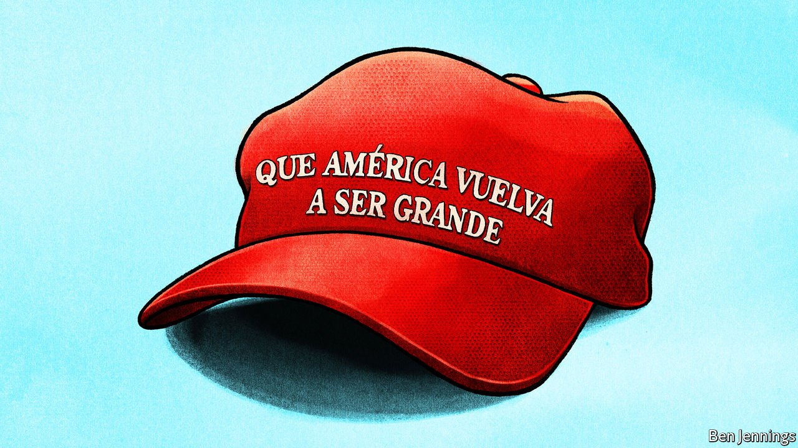

###### Lexington

# A large minority of Hispanic voters support Trump populism 

##### This looks catastrophic for the left 

 

> Nov 13th 2021 

WHEN DONALD TRUMP descended his elevator six years ago and inveighed against Mexican rapist immigrants, it was assumed that Hispanic voters would take offence. But a short hop across the Hudson river, in heavily Hispanic Passaic City, Angel Castillo loved what he heard. “Trump kept it real,” recalled the 43-year-old immigrant, over a cup of strong Dominican coffee in his small family restaurant, El Primito. “He didn’t say all Latinos are rapists. He said a lot of those coming over the border are rapists and drug-dealers and he’s right.”

Though a registered Democrat, Mr Castillo resolved to vote Republican thenceforth. Many of his relatives (a few of whom are illegal immigrants) were horrified: “People said you’re crazy, you’re voting for a racist.” Yet his wife, mother, brother, sister and teenage daughter followed his lead. This puts them in the most intriguing, hotly studied and potentially decisive cohort in American politics: Hispanic Trump voters.


Their emergence as a major electoral force was the big surprise of last year’s election. It saw a huge turnout by Hispanic voters, helping Joe Biden to victory in Arizona and Nevada. Yet it also featured a pronounced Hispanic tilt to Mr Trump. Initially thought to have been a localised phenomenon—which cost Mr Biden Florida and any hope of victory in Texas—it turned out to be nationwide. With around 38% of the Hispanic vote, Mr Trump won a higher share than any recent Republican presidential candidate apart from George W. Bush, a pro-immigrant Texan, in 2004. And last week’s elections in New Jersey—including Governor Phil Murphy’s brush with political death—suggests the shift may endure.

Passaic City, a decaying factory-town where seven in ten voters are Latino, helps illustrate it. In 2016 Mr Trump won 22% of the vote there, almost the same as Mitt Romney had. Four years of relentless immigrant-bashing and race-baiting later, he bagged 36%. Mr Murphy’s Republican challenger, Jack Ciattarelli, appears to have held on to that gain; when vote-counting finishes, a third of the commissioners of Passaic County could be Republican.

The overarching explanation for this development is suggested by the many alternative cuisines, Mexican, Colombian, Peruvian, Venezuelan, Puerto Rican, available within a few steps of El Primito. Hispanics are incomparably more diverse than the earlier waves of immigrants—Irish, Italian, Polish, Hungarian—who turned Passaic from a 19th-century fur trading-post into an industrial hub. They also lack the labour unions that bound those hordes into the Democratic fold. The assumption that Mr Trump’s xenophobic rhetoric would make Hispanics recoil in unison took too little note of their differences. While some have done so—especially young, college-educated Hispanics—the extreme polarisation of the Trump era has pushed others to the right.

Ronald Reagan quipped that hard-working, religious, communism-hating Hispanics were Republican even if they didn’t know it. In his different way, Mr Trump has hammered those same issues. He endeared himself to Miami’s Cuban exiles by calling the Democrats socialists. His claim to defend Christianity wooed Hispanic evangelicals everywhere. Hector Fernandez, a 69-year-old evangelical minister in Passaic, was another first-time Republican voter in 2016. “I don’t love the Republicans but my Christian values compel me to vote for them,” he said—and estimated that over half his congregation voted for Mr Trump last year.

The former president’s strong ratings on the economy, based on his wealth and claim to be a job-creating genius, also attracted the community. “Imagine coming to America from a poor country and seeing Trump’s name on a building!” says Passaic’s thoughtful mayor, Hector C. Lora, a son of Dominican immigrants. Mr Trump’s pivot to raging against economic lockdowns after covid-19 hit probably increased that advantage. Hispanics typically own small businesses, which were hard-hit by the lockdowns, the mayor noted. They also have reason to dislike government diktat.

The excesses of Latin politics perhaps also made it easy for some Hispanics to shrug off Mr Trump’s bigotry. “We are used to vitriolic rhetoric,” says Mr Lora. Yet others liked it—as Mr Castillo illustrates. “Immigrants used to come here to work,” said the restaurateur. “Now they come here and jump straight into government assistance, just like other races in this country.” You need not be Anglophone or America-born to find Mr Trump’s white nationalism and nativism seductive. And Hispanic Trump fans are just as easily radicalised as whites. Mr Castillo is a covid anti-vaxxer who suggests that Mr Biden’s election was not on the level.

It is hard to exaggerate the importance of this development. Republican strategists had considered Mr Trump’s chauvinism incompatible with the coalition-expanding embrace of diversity many recommended after Mr Romney’s defeat. But it appears not to be—and for Democrats that looks disastrous.

The party’s decades-long decline in the white, conservative and electorally crucial Midwest appears irreversible. Even if it could excise its leftist fringe—a kiss of death in such places—mainstream liberal causes such as minority, immigrant and reproductive rights are too toxic there for Democrats to progress. To remain competitive, they must therefore build new strongholds in diverse states such as Florida and Texas. But, as Mr Biden’s failures showed, this requires them to maintain Obama-esque levels of Hispanic support.

The dwindling Democratic majority

Harping on immigration reform, the Democrats’ default response, will not deliver that. Millions of Hispanics are hardly concerned with the issue. Yet it is hard to identify a liberal approach to the diverse and fracturing Hispanic community that would be more popular. Democrats had hoped Hispanics would compensate for the illiberal drift of working-class whites. Yet a sizeable minority of them appear to be following the same inexorable course.■

For more coverage of Joe Biden’s presidency, visit our dedicated 

