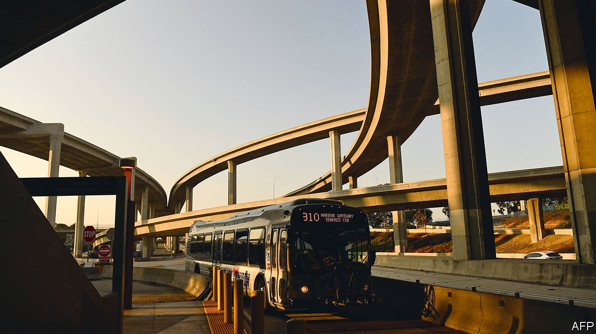

###### Unlocked

# Joe Biden’s infrastructure bill will boost competitiveness for decades 

##### Infrastructure year is finally here 

 

> Nov 11th 2021 

LOCK AND DAM 25 on the upper Mississippi River is testament to how good American infrastructure can be. Stretching nearly 1,300 feet (400 metres) across the water, the concrete-and-steel structure is a crucial link in the system that connects Midwestern fields to Southern ports and thence to Asian markets. Roughly 60% of America’s corn and soy exports pass through it every year. But it is almost 100 years old, and engineers wage a constant battle to keep it operational. It has the same capacity as when it was built, while boats have grown bigger. “How many highways built in the 1930s still have the same number of lanes now?” asks Andy Schimpf, a manager at the lock.

Salvation may be at hand. On November 5th the House of Representatives passed a five-year, $1trn bill to repair and upgrade America’s ageing infrastructure. About $2.5bn has been allocated to inland waterways, and Mr Schimpf is optimistic that some will go towards rebuilding Lock and Dam 25, doubling the size of its chamber. Today, workers sometimes need to break apart barges to get them through, and then reassemble them on the other side, which can take up to three hours. A bigger lock could reduce transit time to 30 minutes.


Hundreds of similarly delayed and neglected public projects around America will get a big boost from the infrastructure bill, which President Joe Biden will soon sign into law (it long ago passed the Senate). It includes $40bn of new funding for fixing bridges, the largest investment since the construction of the interstate highway system. There will be nearly $70bn for passenger rail, aimed both at clearing years-old maintenance backlogs and bringing service to new areas. Another $65bn should ensure that every American has access to high-speed internet. And the list goes on and on, from highways to airports and the electricity grid to water pipes.

For years American infrastructure has suffered from under-investment. It would take $2.6trn over the next decade to get it up to scratch, according to the American Society of Civil Engineers (ASCE), a professional body (albeit one with an interest in spending more). The bill will not fix everything. But it could be the beginning of a process that will make a real difference.

How big a difference? Roughly half the headline amount would have been expected as part of regularly budgeted maintenance, meaning that about $550bn actually constitutes new spending, to be disbursed over five years. That might not sound like much, but it is. From 2022 to 2026 federal infrastructure spending will rise from about 0.8% of annual GDP to 1.3%, well above the trend of the past four decades. Adie Tomer of the Brookings Institution, a think-tank, says that is nearly the same average level as during the New Deal, which helped lift America’s fortunes after the Great Depression.

As a rough rule of thumb, an additional $100bn per year spent on infrastructure could boost growth by about a tenth of a percentage point when the digging actually begins, and potentially more if it catalyses additional private-sector investment, notes Ellen Zentner of Morgan Stanley, a bank. In the longer term, she estimates, a sustained expansion of infrastructure spending could support productivity and raise America’s potential growth by as much as a fifth of a percentage point, a big deal for a large, mature economy. “That’s why whenever you talk to economists, infrastructure is the stuff that we go to bed at night dreaming of,” says Ms Zentner.

Getting a positive return will, of course, require the money to be allocated well. Considering the shortfalls in investment over the years, it should not be hard to find good projects. On average a water main breaks every two minutes somewhere in America, while nearly half of all roads are in bad shape, according to the ASCE. In some cases the investments will not generate new growth so much as defend America’s existing strengths. Take the locks on the upper Mississippi: they help American soyabeans compete against Brazilian ones. Labour is much cheaper in Brazil, but transportation is better in America. Keeping the locks in good shape underpins that. “If you were to close any of them down for a few months, it would cost us billions of dollars,” says Steve Censky, CEO of the American Soybean Association.

Just about doubling the federal government’s expenditure on infrastructure overnight could lead to waste, however. Cost overruns often bedevil American infrastructure projects. It is more expensive to build rail in America than in almost any other country, according to Transit Costs Project, a research group. The price of building highways has also soared. That just about anyone can mount a legal challenge against public works in their vicinity is part of the problem, leading to delays and missed budgets. And the current backdrop is hardly propitious, with supply-chain congestion affecting even the most basic home-building projects.

On the positive side of the ledger, the bill creates space for private investors to join the government’s efforts, which could both enlarge total spending and impose more financial discipline. Any city or state seeking federal funding for transport projects costing more than $750m will be required to evaluate whether partnering with private-sector investors would deliver better results. Some projects, such as the development of the first-ever national network of chargers for electric vehicles, naturally lend themselves to co-operation with the private sector, given that is where the technology resides. The government also wants companies to pitch in to make infrastructure more resilient to climate change. Grant programmes, useful in attracting private investment in water systems, are likely to be expanded. “This bill can potentially create a framework for ongoing and necessary public and private investment in infrastructure,” says Aaron Bielenberg of McKinsey, a consultancy.

But a dose of scepticism is also useful. Ultimately, the amount that America spends on infrastructure is a direct result of the amount that Americans are willing to be taxed. And that, by the standards of other rich countries, is not very much. “Ten years from now, I think we will look back and say that this bill was a historic investment, a great expansion of investments that were neglected,” says Austan Goolsbee, an economist at the University of Chicago and a former adviser to President Barack Obama. “But people are still going to be saying, well, why don’t we have high-speed rail all over the country?” Even so, better to fix roads, expand ports and lay broadband cables than not.■

For more coverage of Joe Biden’s presidency, visit our dedicated 

