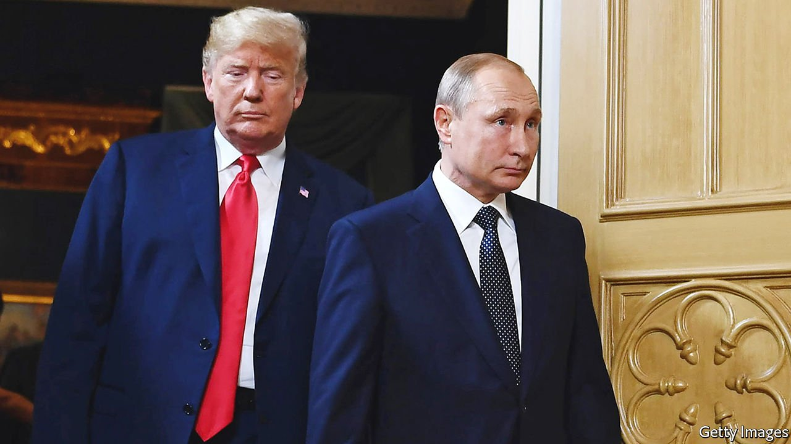

###### You’re in trouble

# John Durham’s indictments reflect poorly on the American media 

##### The special counsel arrests one of the sources of the infamous Steele dossier 

 

> Nov 10th 2021 

ON OCTOBER 17TH Christopher Steele, a former British intelligence officer who now runs a private research consultancy, appeared on ABC News. Mr Steele was being interviewed about a dossier that he had provided to the Democratic Party and to the FBI in the run-up to the 2016 presidential election. It reported on Donald Trump’s business interests in Russia and his team’s relationships there. But most explosively, it also alleged he had possibly been captured on video indulging curious sexual tastes in the presidential suite of the Ritz-Carlton hotel in Moscow in 2013. Mr Steele, asked whether he believes that this video exists, said, “I think it probably does.”

That seems less and less likely. On November 4th John Durham, the special counsel for the Department of Justice, who was appointed by William Barr in 2019 to investigate the FBI investigation into Mr Trump’s supposed links with Russia, indicted Igor Danchenko, a Russian national and professional Russia expert based in America. Mr Danchenko is alleged to have lied about how he collected information for the Steele dossier (knowingly lying to FBI agents is a crime). According to the indictment, Mr Danchenko got some of the rumours he sent to Mr Steele from a Russophile American PR executive, named by the New York Times as Charles Dolan, who previously worked on Clinton campaigns. Mr Danchenko allegedly hid this from the FBI when he was interviewed (he denies it).


Right-wing media in America have turned this into a storm. Kimberley Strassel, a columnist for the Wall Street Journal, wrote that the indictments show that the Steele dossier ought to be called the “Clinton Dossier”, and argued in effect that Mr Trump was a victim of a giant orchestrated conspiracy to make out that he was in (a rather damp) bed with Russia. Others, such as Fox News, have made much of Mr Danchenko’s work from 2005 to 2010 for the Brookings Institution, a centrist think-tank in Washington, DC. Many also suggest that the Mueller investigation, a federal probe which looked into Mr Trump’s team’s links with Russia, began with the Steele dossier. Mr Trump himself said in a TV interview that the findings are “only going to get deeper and deeper”—and would implicate Democrats.

In reality, the conspiracy is not so deep. An earlier investigation by Michael Horowitz, the Inspector-General of the Department of Justice, revealed many of the shortcomings of the Steele dossier. But it also showed that it was not what sparked the FBI’s investigation into the former president’s Russian links. A tip-off from the Australian government in July 2016 did that. The Mueller investigation, which emerged from the original FBI investigation, made almost no mention of the allegations from the Steele dossier. Instead, it focused on the activities of various of Mr Trump’s associates, who certainly did meet Russian officials, and also communicated with WikiLeaks over the release of emails hacked from the Democratic National Committee by the Russian state. A bipartisan Senate report released last year assessed that Mr Trump was aware of this. In April, the Treasury department sanctioned an associate of Paul Manafort, one of Mr Trump’s campaign managers, for feeding information to Russian intelligence.

So Mr Durham has very much not exonerated Mr Trump from having shady dealings with Russia. But he has underlined that the most lurid allegations were, at best, unsubstantiated rumour. That is embarrassing to the FBI, which used the Steele dossier in part to justify a wiretap on one Trump adviser, Carter Page.

But it is also damning of many journalists and Democrats. The Steele dossier was presented by many in the more left-leaning media as a highly credible investigation by a highly respected British former spook, involving “deep cover sources inside Russia” (in the words of one MSNBC anchor). In fact it was outsourced to people outside Russia such as Mr Danchenko, who seemingly gathered information by reading newspapers and drinking with pals.

What happens next? Mr Durham’s investigation has been going on for over two years and, so far, has produced only three indictments: as well as Mr Danchenko, there is Michael Sussmann, a cyber-security lawyer also alleged to have made false statements to the FBI, and a junior FBI lawyer who has admitted altering a document to strengthen a wiretap request. There may well be more. Yet the main outcome of the investigation will be to help Mr Trump move the conversation about his Russian links on from his own actions to the tendency of liberal journalists to believe the absolute worst about him. For the former president, that is a pretty good result. ■

