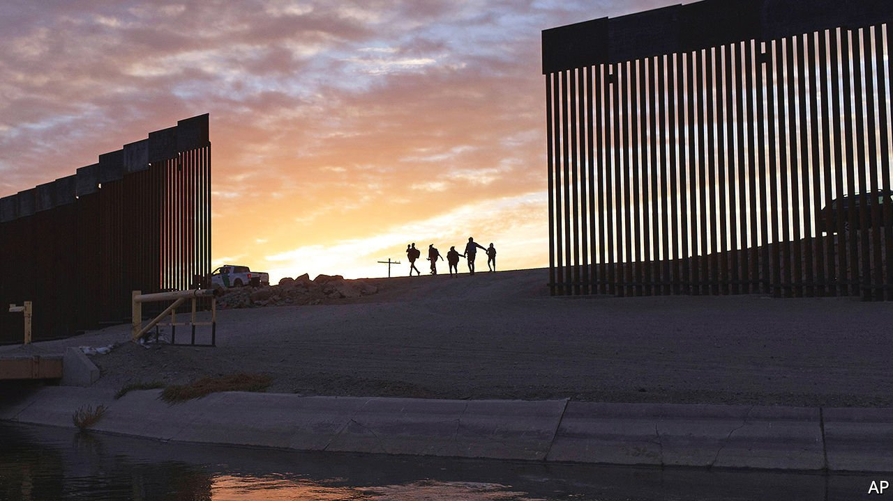
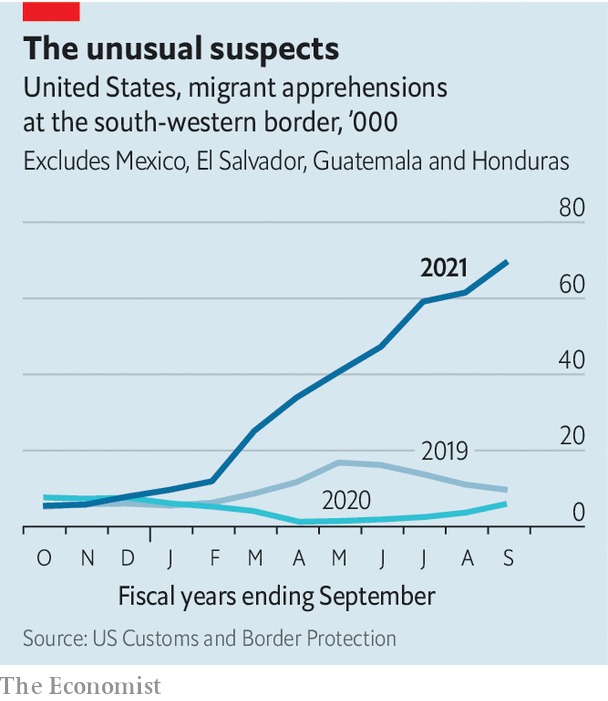
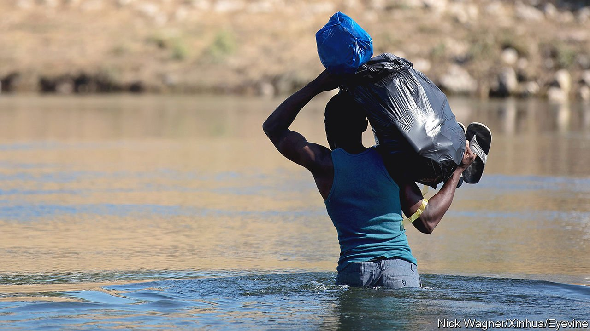

###### Biden and the border

# Why the situation on America's southern border has become unmanageable 

##### Democrats have not realised how serious the problem is 

 

> Nov 13th 2021 

THE SITE has an air of abandonment, like a half-finished apartment building whose developer ran out of money. Thirty-foot (nine-metre) steel rods rise from the desert sand. The area has been electrified and prepared for floodlights, but only half a dozen have been installed, so most of the structure is bathed in darkness at night. Thanks to Donald Trump the border wall, of which this is part, has become a charged symbol of nativism and exclusion. But the design of this stretch, with slats spaced four inches apart to let people see through, is similar to the 128 miles of wall built during Barack Obama’s presidency, just taller. It was built hastily during the final months of Mr Trump’s term. Strewn nearby are steel piles of the old, shorter wall, which have yet to be hauled away.

President Joe Biden, who has not visited the southern border since 2008, put a halt to all wall-construction on his first day in office. The wall here ends abruptly, in the middle of a mountain peak. Close by are several long gaps, where floodgates were planned to allow water to flow through during heavy rains. Time ran out, and they were never added. Instead, a few low boulders and a thin string of wire serve as hurdles. At one break, a dozen water bottles are littered on the sandy ground, a sign of migrants’ passage. “See, this is concerning for us,” says Jesus Vasavilbaso, who works for Customs and Border Patrol (CBP). The nearest city is 45 miles away, a four-day walk through desert and mountains, he explains. Being out of water bodes ill for the migrants’ prospects of survival.


Large construction trucks are still parked nearby, as if awaiting direction. Chris Magnus, the police chief in Tucson nominated by Mr Biden to run CBP, has expressed tentative openness to completing “barriers, walls, other things”. Mr Vasavilbaso is hopeful that Mr Magnus could at least persuade the president to finish the gaps in the Tucson area.

Today the gap-riddled wall represents not only Mr Biden’s predecessor but also Mr Biden, who seems to know what he does not want—any more wall—but has yet to come up with a plan that is both “fair and humane”, which is what he promised on the campaign trail. The result is frustration from immigration advocates and people living close to the southern border, as well as a political headache. In the mid-term elections next year Republicans will accuse Democrats of presiding over chaos at the border. Democrats do not yet have an answer to this, in part because they do not realise the criticism has some truth.

The number of illegal border-crossers is the highest for 21 years. The number of “encounters” in the 2021 fiscal year (which ended in September) was the highest on record. (“Encounters” and the number of border-crossers are different, since one person may attempt several crossings.) The perception that Mr Biden is less hostile to migrants than Mr Trump was one factor in the rise, but not the only one. Covid-19 has hit economies to America’s south, adding to the poverty, violence, natural disasters and autocracy which many people are eager to escape. As more migrants arrive at the border it becomes harder to manage them in a consistent way.

 


Until recently it was overwhelmingly Mexicans and people from the Northern Triangle—El Salvador, Guatemala and Honduras—who showed up at America’s southern border. But in March arrivals from elsewhere began to spike (see chart). Brazilians, Ecuadoreans, Cubans, Haitians, Nicaraguans and Venezuelans are arriving in large numbers. In the 2021 fiscal year 47,000 Haitians arrived at the southern border, 23 times more than in 2019.

“The biggest story of 2021 is not the numbers but the diversity of origins of people,” says Andrew Selee, president of Migration Policy Institute, a think-tank. Word has spread widely that people should try their luck. Some 4,000 Russians were encountered at the southern border by CBP this fiscal year, compared with 21 in 2019.

The variety of nationalities makes the border even harder to manage, says Mr Selee. America can return people to Mexico swiftly, but it is more complicated to return Haitians, Cubans and Venezuelans. In addition, around 28% of those encountered by CBP in fiscal 2021 were family units. As more families with children arrive, operations on the border are getting harder to manage, at a time when tolerance for long holding periods and detention space are in short supply. Unaccompanied children are universally being allowed into America, so some parents are making the difficult decision to send them ahead alone, stretching the ability of American facilities to process them.

Mr Biden’s administration is therefore under renewed pressure to show it can control immigration. Yet like the administration he served in as vice-president, he also faces pressure from immigration advocates, who question how different Mr Biden’s policies are from Mr Trump’s. The Biden administration has continued to rely on a public-health rule called “Title 42”, which was first adopted by Mr Trump in March 2020. This enables America to quickly expel most migrants—even those trying to seek asylum—to Mexico or their home countries on public-health grounds. They are not formally processed or charged for illegal entry, which makes the process much faster. It also explains why border-crossers are making repeated attempts if they are apprehended the first time.

Immigrant advocates recently staged a walk-out during their virtual meeting with White House officials on border policy, due to their frustration with the continued use of Title 42 and the reimposition of the “Migrant Protection Protocols” (MPP) programme, says Gia Del Pino of the Kino Border Initiative, a non-profit. Mr Biden tried to end MPP, which was designed by Mr Trump as a deterrent and keeps asylum-seekers in squalid refugee camps in Mexico while their asylum claims are processed. However, a court order recently required it to be reinstated. “There is very little practical difference between Trump and Biden at the border,” says Lee Gelernt of the American Civil Liberties Union, which is suing the Biden administration to end Title 42 for asylum-seeking families.

Lifting Title 42 would make it harder to deport people who cross the border illegally. But it is hard to justify keeping it on public-health grounds. On November 8th America reopened its borders to foreign, vaccinated travellers. “Someone can come to the border and say, ‘I’m here, I’m Mexican, I’m vaccinated, and I’m here to go shopping at Walmart’ and they’ll be able to come in,” says Aaron Reichlin-Melnick of the American Immigration Council, a think-tank. “But someone can show up and say ‘Hi, I’m Mexican, I’m vaccinated, and I am here to claim asylum because I could be assassinated in the next 24 hours,’ and they’ll be turned away.” This different treatment is “nonsensical”, he says.

Migrants are experiencing widely differing treatment depending on where they come from, who they are and where they try to cross the border. In January this year 88% of border apprehensions resulted in expulsions, 2% in a release into America and 5% in detention. In August 49% resulted in expulsions, 22% in release and 20% in detention. The main factor in the decline in the share of expulsions is the Mexican government’s decisions about who they will take back, says Mr Reichlin-Melnick of the Immigration Council.

For example, Mexico said it would not accept Ecuadoreans who were expelled under Title 42, but single Ecuadoreans who pass into the El Paso sector are, in fact, being sent to Mexico, which seems to be the result of decisions by local officials in the Mexican state of Chihuahua, says Mr Reichlin-Melnick. Tamaulipas, another Mexican state, decided not to take back families with children under the age of seven, which has resulted in America releasing them into the United States. As a result, more migrants go to South Texas near Tamaulipas, anticipating easier entry.

 


In fiscal 2021 284,000 people were released from Border Patrol custody into America according to Henry Cuellar, a Democratic congressman who represents south-west Texas. He thinks Mr Biden is surrounding himself with the “wrong advisers”. “The administration is paying too much attention to the immigration activists, and I don’t think they’re paying enough attention to the border communities and Border Patrol folks, who are on the frontlines of all this,” Mr Cuellar says.

People working on the American side of the border, from non-profit employees to Border Patrol agents, struggle to explain why some people are being allowed in while others are sent away. “I wish I could say I see 100% consistency, but we do not,” says Teresa Cavendish of Casa Alitas, a non-profit organisation that runs migrant shelters. “It could be a factor of volume or training, or just something that happened that day that made allowances for someone to pass who would have otherwise not had entry. The outcome for asylum-seekers crossing the border can vary wildly and depends more on their nationality and family status than on any policies or laws inside of the United States,” she adds.

Things are getting bad when Mr Biden, the most devout Catholic president the country has ever had, is being criticised by nuns. “The lack of clarity about what the United States is doing gives people the wrong message,” says Sister Norma Pimentel, who runs Catholic Charities of the Rio Grande Valley. “The more the US puts effort into clarifying what the immigration process is, it will help avoid great masses of people coming thinking they have a chance to enter when they don’t.” She adds that if the Biden administration has figured out its border policy, “they haven’t voiced it yet”. ■

