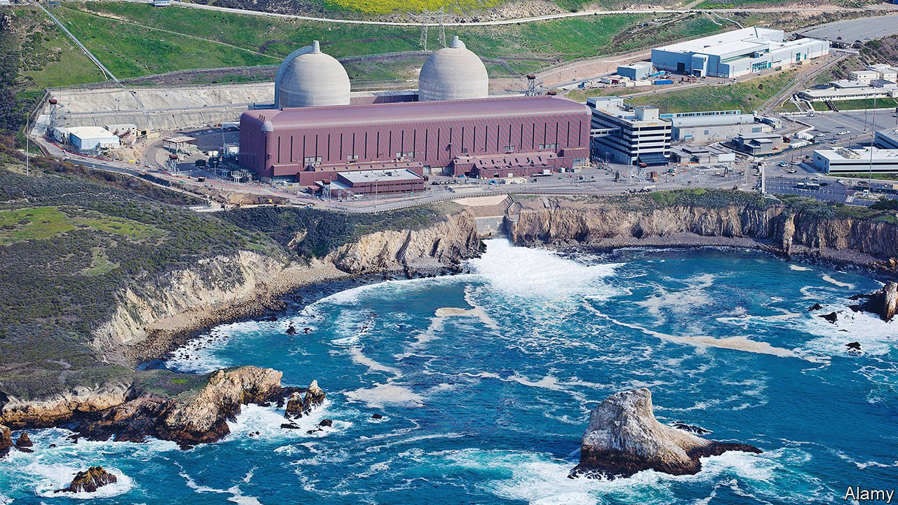
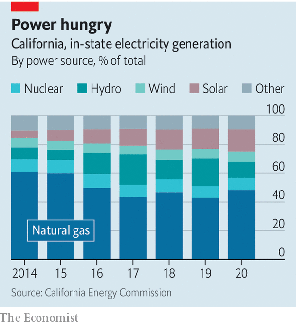
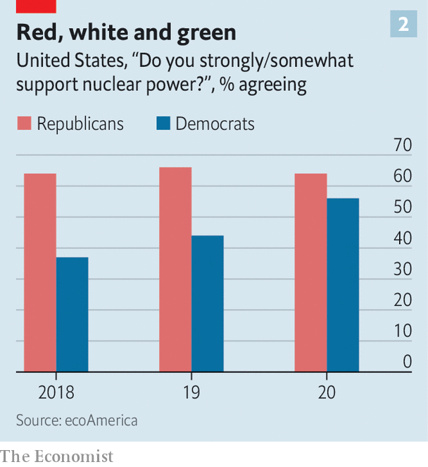

###### Energy deficient

# Will the climate crisis force America to reconsider nuclear power? 

##### Reaching net-zero targets will be much harder without it 

 

> Nov 11th 2021 

THE DIABLO CANYON nuclear power plant lies about 200 miles north of Los Angeles on California's central coast. Its twin reactors sit between the Pacific Ocean on one side and emerald hills on the other. The Golden State’s only remaining nuclear plant provides nearly 9% of its electricity generation, and accounts for 15% of its clean-electricity production. Yet despite California’s aggressive climate goals and a national push to reach net-zero emissions by 2050, Diablo Canyon is set to close down by 2025. A new report from researchers at Stanford University and the Massachusetts Institute of Technology (MIT) reveals just how detrimental that would be.

Diablo Canyon came online in 1985 and has operated without incident. But the plant is controversial. Diablo sits near several major fault lines, and locals have long feared that an earthquake could trigger a nuclear disaster. America’s Nuclear Regulatory Commission (NRC) ordered utilities to evaluate their plants for flooding and seismic risk after the meltdown at the  in Japan in 2011. Diablo Canyon was found to be safe.


Even so, in 2018 the California Public Utilities Commission approved a proposal put forward by Pacific Gas &amp; Electric, the state’s largest utility and the operator of Diablo Canyon, and environmental and labour groups to close the plant. PG&amp;E argued that there was reduced demand for nuclear power because of the promise of renewables, such as wind and solar, and the growth of “community choice aggregators”, which allow local municipalities to decide where they get their power from.

Three things have changed since then. First, California passed SB100 in 2018, which requires the state to achieve 100% clean-power generation by 2045. Second, the south-west is suffering from what paleoclimatologists think is its second-worst megadrought in 1,200 years. Reservoirs across the region are , limiting the supply of hydroelectric power. Just 11% of California’s in-state power generation came from hydro in 2020, a 44% drop from 2019 (see chart 1). Electricity from clean-energy sources (including nuclear) made up 51% of California’s power generation last year, down from 57% in 2019.

 


Third, a heatwave in August of 2020 led to rolling  across the state as demand for electricity (to power air-conditioners) outpaced supply. California’s public utilities commission is scrambling to meet increased demand. The regulator recently ordered utility companies to buy up renewable energy and battery storage to try to offset the impending loss of Diablo.

These three trends led researchers to ponder how keeping the plant running might change California’s energy outlook. They found that to keep it going to 2035, ten years past its current operating licence issued by the NRC, would cut emissions, bolster the grid’s reliability and save the state $2.6bn. The analysis shows that Diablo’s continued operation would reduce the carbon emissions from power generation by 11% each year from 2017 levels. And unlike wind and solar power, nuclear energy provides a stable source of electricity unaffected by changes in weather.

The researchers also suggest that Diablo could potentially help California make its power sector greener and tackle water shortages by producing hydrogen or powering a salt-water desalination plant in addition to generating electricity. “You cannot afford to take technology solutions off the table” when pursuing net-zero goals, says Jacopo Buongiorno, one of the authors and a nuclear scientist at MIT. “All of the above is really the best strategy.”

It is one thing to prove Diablo’s value, and quite another to reverse its retirement. A law aimed at protecting marine ecosystems would force the plant to replace its water-intake system, which cools its reactors, with a new system that reduces the intake flow rate by 93%. It would also require PG&amp;E to reopen its 2018 settlement and relicense the plant, which can be an onerous process; or sell Diablo to another utility.

Fission impossible?

The debate over Diablo Canyon reflects the recent rebranding of nuclear. Steve Nesbit, president of the American Nuclear Society, says three things happened in the 2000s to put a damper on nuclear power in America: fracking took off, the financial crisis of 2007-08 lessened demand for electricity and the Fukushima accident spooked politicians. The plants that were commissioned were delayed and over-budget. Yet evidence shows that when nuclear reactors shut down, polluting fossil fuels make up the difference.

Even while plants are being shut down, nuclear power is gaining in appeal. Environmental groups have long been sceptical of nuclear because of the toxic waste it produces, or because they were against nuclear weapons. Jessica Lovering, the founder of Good Energy Collective, which aims to build the “progressive case for nuclear energy”, says today’s climate activists are more pragmatic, and focused on nuclear’s lack of carbon emissions. She cites the Sunrise Movement as a group that is not necessarily pro-nuclear, but is against closing down existing plants.

 


Nuclear is responsible for nearly 20% of America’s power generation and about half of its clean energy. A survey from ecoAmerica found that 56% of Democrats supported nuclear power in 2020, up from 37% in 2018 (see chart 2). “Young people these days maybe don't bring with them the baggage of their parents and grandparents, who were raised during the cold war, in their view of nuclear power,” says Mr Nesbit.


Policy is slowly catching up. Pro-nuclear groups point to the use of “clean electricity” or “zero-carbon” language in state and federal climate targets as a way to leave the door open for nuclear, rather than requiring renewables. Jennifer Granholm, President Joe Biden’s energy secretary, told a crowd at , the global climate conference in Glasgow, that nuclear energy is an “essential tool” in decarbonising the grid. Republicans and Democrats alike are excited about the potential for converting coal plants into nuclear power stations. When TerraPower, a company founded by Bill Gates,  that it would build a nuclear reactor at the site of a closing coal plant in Wyoming, Ms Granholm, the state’s Republican governor and its senior senator were in attendance. The federal government is also subsidising the project to the tune of $80m.

But nuclear power still faces several obstacles. Experts say the biggest is the prohibitive cost of building a new plant. New designs, such as TerraPower’s, may help with this. Many states, including California, also have de facto bans on building new reactors until radioactive waste can be permanently disposed of. The federal government tried for decades to build a nuclear waste repository at  in southern Nevada, but met stiff resistance from local politicians who didn’t want the stuff buried in their backyard.

The first of Diablo’s reactors will lose its licence in 2024. The report’s authors hope the Golden State will come to its senses before then. “The circumstances have changed,” says Ejeong Baik of Stanford. “Diablo Canyon presents an opportunity,” she adds. Will California take it? ■

