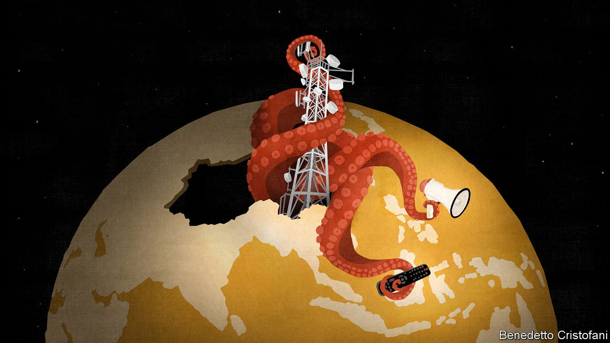

###### The embrace of the motherland

# Chinese propagandists court South-East Asia’s Chinese diaspora 

##### They are winning converts for China’s worldview 

 

> Nov 20th 2021 

EVERY NIGHT Lee Ah Huat (not his real name) turns on the news. The 60-something engineer lives in Malaysia’s capital, Kuala Lumpur, but he does not bother with local channels. He goes straight to CCTV, China’s state broadcaster, and usually watches its international broadcast in Chinese. Mr Lee’s family left China and settled in Malaysia decades ago. He maintains few direct connections to his ancestral home and has complicated feelings about it.

Yet when it comes to current affairs, his views are straightforward. The protests in Hong Kong and the oppression of the Uyghurs, an ethnic minority, are “China’s domestic issues”. American politicians who bang on about the Chinese state’s human-rights abuses are, in this view, hypocrites. Just look at “how America treats African-Americans or Native Americans. They murdered them, stole their land. America is just causing trouble.”


Mr Lee’s remarks would delight the Chinese Communist Party (CCP). At least 30m members of the Chinese diaspora, 60-70% of the total, live in South-East Asia. They are the targets of increasingly sophisticated Chinese state-sponsored influence operations. Though few members of the diaspora are Chinese citizens, the state expects them to have strong sympathies with their ancestral homeland. They have an important role to play in what the party calls China’s “great rejuvenation”.

In 2018 the United Front Work Department, the main organ responsible for influence operations among people who are not party members, absorbed the Overseas Chinese Affairs Office, responsible for tending to those abroad. Jacob Wallis of the Australian Strategic Policy Institute, a think-tank, thinks that “the CCP sees the diaspora as a powerful vector of influence” and is trying to recruit its members.

The South-East Asian diaspora is of particular interest to China’s info-warriors because China thinks it has a “natural right” to primacy in the region, says Kenton Thibaut of the Atlantic Council, an American think-tank. “China sees it as an easy proving ground,” she adds, where it can “start to express itself as a global power”.

How to recruit these potential partisans? “Wherever the readers are, wherever the viewers are, that is where propaganda reports must extend their tentacles,” said Xi Jinping, China’s president, in 2015. Their grip can be felt almost everywhere. “Over the past decade, top CCP officials have overseen a dramatic expansion in efforts to shape media content and narratives around the world,” according to a report in 2020 by Freedom House, a watchdog.

“This push feels particularly strong in South-East Asia because there are more outlets that are willing to rebroadcast some of these claims,” says Ja Ian Chong of the National University of Singapore. Prominent state media like CCTV are broadcast in every South-East Asian country. Some, including Xinhua, a government news agency, have struck attractive content-sharing deals with cash-strapped local newspapers, wire services and television broadcasters in Vietnam, Laos and Thailand. In 2017 a Chinese firm and the Cambodian interior ministry launched a TV station which carries content from China’s official media.

The complexion of some local media is increasingly red. Cambodian media now carry “journalism with Chinese characteristics”, according to Reporters without Borders, another watchdog. Chinese-language outlets in Malaysia are muzzling journalists who do not toe the CCP line. In April Lianhe Zaobao, a Chinese-language Singaporean newspaper, renamed its “Greater China” section (covering China, Hong Kong and Taiwan) simply “China”, reflecting China’s claim that Taiwan is its territory. It is one of the few foreign newspapers which are allowed to circulate in China.

China also spreads disinformation. A recent investigation by Malaysiakini, a news website, found that during the mass unrest in Hong Kong in 2019, mainstream Chinese-language media in Malaysia regurgitated false reports from Chinese state media claiming that protesters threw Molotov cocktails at school buses. China manipulates digital outlets, too. Its lies often pop up on social-media platforms in Taiwan, which is a “testing ground for [the] PRC’s worldwide propaganda”, according to DoubleThink Lab, a local outfit that tracks digital-information operations. From there it spreads to South-East Asia, piggybacking on the Twitter, Facebook and WeChat accounts of South-East Asian migrants in Taiwan or ethnic Chinese in South-East Asia.

Chinese propagandists have a few favourite themes. They include China’s benevolence, as illustrated by its donations of vaccines to South-East Asian countries (true) and the invention of the first covid-19 vaccine by a Chinese general (false). Democracy is portrayed as a messy, chaotic form of government and America as a racist country. A video purporting to depict black and white Americans beating a Chinese man with sticks was shared widely on South-East Asian chat groups earlier this year. The caption was false: the video actually depicted a prison riot in Ecuador.

There is also evidence that the Chinese propaganda apparatus, which has become “much more sophisticated, multi-layered and international facing” in the past two years, is conducting digital operations intended to manipulate public opinion in South-East Asia about domestic politics, says Mr Wallis.

It is hard to establish whether China is winning hearts and minds with such tactics. A Pew poll conducted this year found that in Singapore, which is about three-quarters Chinese, nearly two-thirds of respondents did have favourable views of China. Older Singaporeans were more likely than youngsters to hold such views. Last year, a Singaporean woman posted on Reddit, an online forum, about her father who was “self-radicalising every night with extreme pro-China videos”. Scores of Singaporean users recounted similar experiences with their own parents.

Sometimes influence operations backfire, however. In 2015, the perception that China was interfering in Malaysia’s affairs led tens of thousands of Malays to march through Chinatown in Kuala Lumpur, stirring memories of past race riots.

And if Mr Lee, the Malaysian engineer, is anything to go by, the party still has work to do. Lofty rhetoric about the Chinese diaspora belonging to a “community of common destiny” is all well and good. But his mainland-Chinese colleagues “look down on us…They think we come from a small, poor and weak country.” He adds: “[They] don’t see us as one of them”. Nor does Mr Lee. He identifies not as a Chinese national but as Chinese Malaysian. ■

