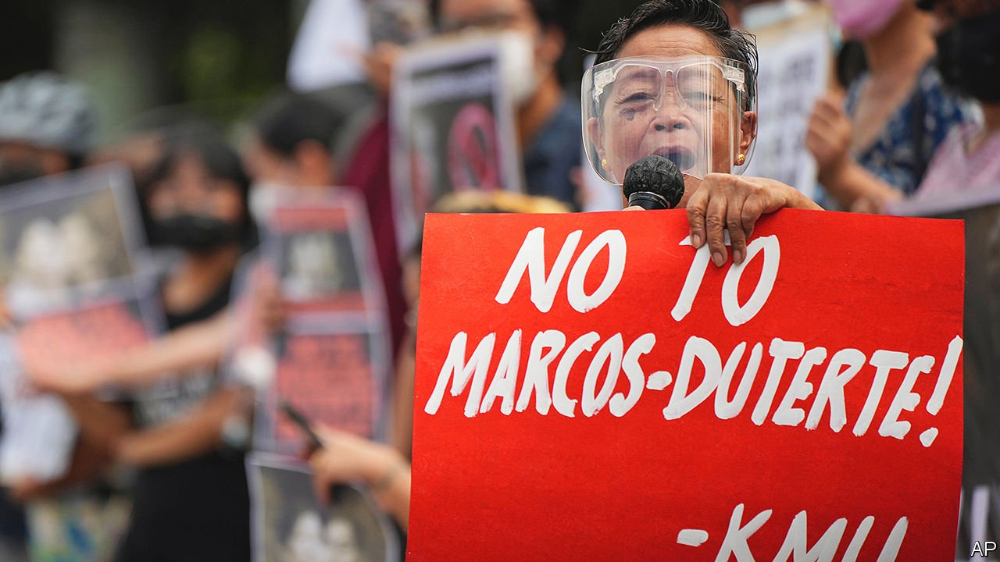

###### Succession

# Philippine President Duterte’s daughter spurns him and his job 

##### But she still has her eyes on a powerful role 

 

> Nov 20th 2021 

SARA DUTERTE had seemed destined to be swept to power on a wave of inherited popularity. But then she shunned her clear-cut opportunity to win the election next May and succeed her death-dealing father, Rodrigo Duterte, as president. Instead, Ms Duterte registered to run for vice-president, a position that has no power. In doing so, she appears to have messed up the Duterte dynasty’s chances of prolonging its grip on national government. So the president hastily made arrangements to preserve a measure of political influence once he completes the single six-year term in office the constitution allows him. He registered to run for a seat in the senate.

Father and daughter both put their names down just before the deadline of November 15th set by the election authority for the myriad political parties to rearrange their slates by substituting new candidates. Ms Duterte began by withdrawing her bid for re-election as mayor of the southern city of Davao, the Duterte dynasty’s bailiwick, and changing parties. But, dashing her father’s hopes, she registered as a substitute candidate not for president but vice-president. In remarks directed at supporters clamouring for her to run for the presidency, in the hope she would rule in the same manner as her father, Ms Duterte told them this was “an opportunity to meet you halfway”. President and vice-president are elected separately. Sometimes they are political rivals. Unless appointed to a government job by a sympathetic president, the deputy has nothing to do but wait to take over if the boss becomes unable or unwilling to carry on.


“I was puzzled,” her father said. “She was number one in the surveys, so why did she consent to running only for the vice-presidency?…I didn’t know what was going through her head. We don’t talk.” Within hours of Ms Duterte’s registering, her father had dispatched his right-hand man, Senator Christopher “Bong” Go, to register as a presidential candidate. Two days after that Mr Duterte himself registered to run for the Senate. Their purpose is clearly to reverse the present arrangement whereby Mr Go serves as Mr Duterte’s alter ego in the legislature.

For this to work, Mr Go must win the presidential election. But the latest opinion survey, taken in October, does not give him much chance. The front-runner is Ferdinand “Bongbong” Marcos, son of the late tyrant, Ferdinand Marcos, far ahead of the leader of the opposition, Vice-President Leni Robredo, and the mayor of Manila, Isko Moreno. The day after the substitution deadline, Ms Duterte and Mr Marcos acknowledged publicly that they had formed an alliance and each would support the other’s election campaign.

Ms Duterte may have sharper political acumen than her father. The survey put her second in the vice-presidential race, behind only Senator Vicente “Tito” Sotto, a former comedian. If Ms Duterte can win the vice-presidency, a similarly victorious Mr Marcos may include her in his government. This would put Ms Duterte closer to the seat of power than her father, even if he succeeds in reaching the Senate. But comfortingly for her father, of all the presidential candidates, Mr Marcos is the least equivocal about his intention to prevent the International Criminal Court from investigating Mr Duterte on suspicion that his campaign against illegal drugs, which has killed thousands of Filipinos, is a crime against humanity. ■

