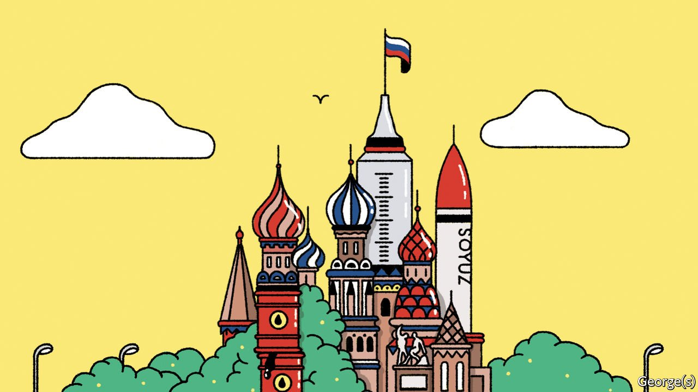

###### Banyan

# Russia moves with a new swagger in South-East Asia 

##### But its regional influence remains limited 

 

> Nov 20th 2021 

MIN AUNG HLAING can cut a lonely figure on the international stage. Since seizing power in a coup in February, the commander-in-chief of Myanmar’s armed forces has been persona non grata in many places. But one country at least has remained steadfast: Russia. Its friendship with Myanmar grows “stronger and stronger”, boasted the general on a visit to Moscow in June. Nor is Myanmar the only South-East Asian country Russia is buddying up with. In July President Vladimir Putin gave Hun Sen, Cambodia’s prime minister, a “friendship” medal, and sent his foreign minister on official visits to Laos and Indonesia. Seven of the ten member-states of ASEAN, a club of South-East Asian countries, have bought or plan to buy the Russian government’s Sputnik V vaccine. Vietnam, Malaysia and Indonesia have even signed deals to manufacture it.

Russia’s Asian charm offensive is not new. Since Mr Putin first took office two decades ago, Moscow has assiduously cultivated ties there, eager to sell commodities to its booming markets and to develop the anaemic economy of its far-eastern territories. But some analysts argue that this “pivot to Asia”, as Moscow calls it, is really a pivot to China, which is thirsty for Russian hydrocarbons and with which Russia shares a rival, America. And as fears have grown that Russia’s economy is becoming too dependent on China, so the benefits of sharing the love with the rest of Asia have seemed more apparent. So over the past decade, Moscow has stressed the importance of stronger bonds with ASEAN.


The most obvious evidence of this burgeoning friendship is on the parade ground. Russia is the region’s biggest arms supplier. Between 2000 and 2019 it sold $10.7bn-worth of tanks, warships, fighter jets and other weapons to South-East Asia, surpassing America, the region’s second-biggest supplier, by nearly a third. Over the past decade, Russia’s navy has made more frequent port calls in the region. Its armed forces occasionally conduct joint exercises with its South-East Asian counterparts. Over the past five years these ties have been affirmed by a flurry of defence agreements—with Indonesia and Myanmar, but also with Thailand and the Philippines, both formally allies of America.

Moscow supplements military ties with camaraderie. Mr Putin has for years made a point of attending ASEAN summits, and in 2016 began to play host to an annual Russia-ASEAN shindig. Years of glad-handing have borne fruit. When in 2014 the UN voted on a resolution condemning Russia’s annexation of Crimea, Vietnam, Brunei and Cambodia abstained, while Laos apparently forgot to vote. Russia reciprocated this year, torpedoing moves by other members of the UN Security Council to condemn the military coup in Myanmar.

South-East Asian governments welcome Russia’s courtship. Its weaponry is more reliable than China’s, and cheaper and less tangled in red tape than America’s. Moreover, as the rivalry between America and China ratchets up, many South-East Asian countries feel under pressure to choose sides. So they are keen on ties with other powerful countries like Russia, says Elizabeth Buchanan of Deakin University in Australia.

The problem is that, aside from arms and hydrocarbons, Russia does not have much to sell to the region. In 2019 ASEAN’s bilateral trade with America was worth $292bn and with Japan $116bn. With Russia it amounted to a piddling $18bn. Little has changed since 2010, when Russia’s foreign minister lamented that economic ties with ASEAN were “mostly skin-deep”.

Russia’s approach to foreign policy is “short-termist”, says Alexander Gabuev of the Carnegie Moscow Centre, a think-tank. Strategists know that the country ought to focus on the rest of Asia, yet “every year we see Russia doubling down on China” because it remains preoccupied by the commercial potential there. But when democracy takes a beating in South-East Asia, Russia does seize the opportunity to reward its assailants, notes Zachary Abuza of the National War College in Washington. When coup-makers in Myanmar and Thailand took power and when the Philippines’ irascible president seemed inclined to rip up its alliance with America (he later relented), it swooped in to sell arms and promise lasting friendship. Unable to add substance to those overtures, however, Russia contents itself with thumbing its nose at America and patting authoritarians on the back. It is not so much a great power as a great mischief-maker.

