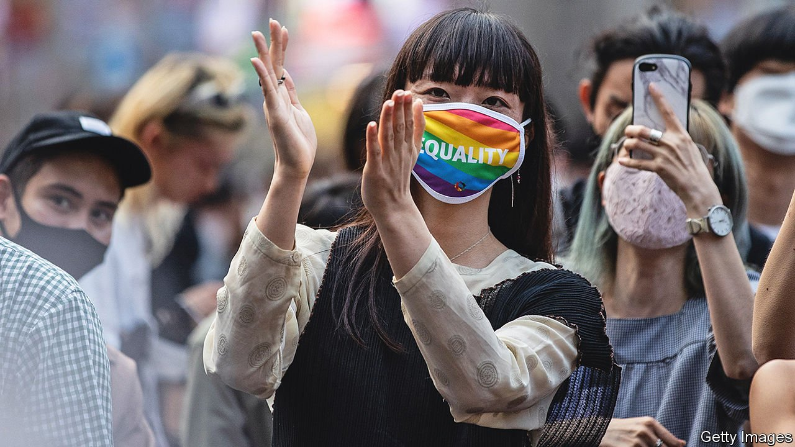

###### Some cause for pride

# Support for gay rights in Japan is gaining momentum 

##### But conservative politicians in the ruling party are blocking progress 

 

> Nov 18th 2021 

WHEN AIKO (not her real name) was at school nearly 20 years ago, her parents found a love letter another girl had written to her. “They cried a great deal,” she recalls. They told Aiko it was a phase and forbade her from going out at night. When she moved away to college, they told her not to come home if she was going to talk about her feelings. She feared a lonely life.

Japan has yet to legalise gay marriage, leaving it out of step with all other G7 countries and even a former colony, Taiwan, which did so in 2019. The OECD, a club mostly of rich countries, ranks Japan ahead only of Turkey among its 38 members for legal protections for LGBT rights. Activists looked to the Tokyo Olympics to spur change—the Olympic charter, after all, forbids discrimination of any kind.


Yet a relatively tame bill declaring discrimination against LGBT individuals “unacceptable” faltered in the spring. Over the summer conservatives in the ruling Liberal Democratic Party (LDP) blocked even a watered-down version which pledged to “promote understanding of LGBT people”. One LDP legislator reportedly said that gay and transgender people “go against the preservation of the species”. Two candidates in the race this autumn to lead the LDP (and become prime minister) expressed openness to same-sex marriage, but the party chose Kishida Fumio, who opposes it.

For all the LDP’s backwardness, attitudes have shifted drastically in recent years: today some 65% of Japanese approve of same-sex marriage, up from around 40% in 2015. Even a majority of LDP supporters are now in favour. Pride parades in Japan once struggled to draw crowds; now they have corporate sponsors. Since 2015 some 130 municipalities representing over 40% of the population have introduced systems to recognise same-sex partnerships. This March, in an important symbolic victory for Aiko and her partner of 14 years, a district court in Sapporo declared the prohibition on gay marriage unconstitutional. Judgments in similar cases in four other cities are due this year or next.

For much of Japanese history, sexual and gender mores were more fluid. Samurai were known to take younger male lovers. Traditional Japanese theatre, from noh to kabuki, features cross-dressing performers; shunga, a genre of erotic woodblock prints, teems with all manner of sexuality. Anti-gay sentiment is in contrast a relatively modern import from the West.

But it has become a strong social convention, making life hard for those who do not conform. In workplaces, colleagues make demeaning jokes. Like many gay and transgender Japanese, Aiko's partner has not come out to her colleagues. In schools, gay children are often bullied. When Aiko and her partner bought an apartment last year, they could not find a bank to issue a mortgage to same-sex partners.

Yet several forces favour change. Support for same-sex marriage is very strong among Japanese in their 20s and 30s; more than 80% back it. Kawaguchi Kazuya of Hiroshima Shudo University says that portrayals of gay life on Japanese television and film have shifted from erotic, seedy dramas in the early 1990s to more “wholesome” images, as epitomised by a hit comedy series about a gay couple, “Kino nani tabeta?” (“What did you eat yesterday?”). More Japanese firms now see protecting LGBT rights as a step that will “enhance, not reduce economic power”, says Yanagisawa Masa of Goldman Sachs in Japan.

Finally, progress elsewhere—especially in Taiwan—is expanding the boundaries of the possible. Taiwanese activists’ use of courts to put pressure on legislators inspired the lawyers of Japan’s “Marriage for All” movement, says Takeharu Kato, who represented Aiko in Sapporo.

Although local courts cannot force a change in national laws, “we hope the local verdicts will push the Diet,” says Mr Takeharu. If it does not act, the lawyers plan to appeal up to the Supreme Court, which could eventually force the Diet to legislate. In the meantime, the verdicts offer symbolic succour. Hearing the court declare the prohibition on gay marriage unconstitutional was “almost like a dream for me”, Aiko says. The case even helped sway her parents. Now, she says, “they want me to be able to be happy and to die happy”. ■

