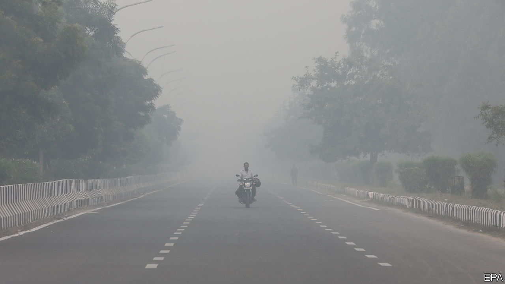
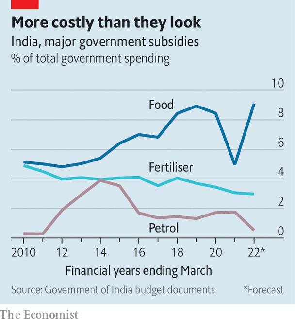

###### Hooked on handouts

# The Indian government’s addiction to subsidies has dire effects 

##### Delhi’s poisonous air is just one of them 

 

> Nov 18th 2021 

BACK AT SCHOOL this month for the first time since early last year, Delhi’s children are locked out again, but not by covid-19. Delhi’s air is so filthy that on November 13th the government decreed an indefinite closure. One rarely mentioned reason for the pollution also plays a part in a host of other troubles: subsidies. Despite endless warnings about moral hazard and distorted markets, politicians and bureaucrats keep creating them.

Delhi’s bad air in November is one result. Farmers hurry to clear the rice harvest before planting spring wheat, burning off stubble in a vast pall of acrid smoke. Rice uses a lot of water, and the region around Delhi is fairly dry, but decades ago the government began paying fat prices to push rice-growing. It also subsidised wheat, fertiliser and diesel to fuel water pumps.


So farmers pumped ever more water to grow ever more wheat and rice. With some 9m pumps, parched India now uses more groundwater than America and China combined, and holds far bigger grain stocks than it needs. Diesel’s low price also encouraged carmakers to switch to the fuel and drivers to buy it, adding yet more carcinogenic soot to Delhi’s toxic air.

 


Farm subsidies—amounting to some $48bn a year if government waivers on bank loans are included—skew spending away from such things as education and public health. They have also created dangerous dependence. Last year tens of thousands of farmers besieged Delhi for months, angered by reforms they thought might lead to a reduction in handouts.

Other subsidies, too, show how good intentions pave dangerous roads. Those for electricity make power more affordable, but leave the distribution network underfunded. Only 77% of electricity is paid for, piling up debts reckoned in 2019 at around $57bn. To compensate, commercial consumers pay up to four times more for power, helping make Indian manufacturers uncompetitive. Similarly, Indian Railways can afford government-imposed low passenger fares only by raising the cost of freight. It relies on shunting coal from forest-devouring strip mines to smoke-belching power plants.

Subsidies can also bring international obloquy. A World Trade Organisation (WTO) agreement required India to phase out varied export-promotion subsidies by 2016. Instead the country ramped up several programmes, earning in 2019 a sharp reprimand from the WTO. It was chastised again this year, this time for concealing subsidies for agricultural exports.

The WTO might be more sympathetic if it were to study a typical Indian election campaign, where parties vie to offer ever-higher handouts. The current government started off in 2014 insisting it would slash subsidies, and compressed a multiplicity of government schemes into just 40 main ones (not counting various hidden handouts and cross-subsidies). But it still spends more on subsidies than on defence, and has added new beneficiaries. During the worst of the covid slump, many economists counselled boosting demand by giving cash to the hardest hit. The government’s biggest initiative instead propped up manufacturers, encouraging them to invest where bureaucrats think they should by offering “production-linked incentives” to make things like solar panels. In other words, it offered subsidies. ■

