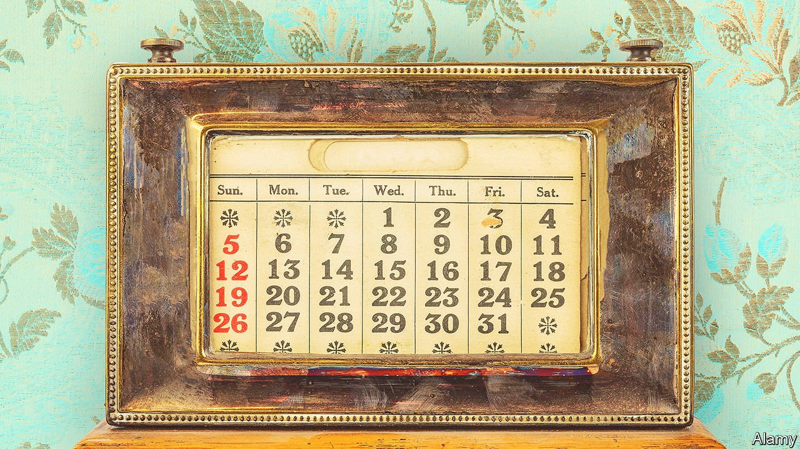

###### Marking time

# How the seven-day week came to rule the world 

##### A new book shows how modern cities embraced the weekly rhythm 

 

> Nov 20th 2021 

The Week. By David Henkin. Yale University Press; 288 pages; $30 and £20

IN THE AUTUMN of 1853 Thomas Butler Gunn got lost—temporally rather than physically. On a visit to Mammoth Cave in Kentucky, and isolated from the outside world, his diary quickly slipped the moorings of chronological reality. Wednesdays are repeated and days go mislabelled. It took around a fortnight, and renewed contact with civilisation, for Gunn to restore his weekly bearings.


The episode, says David Henkin, suggests how fragile a sense of time can be—especially when it comes to weeks. Unlike months or years, these seven-day groupings have no real basis in astronomy. People from Nigeria to China have thrived without them. And yet the week has become the measure not only of routine, but even of sanity. “Weekly rhythms have become so thoroughly absorbed into ordinary human experience”, Mr Henkin writes, “that forgetting what day it is constitutes a singular symptom and feeling of disorientation.”

His new book shows how the week came to rule the world. Until the 19th century, he explains, the other days were a preamble to the Sabbath for many Protestants. Catholics followed a cycle of feast days and fasts. When newspapers, factory schedules and weekly paydays were all rarer, the weekly structure was less important. People got muddled, not just underground. As late as 1866, the Louisville Courier mentioned a man getting drunk on Friday because he thought it was Saturday.

In outline, the story is one of urban development. As towns grew and society became more sophisticated, citizens “became differently and more intensely week-oriented, in ways we can now recognise as modern”. When his local benevolent society met on Wednesdays in 1859, and choral concerts were scheduled for Fridays, James Fiske of Massachusetts couldn’t afford to mix up his days. When Every Saturday magazine landed in New York each weekend in 1866, Bayard Taylor was expecting it.

Later anecdotes illustrate the “distinctive air” that individual days came to develop—the particular associations each subliminally carries. Philadelphians once used chains to block horse traffic on Sundays. The advent of washing machines disrupted the weekly cleaning schedule. In due course Westerners exported these feelings to the world. Japan formally adopted the seven-day system only in 1873; all the same, a character in a novel by Haruki Murakami is as sure of something “as I am that today is Wednesday”.

That sort of conviction is now crumbling. French and Russian revolutionaries ultimately failed in their attempts to abolish the seven-day week, but for many people the pandemic has squashed the weekly rhythm into an interminable present. Monday, runs the joke, has been replaced by Noneday. As Netflix offers entertainment on a whim, and morning newspapers become obsolete, Mr Henkin argues that “the hold of the week on our lives loosens, and our place in the cycle becomes in turn less memorable.” Everyone may soon start to feel a bit like Thomas Butler Gunn.

