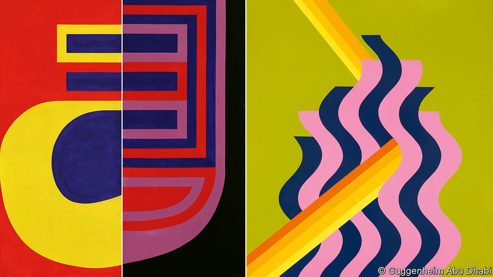

###### Brave new worlds

# The travails and bold aims of the Guggenheim Abu Dhabi 

##### It intends to retell the story of modernism 

 

> Nov 20th 2021 

THE JAGGED towers and palm-fringed walkways of the proposed Guggenheim Abu Dhabi (GAD) take their inspiration from the wooden sailing dhows that ply the waters of the Gulf and the funnel-shaped wind towers, known as barjeel, built to bring natural ventilation into old houses in the United Arab Emirates (UAE). Designed by Frank Gehry, the project has been beset by protests over workers’ conditions and other human-rights issues, and by finance-induced delays and cancelled contracts. Now, ten years after clearance of the site began, work has restarted at last.

The museum is part of a long-term, state-funded effort to diversify Abu Dhabi’s economy. Culture—and especially museums—are part of the push. The Guggenheim will be the third to be built on Saadiyat Island, a flat sandy triangle just off the coast that will be the biggest cultural infrastructure project between Marrakech and Shanghai. The first museum, Jean Nouvel’s Louvre Abu Dhabi, opened in 2017; the Sheikh Zayed National Museum, designed by Sir Norman Foster and named after the UAE’S founding ruler, will follow in 2023. The hope is for GAD to open in 2025.


“It’s like walking through a really great Minecraft setting,” says a curator of the computerised mock-ups of galleries that GAD has developed. But though the building is still imaginary, the collection—about 600 artworks from 60 countries, of which half have been acquired in the past four years—is real. And the mission is clear: to present a journey through global art from the 1960s to the present, and in so doing rewrite the story of modernism.

Modernism, and especially abstract expressionism, was at the heart of Solomon Guggenheim’s original collection. On his death in 1949, the businessman left hundreds of works by American and European artists, such as Vasily Kandinsky and Laszlo Moholy-Nagy, to the museum in New York that bears his name (and which will earn $100m for advice on construction and acquisitions for its latest offshoot). But there were many modernisms, not just the Euro-American kind. “Around the world,” says Dana Chehayeb of Abu Dhabi’s department of culture, “artists were asking ‘How can I be modern without being Western?’ And artists in the West often asked, ‘How can I draw from non-Western and premodern sources to make art more universal?’”

Inspired by the UAE’s history and position as a pivot between Europe and Asia, GAD aims to chart modernism’s evolution into a nuanced global movement. Alexandra Munroe, the curator of Asian art at the Guggenheim in New York, is central to that effort. She persuaded Guy Ullens, a Dutch collector of Chinese contemporary art, to give GAD first choice from his art trove before he consigned it for sale at Sotheby’s in 2011. The embryonic museum acquired pieces by Ai Weiwei and Huang Yong Ping, work by early Chinese video artists and some political pop art which could never be shown in China—such as “The Last Banquet” (1989), Zhang Hongtu’s panorama about the deification of Mao Zedong. “It was a real coup,” effuses Ms Munroe.

As well as art from China, GAD is building up a collection from Japan’s radical Gutai movement, which in the 1950s rejected traditional styles in favour of large multimedia works and the immediacy of performance. Both approaches would later become popular everywhere. Another focus is Latin American modernism, such as the geometric abstraction of Gego and Jesús Rafael Soto, both Venezuelan, and Carmen Herrera (originally from Cuba). The Neo-Concrete movement in Brazil, meanwhile, brought together Lygia Clark, Lygia Pape and Hélio Oiticica, stars of the country’s art in the 1950s. Their folded or curved sculptures were meant to make abstract expressionism more human.

Like many of the Asian and Latin American artists who feature in the new collection, several from Iran and the Arab world studied in Europe in the mid-20th century, afterwards creating modernist hubs in their home countries. Mohamed Melehi and Mohamed Chabâa of the Casablanca School, for instance, studied in Rome in the early 1960s and, with their compatriot Farid Belkahia, developed links to the Bauhaus school of design. Returning to Morocco, they strove to combine the modernist influence of European artists, such as Paul Klee and Nicolas de Staël, with an abstraction indebted to the geometric patterns of Berber carpets and the use of henna and walnut to stain leatherwork.

Parviz Tanavoli, who also studied in Italy, is the central figure of another modernist movement, known as Saqqakhaneh or Iranian Pop. Fascinated by locksmithing and calligraphy, Mr Tanavoli is best-known for metal sculptures that use the three letters in the word heech, Farsi for “nothing”. They are inspired by Alexander Calder and Barbara Hepworth, but also by the symbolic metal locks often attached to Iranian drinking fountains. Such work has generally been exhibited in artistic silos, in shows based on geography rather than form and ideas. The aim at GAD is to draw out overlooked connections, such as between Mr Tanavoli and his contemporary On Kawara, a Japanese conceptual artist who created an important series of paintings based on dates in the calendar.

Officials hope that Saadiyat Island will be a big employer. Despite the ongoing human-rights concerns, it is already a tourist draw—one reason why 11.35m people visited Abu Dhabi in 2019, more than double the number who came in 2016. The emphasis on culture is meant to distinguish the emirate from the shopping malls and glitz of Dubai, an hour down the road. When at last GAD opens, it will offer an encounter with a scintillating range of artists and fresh ways of seeing the world. Viewers will emerge with a rebalanced sense of art’s tumultuous recent history. ■

