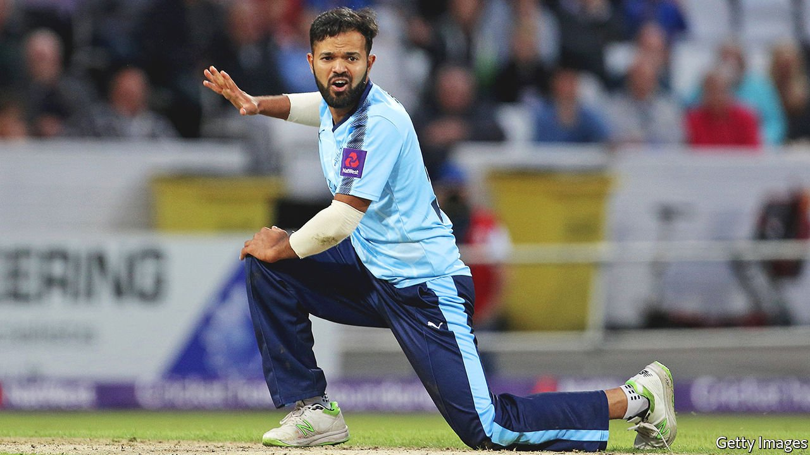

###### Just not cricket

# Azeem Rafiq claims anti-Asian abuse is widespread in English cricket 

##### Allegations made to a parliamentary committee may spark a wider reckoning 

 

> Nov 20th 2021 

IN MARCH A government report concluded that institutional racism was not a significant issue in Britain. But evidence heard by a parliamentary committee on November 16th suggested that such complacency was misplaced.

Azeem Rafiq, an English cricketer of Pakistani origin who played on and off for a decade for Yorkshire, a leading county side, had alleged in interviews and an employment-discrimination claim that racial taunts and bullying had driven him close to suicide. An investigation for Yorkshire conceded that he had been a “victim of racial harassment” but nothing more systematic. It imposed sanctions on no one. Mr Rafiq’s evidence to parliamentarians broadened this long-running county row into something that may implicate senior sports administrators and the national team.


Mr Rafiq, a practising Muslim, said that at his local club when he was a teenager, he had been pinned down by a teammate and had wine poured into his mouth. He claimed that after he joined Yorkshire Michael Vaughan, a former England captain, said of the county’s Asian players that there were “too many of you lot”. (Mr Vaughan denies this.) A former teammate and England batsman, he said, had called all Asian players Steve and black players Kevin because their names were too hard to pronounce.

When Mr Rafiq’s wife gave birth to a stillborn son, he told the committee, the club’s head coach suggested that he was making too big a deal of it. Other allegations included that some of his teammates had referred to players of Asian descent as “elephant washers” and frequently used the derisive moniker “Paki”. That word, the club report decided, had been “in the spirit of friendly banter”.

Mr Rafiq thinks such behaviour is common across cricket and part of the reason that few Britons of South Asian origin play the sport at high levels. They account for around 30% of recreational and club players, but just 4% of the professionals who turn out for county sides. Others point out that the sport brings together posh white boys from private schools and working-class South Asians, providing occasion for displays of arrogance, and clashes over heavy drinking and wild nights out. “Sledging”—taunting intended to distract a batsman—is common and sometimes crosses into abuse. It may contribute to a culture in which offensive remarks are normalised.

Yorkshire seems to have been shaken out of its complacency: its new chairman has apologised to Mr Rafiq and said the charge of institutional racism would be addressed “head-on”. The bigger question is whether this is an isolated example of crass, outdated attitudes coming up against modern sensibilities or something more widespread. An independent commission on racism in cricket set up in March has received more than 1,000 calls since a request for evidence on November 9th. The “floodgates” would now open, Mr Rafiq predicted. This reckoning is likely to have consequences both on and off the field.

