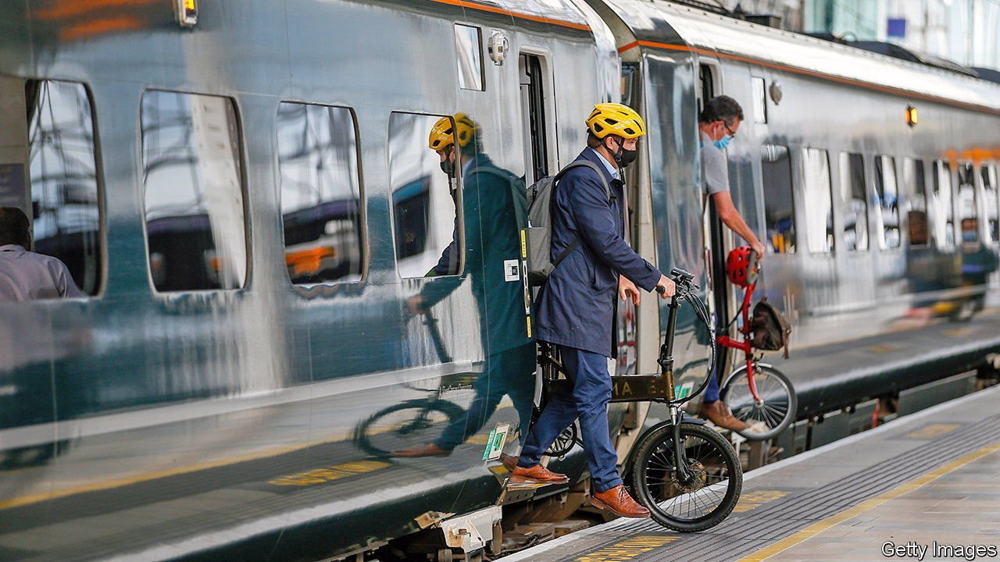
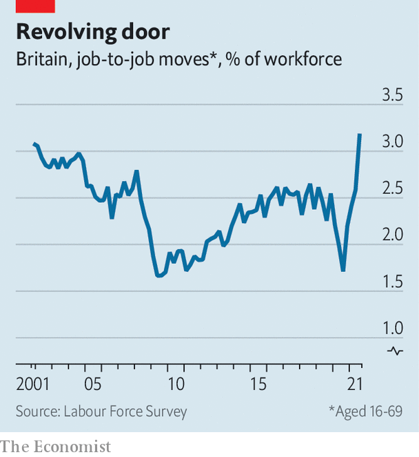

###### All change

# Britain’s economy does not lack oomph, but productivity is lagging 

##### Post-furlough labour-market data offers grounds for hope, but more investment is needed 

 

> Nov 20th 2021 

WONKS SPENT months worried about the thousands of British workers sent home during the pandemic, who then lingered on the government’s furlough scheme. Were they simply being strung along by employers, to be discarded once it ended on September 30th? On November 16th the first batch of post-furlough labour-market data offered reassurance. The number of payrolled employees (that is, excluding the self-employed) grew by 0.6% in October compared with the previous month. The economy will need that dynamism as it adjusts to Brexit, covid-19, climate change—and more besides.

 


A big employment reshuffle is clearly under way in Britain, which is good news for growth if people move into roles they are better suited for. The share of workers switching jobs rose to a record high of 3.2% in the third quarter of the year (see chart). Encouragingly, this was mostly driven by people resigning rather than being dismissed. Fabrice Montagné and Abbas Khan of Barclays, a bank, note that this mobility was broad-based, having now spread beyond people with highly skilled jobs.


Other measures of dynamism are looking up, too. Joint research from the Centre for Economic Performance and the Resolution Foundation, two think-tanks, analyses the Decision Maker Panel, a survey of British companies. It suggests that financial officers expect the reallocation of workers from shrinking to growing companies (a measure of dynamism) to speed up in the coming year. A different business survey found that by July this year over 60% of companies had engaged in product innovation and nearly 70% had adopted new management practices. Since productivity increases when people and stuff are used more effectively, all this bodes well.

Britain’s productivity could certainly do with some added oomph. Before the crushing impact of covid-19 restrictions, it was languishing. Between 1995 and 2007 output per worker grew by around 2% a year, roughly matching the rate in the 25 richest members of the OECD. But during the next 12 years that figure for Britain was a dismal 0.4%, compared with an average of 0.9% among the rest.

Britain has long been known for outdated and ineffective management practices, so innovation here is a promising sign. As for labour dynamism, a back-of-the-envelope calculation from Juliana Oliveira-Cunha of the Centre for Economic Performance and her co-authors suggests that if just 4% of workers moved from the least productive companies to ones at the other end of the distribution, and those companies’ productivity remained unchanged, GDP could grow by a sizeable 6%. (They reject the commonly heard suggestion that improving Britain’s long tail of relatively unproductive firms would make a big difference, both by debunking the idea that this tail is indeed unusually long, or has grown in the past decade, and by pointing out that these firms are so unproductive that even large improvements would barely register at the level of the economy.)

As an explanation for Britain’s past productivity malaise, however, an insufficiently dynamic labour market cannot satisfy. Britain’s productivity has lagged behind that in other developed countries throughout recent decades, even as its companies created and destroyed jobs at a pretty steady rate relative to overall employment. Meanwhile, the rate of such creative destruction in France and America fell. Even as Britain’s productivity growth slowed between the 2000s and the 2010s, the researchers found that its economy actually became better at reallocating workers from less productive companies to more productive ones.

The researchers think that a surer path to a high-wage, high-productivity economy lies in raising investment. Between the public and private sectors, investment grew by less than1% in Britain over the five years to mid-2021, compared with an average of14% across France, Germany and America. Higher investment will be expensive in the short term, of course. But without it, sustained real wage increases are unlikely. For all the job-switching going on, underlying wage growth from July to September could be as low as 3.4% relative to the previous year. Meanwhile in October inflation reached 4.2%. Adapting to new challenges will require fixing the weaknesses in Britain’s economy, not merely playing to its strengths. ■

