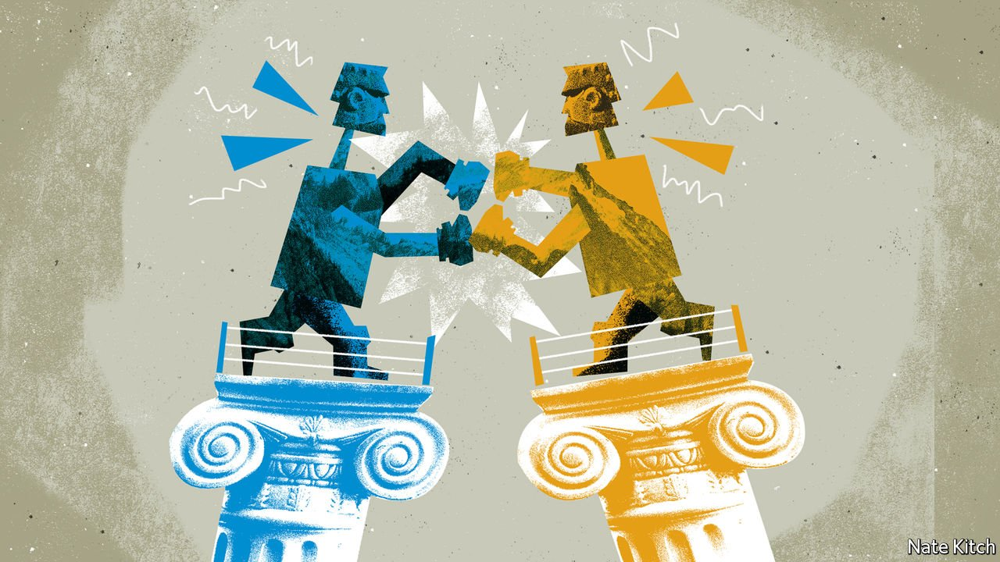

###### Bagehot

# Britain’s establishment has split into two, each convinced it is the underdog 

##### The result is extremism, and juvenile squabbling 

 

> Nov 20th 2021 

BORIS JOHNSON is under siege from all directions. Stories of “Tory sleaze” multiply. Constituencies in the north of England are furious about plans to scale back high-speed rail. Yet the prime minister nevertheless found time on November 15th to don white tie and tails and address the annual Lord Mayor’s banquet at the Guildhall in London. Packed with people far more powerful than mere politicians, it had all the hallmarks of an establishment affair. The proceedings were incomprehensible to outsiders; dullness and high theatre intermingled. Mr Johnson started by name-checking dignitaries: aldermen, sheriffs and the chief commoner (whose title was once rendered in Chinese as “head peasant”) and progressed to quantum computing and AstraZeneca vaccines.

Henry Fairlie, who coined the term “establishment” in 1955, argued that “the exercise of power in Britain…cannot be understood unless it is recognised that it is exercised socially”. Surveying the stately procession of sea-bass and grass-fed beef on Monday night (Monday night!) he would have been certain that nothing had changed. Yet the self-satisfied surface concealed a split. For Britain’s establishment is now not unitary, but divided—a pair of rival power centres, hostile and mutually uncomprehending.


One, centred on the Conservative Party, includes such vestiges of the old establishment as the armed forces and great public schools. It extends to public-relations firms, government contractors and right-wing newspapers. The City, once happy with New Labour, was pushed towards the Conservatives by Labour’s former far-left leader, Jeremy Corbyn. This establishment’s heartlands are the provinces, where small-business owners complain about their taxes and swap stories of political correctness gone mad.

The other power centre is progressive-liberal. It is less focused on a political party (though it loved New Labour) than on cultural institutions: the civil service, universities, publishing houses, the BBC, the Observer and Guardian newspapers, the arts bureaucracy and, increasingly, the legal profession. It is so metropolitan that the division between the two echoes the split between the Court and Country factions of the 17th and 18th centuries.

The Tory establishment believes in the primacy of the nation state; the liberal establishment in cosmopolitanism. This divide was both reflected in and reinforced by the struggle over Brexit. The Tory establishment believes in the primacy of the queen-in-parliament (much of Mr Johnson’s legislative agenda is motivated by a desire to undo New Labour’s constitutional fiddling); the liberal establishment in dividing power between lots of institutions. The Tory establishment sees British history as a treasure-house of achievements (David Cameron, Mr Johnson’s predecessor-but-one, said that Henrietta Marshall’s “Our Island Story”, published in 1905, was his favourite book as a child, and he often referred to it when calling for reforms of the history syllabus.) The liberal establishment believes that the “arc of history bends towards justice”, with justice defined as diversity, equity and inclusion.

The Tory establishment’s most irritating tendency is to justify its actions as the will of the people—as if the leading light of Tory philosophy was Jean-Jacques Rousseau rather than Edmund Burke. The liberal establishment, meanwhile, thinks it knows what is good for people. The Tories see the man in the pub as a fount of wisdom; liberals increasingly think he is a bigot.

Having two establishments is not all bad. Whichever is out of power can act as a counterweight to the government, helping to make up for Britain’s lack of constitutional checks and balances. Arguably, Britain is now politically healthier than during the early days of New Labour, when both government and cultural institutions sang from the same hymn-sheet.

But there are many disadvantages, among them institutionalised irresponsibility. For both elites refuse to acknowledge that that is what they are, seeing themselves rather as heroic rebels. Mr Johnson (educated at Eton and Balliol) thinks of himself as leader of an army of revolutionaries against what he calls “the blob”—that is, civil servants and anyone else who seeks to frustrate his will. Panjandrums of the liberal elite, such as heads of Oxford colleges, an astonishing number of them cast-offs from the civil service and BBC rather than distinguished scholars, regard themselves as freedom-fighters against a dictatorial government.

Another disadvantage is the triumph of extremism. You can’t get into the Tory establishment without endorsing Brexit, or the liberal establishment without lauding diversity. Thus the Tories have lost moderates such as Rory Stewart, a former diplomat and candidate for the party leadership. The liberals have exiled heterodox thinkers such as Kathleen Stock, a philosopher who questions liberal pieties about trans identities, and who recently left Sussex University after harassment by students and colleagues.

Power without responsibility

Yet another drawback is a weird combination of blame-shifting and tail-pulling. The government is adept at pinning crises on civil servants—hence the unusually high number of permanent secretaries to resign since the election of 2019. The liberal establishment attributes everything bad to Tory cuts. The Tory establishment delights in foisting hard-core Brexiteers on the liberal establishment—hence the attempt to install Paul Dacre, former editor of the Daily Mail, as chair of Ofcom, the broadcasting regulator. The liberal establishment is never happier than when casting the other side as woman-hating racists, even though the Conservative Party has produced two female prime ministers and Labour none, and the cabinet is filled with members of ethnic minorities.

The great virtue of Fairlie’s old establishment was that, for all its pompousness, it brought an adult seriousness to British life. Its twin successors, by contrast, are addicted to juvenile squabbling. That would be bad at the best of times. When the country faces such severe problems, it may prove catastrophic. ■

For more coverage of matters relating to Brexit, visit our 

