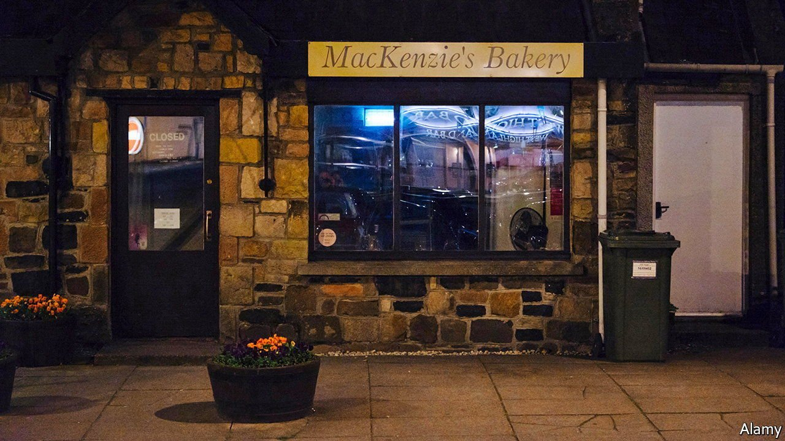
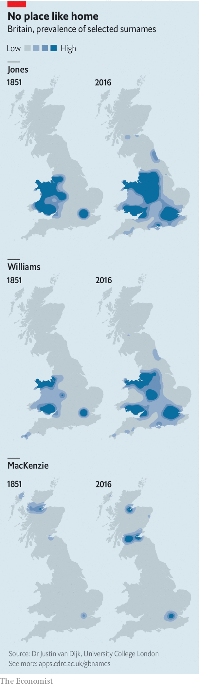

###### Social mobility

# Britain’s inequalities are spelt out in its surnames 

##### Shapley, Evershed and Charter are among the most fortunate 

 

> Nov 18th 2021 

“AM SURPRISED TO realise that anybody ever goes to, lives at, or comes from, Norwich,” wrote the novelist E.M. Delafield in 1930. The town is not Britain’s only one to find that its charms elude outsiders. There are also Slough (John Betjeman invited “friendly bombs” to fall on it), Hull (“a dump”, said Philip Larkin) and Bromley (“suburb of the damndest”, according to H.G. Wells). These opinions are abrasive, but hint at an abiding mystery. The world is our oyster. And yet people happily spend their lives in such unremarkable places.

New research suggests a simple reason. “Most people don’t move,” says Paul Longley, a geographer at University College London. By combining census records since 1851 with other data sources, such as electoral rolls, he and colleagues have plotted 40,000 British surnames to show how they have moved in 150-odd years. Mostly, they haven’t. “The vast majority of family names are…concentrated around the locales in which they were first coined between the 12th and 14th centuries,” they write in Nature Communications, a journal.

 


An online time-lapse tool animates this information (see maps for some snapshots). Regional names tend to remain in the regions, apart from some spread to London and the nearest big city. Wales remains crowded with Williamses and Scotland with MacKenzies. The Joneses are easy to keep up with as they gently ooze across the Midlands.


This probably seems surprising if you work in or visit London, where a single meeting may contain people from all over not only Britain, but the world. Moreover, the English middle classes have all but institutionalised migration through universities and, for the richest, boarding schools. But their experiences are atypical. For most people, says Mr Longley, “migration is a traumatic experience and is not undertaken lightly”.

Surnames are linked to social as well as geographical horizons. The researchers scored them on an index of multiple deprivation, from 1 (worst) to 100 (best). If Britain were perfectly socially mobile they would cluster around 50, with a little random variation; in fact, some do markedly better and others worse. Among the hundred most fortunate are Shapley, Evershed and Charter, which would sound at home in a Dickensian law firm. The bottom 100 includes Ram, Scamp and Pincher, any of which Dickens might have used for a street urchin.

Mr Longley also rated places in a similar manner. The bottom 100 included Wigan, Liverpool and Coventry; the top Cheltenham, Harrogate and, despite H.G. Wells’s disdain, Bromley. In Britain family, geography and destiny intertwine in an intricate dance—one that spans centuries.

