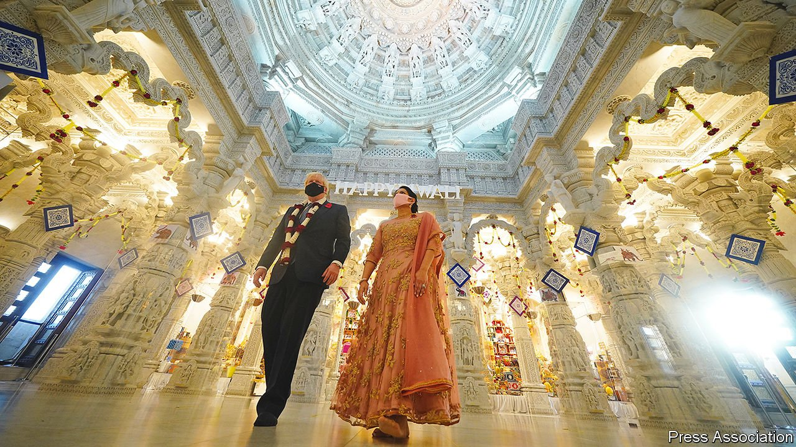

###### Blue light

# British Indians are emerging as an important group of swing voters 

##### But domestic issues trump foreign affairs 

 

> Nov 18th 2021 

“I HAVE BEEN here many times,” declared Boris Johnson as he and Priti Patel, the home secretary, toured a Hindu temple in north London (pictured) on November 7th to mark Diwali. And indeed so: he had last dropped in days before the election of 2019. His predecessors, Theresa May and David Cameron, visited too.

Such trips reflect not only the goodwill that leaders extend to many faith groups, but also the growing potential for the Tories to scoop up support from British-Indian voters. The Labour Party still enjoys a ten-percentage-point lead over them among British Indians, who also prefer Sir Keir Starmer, Labour’s leader, to Mr Johnson. But Labour’s historical advantage has eroded, while support for the Tories has remained stable. The result, according to a study published on November 18th by the Carnegie Endowment for International Peace and Johns Hopkins School of Advanced International Studies, is a growing pool of British Indians who are undecided or aligned to third parties.


These swing voters are in theory ripe for wooing. But they are not a homogeneous bloc. Moreover, much of the received wisdom in Westminster about what makes them tick is based in stereotypes.

The Indian diaspora fragments according to age and class. Younger British Indians lean most heavily to Labour, as do the poorer and those without degrees. The older, wealthier and better-educated are more inclined to vote Tory. There is also a cohort effect, with an earlier generation of immigrants and their children more likely to vote Labour, and more recent arrivals to vote Tory. That might reflect differences in political attitudes between those who grew up under the social-democratic government of Jawaharlal Nehru, India’s first prime minister, and those conditioned by Narendra Modi’s right-wing administration, speculates Devesh Kapur, a co-author of the study. But religion is the most important fissure. Support for the Tories is far higher among Hindus and Christians than among Muslims or Sikhs.

One common misconception is that the Tories’ appeal relies on recruiting more MPs of Indian descent, such as Ms Patel and Rishi Sunak, the chancellor. Such diversity is good in itself. Yet the study found “large levels of indifference” among British Indians to the ethnic composition of the Cabinet, with only around a quarter of them saying it made them look more favourably on the Tories.

Another misconception is that foreign policy is decisive. Many Tory MPs embraced the argument that Brexit would allow Britain to prioritise its former imperial assets over the European continent. Ms Patel once promised a post-Brexit migration regime to “save our curry houses”. Yet Brexit has limited appeal for British Indians, with two-thirds of those who voted now reporting that they opposed the divorce.

Mr Johnson is seeking a trade agreement with India. But if there are votes for the Tories among the Indian diaspora, they will not be found by cosying up to Mr Modi’s government, which is approved of by only one in five respondents. Those British Indians who did support Brexit were far more likely to cite restoring Britain’s lawmaking powers than striking a trade deal with New Delhi. On the whole, British Indians seem not to dwell much on which politicians would best serve Anglo-Indian relations: 31% say there is no difference between the parties and another 31% say they don’t know.

The final myth is that British-Indian values are an unusually good fit for the Tories, representing hard work, enterprise and family. Many British Indians do value these things, as do their neighbours. Yet asked to place themselves on a seven-point ideological scale, ranging from “extremely liberal” to “extremely conservative”, British Indians skew to the liberal end.

What does move their votes? The economy, health care and climate change were respondents’ top priorities—the very things that other polls suggest preoccupy the rest of Britain. It is no surprise that bread-and-butter issues come first among immigrant communities, says Mr Kapur, since people move to improve their daily lives. Cultural identity supposedly matters increasingly in politics. But sometimes it’s best to stick to the basics. ■

