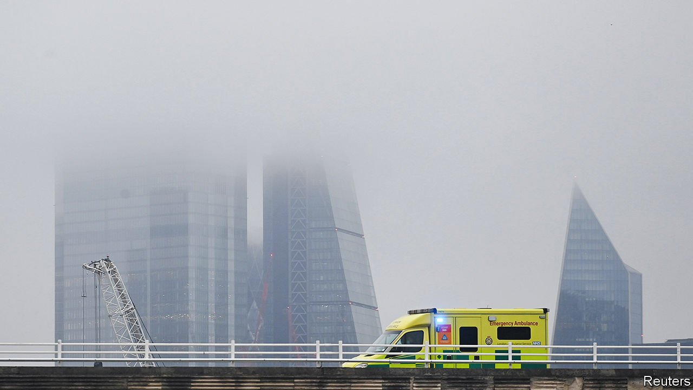
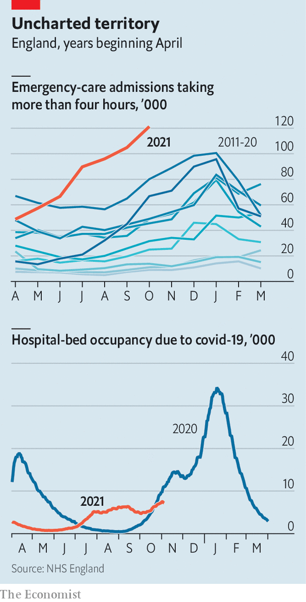

###### Emergency care

# The NHS faces a bleak winter 

##### Hospitals are in a dire state—and temperatures are only just starting to drop 

 

> Nov 20th 2021 

HOW MUCH is the local Amazon warehouse paying? Raina Summerson used to ask that question a couple of times a year. Now her firm checks most weeks, such is the competition for workers. In parts of the country she has raised pay at Agincare, the care provider she runs, to £11 ($15) an hour from around £9.50 before covid-19 struck. Even so carers are scarce: “We are turning away work every day in every one of our locations.”

That is bad for business—and for the health service, the source of much of that work. With hospitals unable to free beds because of a lack of carers, patients ready for discharge are piling up, crowding out new admissions. In October, across England, nearly 120,000 people spent more than four hours waiting to be admitted. Even in the worst winters, waits have never been so long (see chart).


Outside the wards are ambulances trying to discharge patients and unable to pick up fresh ones. The average wait for a “category two” incident (concerning a serious condition such as a stroke, chest pain or burn) is 54 minutes, up from an average of 25 last year and missing a target of 18. Research shows longer waits are associated with more deaths. The West Midlands ambulance service has warned delays are putting patients at risk of “catastrophic” harm.

 


Pressure is ratcheting up almost everywhere, says Chris Hopson of NHS Providers, which represents hospitals. After nearly two years in which people have tried to stay away from health-care facilities, patient demand is now higher than it was before the pandemic. More primary-care appointments are by phone, which tends to mean more referrals. Patients presenting for acute care, meanwhile, are sicker, suggesting that the wait for treatment has taken a toll on their health.

Fewer than 9,000 people are in hospital with covid, down from more than 34,000 in January. But that is still a lot, and infection controls further reduce the number of beds available. “We’ve stopped using areas that were unsuitable even before the pandemic,” says an emergency doctor. According to Mr Hopson, the combination of covid, anti-infection measures and the difficulty of discharging patients has cut the number of beds available by a third.

What particularly worries hospital bosses is how early in the year this crunch has come. The normal pattern is for problems to mount until January, and sometimes longer. Having declined for three weeks, covid cases are now ticking back up, meaning those with the disease will continue to take up space. And anti-covid measures are making recruitment more difficult. Ms Summerson lost 20 of her 1,100 care-home workers because of a national vaccine mandate which came into effect on November 11th.

Winter is tough in health-care systems everywhere. That the taxpayer-funded NHS falls into a “crisis” every year—and is suffering so early in this one—reflects how little slack it has. It runs on relatively low numbers of doctors and nurses. In Europe, only Sweden has fewer beds per person than Britain does. Other rich countries with small numbers of beds also tend to have more “step-down” care, so people do not linger in hospital.

Policymakers have long sought to divert patients away from accident-and-emergency departments. The latest attempt is a health and care bill making its way through Parliament, which the government promises will move “services out of hospitals and into the community”. Yet two decades of attempts to do just that have so far had little success, notes Nigel Edwards of the Nuffield Trust, a think-tank. That is both because preventive health care is inherently difficult and because of hospitals’ dominance within the NHS.

Even if this attempt succeeds, it will take time to bear fruit. Spending on health care is set to rise by 4% a year for the next three years, which will ease pressures, but not immediately. The decision on November 15th to offer covid boosters to over-40s will help, but will not make a big dent in patient numbers. It is already too late to meet many of the goals in the NHS’s emergency-care “recovery” plan, published in September (“patients should not be left waiting in ambulances for handover to emergency departments,” for instance).

A spoonful of sugar

Sajid Javid, the health secretary, is establishing a “delivery unit” under the guidance of Sir Michael Barber, who set up the original one for Tony Blair in the 2000s and another for Boris Johnson that works on a wide range of policies. The new unit will include 30-odd people from the health department, NHS and outside government, and will scrutinise health-care data in an attempt to cut surgical waiting lists. This focus on waiting times for operations could, however, fall victim to deteriorations in emergency care, which will suck up hospital beds and attention.

All this is a problem for a government that has done a great deal to tie its fortunes to those of the health service. Before the general election in 2019, Mr Johnson toured hospitals vowing more nurses, equipment and cash (as he also did before the Brexit referendum). Having now raised taxes in order to increase spending on the health service, even more rides on its performance improving. Until it does ministers must hope, as one Conservative politician puts it, that “people are quite used to NHS war stories”. Yet the coming months may bring enough casualties to shock even hardened observers. ■

