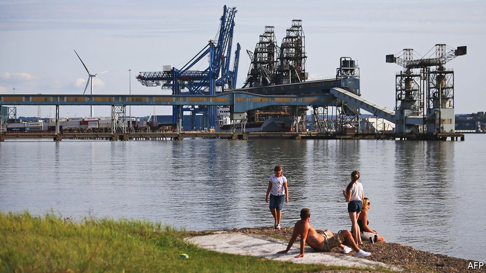

###### On the dock

# The government wants to ensure that tax breaks for freeports aren’t wasted 

##### That makes them more complicated and potentially less fair 

 

> Nov 20th 2021 

ENTER THE port of Tilbury and you will see heaped-up building materials, imported, processed and waiting to be carted to construction sites. With London nearby and a pandemic-related increase in demand for home extensions, business is booming—or rather, beeping, as vehicles lift and pile containers into stacks. Things quieten as you go east to land that is part of Thames Freeport, one of eight experiments in boosting deprived areas. The hope is that when generous tax breaks become available for new investors on November 19th, the hubbub will spread.

More than 5,000 tax-advantaged zones are dotted around the world, with varying incentives and eligibility rules. Britain’s freeports will offer simpler customs procedures as well as relief from stamp duty, employer payroll taxes, business rates and corporation tax. Politicians hope all this will support innovation, trade and, in the inequality-slaying phrase of the moment, “levelling up”. A report in 2016 by Rishi Sunak, then a backbencher and now the chancellor, claimed that if Britain replicated America’s success with its free-trade zones, it could create 86,000 jobs.


It is easy to scoff at such boosterism. Mr Sunak counted all jobs within any American free-trade zone as created by its existence—a heroic assumption, since pre-existing factories can apply for special status. More generally, sceptics point to three risks. What if businesses stay away? What if any new activity would have happened anyway? And what if the sites suck investment from places even more in need? Some of these are in tension; if no one invests, freeports will not cost the exchequer much. But common to all is the idea that they will fail to encourage new activity.

 


Britain’s experiences with place-based policies have been disappointing. Last month the Office for Budget Responsibility (OBR), a government watchdog, pointed out that an older policy of enterprise zones, which offered tax breaks for investors in struggling places, cost around a quarter as much as expected, which suggests that it had “smaller impacts than initially hoped”. An evaluation by the Centre for Cities, a think-tank, found that the jobs created were overwhelmingly done by people with low skills. Drawing on international evidence, the OBR assumed that freeports would mainly move economic activity around rather than stimulating it, and would cost the taxpayer around £50m ($67m) in the 2022-23 fiscal year.

Freeports offer a greater array of benefits than enterprise zones do. But British businesses can already defer tariff payments by parking goods in bonded warehouses, or escape them altogether for items that are processed and immediately re-exported through special customs arrangements. If freeports really make a difference, it will be because of tax breaks. Lewis Atter of KPMG, an advisory firm, says these could be worth 15-25% of the cost of constructing a new factory. LM Wind, a subsidiary of GE, made its investment in Teesside contingent on the area succeeding in its bid to be a freeport. Ben Houchen, the mayor of Tees valley, says talks are under way with around 30 other big, internationally footloose businesses. Although some sites need decontaminating and developing, Mr Atter says ground may be broken on some projects early in the new year.

The question, then, is how much of this activity would have happened anyway, either in freeports or elsewhere in Britain. In time Tilbury port would have expanded to serve the hungry London market. There are plans for education projects, both to develop locals’ skills and to persuade youngsters that working in logistics really is attractive. But the second of those sits uncomfortably with the notion that freeports will absorb labour that would otherwise have sat idle. And a cynic might point out that companies have every incentive to claim that their investments are contingent on tax benefits. LM Wind, for example, was already facing pressure to strengthen its British supply chain because of separate commitments to bring production onshore.

The government has come up with its own way of making sure that freeports do not merely pull in activity that would otherwise have happened elsewhere. Officials have spent recent months haggling with freeport operators over which sectors will be eligible for tax benefits. These vary from location to location. In theory, that means each can play to its strengths. Thames Freeport will specialise in logistics and advanced manufacturing (its site in Dagenham is linked to a big Ford engine plant). The industries favoured include chemicals processing, advanced manufacturing and low-carbon energy production. In the Wilton site of the Teesside freeport, chemicals processing will be eligible for the tax breaks. Low-carbon energy sources will be encouraged at the Teesworks site.

So far this micromanagement is pretty opaque, at least to potential investors, who must contact each freeport company or landowner to see whether their plans would qualify under the terms negotiated with the government. This may reduce the risk that freeports merely displace activity, at some cost to the public purse. But it does nothing to reduce the risk of a tax bung for investors who would have made investments anyway. And the more prescriptive freeports are about who qualifies, the greater the chance that genuinely new investment will be shut out.

Discrimination is the object of freeports, as the government tries to shepherd businesses into busy, efficient clusters. The hope is that any casualties will be overseas, in countries too slow or too stingy to match Britain’s competitive tax offering. But as word spreads of which sectors and companies are eligible and which not, businesses closer to home may conclude that the whole policy is simply unfair. ■

