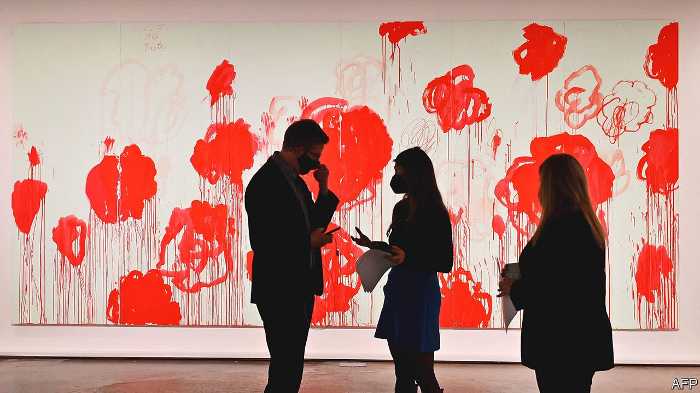

###### Monet, Manet, Money

# An auction at Sotheby’s raises $676m 

##### The art market is changing 

 

> Nov 20th 2021 

WHEN SOTHEBY’S raised the gavel on the season’s biggest art auction on November 15th the sellers, Harry and Linda Macklowe, did not arrive as one to watch the proceedings from the discreet skybox above the auction floor, as those disposing of a collection often do. The couple can hardly stand to be in the same room together. Their divorce, after nearly six decades of marriage, was so contentious that in 2018 a judge ordered them to sell 65 of their magnificent 20th-century artworks and split the proceeds.

Death, debt and divorce are the auction market’s traditional catalysts. Sotheby’s won this particular deal by guaranteeing the Macklowes at least $600m from the sale. At the time it was agreed such a fulsome promise, the biggest ever offered to a client by an auction house, seemed to hark back to a bullish age before covid-19 roiled the art market. But Sotheby’s panache was well judged: the evening brought in $676m including fees, to which the proceeds of a second auction in May will be added. For beyond the Macklowe sale, the art market is changing, in three important ways.


It started even before the pandemic. The takeover of Sotheby’s by Patrick Drahi, a French telecoms and cable entrepreneur, for $3.7bn in the summer of 2019 looked with hindsight like an error when covid struck nine months later. Lockdowns shuttered auctioneers and galleries the world over. Art collectors quickly decided that 2020 was a bad time to sell. The best-connected auction houses moved swiftly into trying to broker private deals; the more entrepreneurial bolstered online sales with digital auctions.

Mr Drahi’s commercial nous has brought new meaning to the famous art-market quip that Sotheby’s are “auctioneers trying to be gentlemen”, in contrast to Christie’s, a firm of “gentlemen trying to be auctioneers”. The tycoon, who took on well over $1bn of debt to finance the deal, now has access to details of the 300,000 or so richest people in the world. The new Sotheby’s is bent on selling them not just art, but handbags and history too.

His timing may prove prescient. Contemporary art, which accounts for the single biggest share of the art market, saw a record-breaking $2.7bn change hands during the year to June, according to Artprice, which tracks sales. Both Sotheby’s and Christie’s say they expect their sales in 2021 to match the $4.8bn and $5.8bn they respectively made in 2019.

In part that is because both the main auction houses are expanding beyond their conventional offering of art, watches and wine—the market’s first big shift. In 2020 Christie’s sold a dinosaur fossil named Stan for $31.8m. Earlier this year Sotheby’s auctioned Kanye West’s Yeezy trainers for $1.8m. Both firms have jumped into crypto-art, selling non-fungible tokens (NFTs) to techies. All of these have brought in new buyers, especially from Asia, the fastest-growing market. Of the top 20 lots auctioned by Sotheby’s last year, Asian clients bid on ten and bought nine.

A second new development is that the two houses are wooing new customers by making buying at auction more fun. Last month Sotheby’s organised a weekend jamboree in Las Vegas for 40 clients. The main business was the auction of $100m-worth of artworks by Picasso. But in an effort to turn the affair into more of an experience, Sotheby’s also laid on wine-tasting, a session on how to game an auction and a talk by Jay Leno about vintage cars. At the party after the sale, the DJ was Picasso’s great-grandson.

Going, going, gone

The most far-reaching shift, though, may be the auction houses’ new cosy relationship with commercial galleries and private dealers. Historically these were their great rivals. Galleries know where the art is and what their clients might be prepared to sell, but lack the access to buyers who flock to auction houses. Now the two work more closely together, to find the right buyer for a piece and vice versa.

When a Düsseldorf gallerist recently wanted to sell a Gerhard Richter from the 1970s, an under-appreciated period, he turned to Sotheby’s. The private sale to one of its clients was at a far better price than he would have got at auction or selling to one of his own collectors, he says. In April 2020, a month after the pandemic hit, Rafael Valls, an dealer in Old Masters in London, was able to sell nearly 100 pictures in an online Sotheby’s auction; in a normal year the gallery would sell around 200.

In a move that highlights this rapprochement between auction houses and dealers, Sotheby’s recently hired Noah Horowitz, a director of the Art Basel art fair who is known to be particularly close to galleries. “Sotheby’s is tearing up the traditional playbook,” says a rival. The marriage is partly one of financial convenience: galleries lack the pools of capital big auction houses deploy to offer guarantees and thus lure potential sellers. Teaming up with dealers helps auctioneers find works to sell, which is almost as hard for them as identifying the next generation of buyers.

Sotheby’s and Christie’s hope their new approach will help both sides of the trade. When Christie’s sold its first piece of crypto-art earlier this year, its boss Guillaume Cerutti points out, almost all of the 33 bidders were new to the firm. A few days later one of those who had been outbid, a 31-year-old Chinese-American tech entrepreneur named Justin Sun, went on to buy a $20m Picasso—and, in the Macklowe sale, a Giacometti sculpture for $78m. ■


