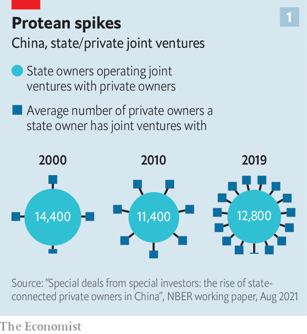

###### The Party capitalists

# China’s communist authorities are tightening their grip on the private sector 

##### Its growth model is at risk 

 

> Nov 18th 2021 

IT MIGHT just be confused for one of the world’s savviest tech investors. China Internet Investment Fund’s (CIIF) portfolio is the envy of venture capitalists everywhere. It owns part of a subsidiary of ByteDance, the Beijing-based parent of social-media group TikTok, and Weibo, a Twitter-like platform. It has a stake in SenseTime, one of China’s most advanced artificial-intelligence (AI) groups, and Kuaishou, a popular short-video service. The firm’s investment list reads like a who’s who of the industry.

More stunning are the terms of these investments. CIIF’s 1% stake in a ByteDance subsidiary gives it the power to appoint one of three board members in a unit that holds key licences for operating its domestic short-video business. A similar bargain has been struck with Weibo, which is listed in New York, with CIIF picking up 1% for just 10.7m yuan ($1.5m). The firms hardly need more capital. Nor is CIIF, with plans for a 100bn yuan fund—enough to rival a big Silicon Valley venture-capital firm—overly concerned with the outsize returns its investments will certainly deliver.


That is because the outfit, founded a mere five years ago, is no typical investor. CIIF is itself mostly owned by the Cyberspace Administration of China (CAC), a powerful internet watchdog. The arrangement is akin to America’s Federal Communications Commission taking discounted stakes in tech groups such as Facebook and Twitter, appointing board members, then steering them in the direction it sees fit.

CIIF’s investment spree is symptomatic of a new form of state capitalism that is taking shape in China. Under the aegis of President Xi Jinping, regulators in recent years have unleashed a sustained attack on the technology sector, deeming it to have gained too much influence and strayed too far from the Communist Party’s core values. Tech magnates such as Jack Ma, the co-founder of e-commerce giant Alibaba, have been subdued. Entire business models have been rewritten from on high—and the tenor of the Chinese economy altered as a result.

Bringing the commanding heights of the modern economy to heel might be expected from what is, after all, a communist regime. Nor is state investment in private companies anything new: “guidance funds”, massive state vehicles that direct money towards semiconductors and other favoured areas, have become a fixture of China’s investment landscape. But the extent of such activity over the past two decades has risen sharply.

 


Private companies with state-connected investors increased from 14.1% of all registered capital in China in 2000 to 33.5% in 2019, according to a paper by Chong-En Bai of Tsinghua University in Beijing, Chang-Tai Hsieh of the Booth School of Business in Chicago, and two other academics. While the number of state-controlled investors has not changed much, each has done vastly more business with private firms (see chart 1). As a result, today’s Chinese corporate landscape might best be described as a sprawling complex of state-private commerce. More than 130,000 private companies had formed joint ventures with state-owned companies by 2019, up from 45,000 at the turn of the century.

 


The jump in private companies with state investment since then has accounted for nearly all of China’s increase in new registered capital. Public investments in private-sector companies surged from $9.4bn in 2016 to $125bn in 2020, though looks set to fall this year, according to data from Dealogic, a research firm (see chart 2).

This means the growth of business in the country is inextricably linked to the state. The tech industry has been a notable focus. Regulation has long hemmed in the sector, as has the occasional bringing down of a tycoon by one or two notches. This is now considered insufficient to ensure entrepreneurs are kept in line.

Thus extending the government’s reach directly into more private companies via financial interests is emerging as a mechanism to control them. Government “golden shares”, tiny investments that give a high degree of control over companies, have been rumoured for years; only recently have they been disclosed in the likes of Weibo and ByteDance. It is likely this feature of state investment will expand, says Nana Li of the Asian Corporate Governance Association, an investor interest group.

Unwittingly tagging along for the ride have been global investors who had once spent freely to gain a foothold in the booming Chinese market. Americans and others are unlikely to be comfortable with the new arrangements. More might get snared: CAC, the ultimate power behind the state investments in startups, was recently given the authority to vet the overseas share listings of large Chinese tech groups.

What might the new regime mean for the firms involved? CIIF’s chairman, Wu Hai, has proclaimed the fund to be firmly part of China’s “national team”, a catchall for the most important state-owned enterprises. The Communist Party has provided generous financial and policy support for CIIF-backed firms, says Sun Xin of King’s College London. But, he adds, these investments also tighten regulatory scrutiny and have even imposed greater direct control by the Party over their management.

Yet CIIF’s objectives would fit awkwardly in a venture-capital firm’s pitch book. It has committed itself not to pursue “excessive profitability” in its investments. That echoes recent missives by top officials concerning the “savage growth” and “disorderly expansion of capital” at China’s tech groups. Its area of focus—AI chips, robotics, quantum computing and blockchain—dovetail with the sectors the government prioritised in its 14th five-year plan, one of the state’s most important policy documents. Companies have no doubt taken note.

ByteDance has claimed the CIIF investment has little influence over operations. If that is true then it somehow found it wise of its own volition to mirror new state policy. TikTok’s owner has officially limited working hours to 10am-7pm on weekdays; the change comes after the state berated Mr Ma and Alibaba for vocally supporting a “996” work schedule, or working 9am-9pm six days a week. The firm is among those whose founders have departed during the crackdown.

As Mr Xi’s model for state curbing of tech darlings becomes clearer, so too have the potential drawbacks. One of them is the clumsiness built into some of the Party’s increasingly dogmatic practices. For the past two decades links between companies and local governments have been central to the Chinese economic model. These partnerships have historically been focused on business, not Party ideology.

More recently there have been signs that local governments are preoccupied more with ideological exercises, says Mr Hsieh. These include frequent “study sessions”, where Party officials gather to read and discuss the merits of Xi Jinping Thought. Forging connections between state and private companies has become more difficult and requires informal connections with more senior leaders, he says.

Another problem is the level of risk aversion among the new government-linked shareholders. China’s model was recently described as a “venture capitalist state” by Arthur Kroeber, an economist. The model mimics a massive corporate investor, taking small stakes in various early-stage companies; CIIF itself is staffed with executives with tech and startup investing experience. Yet the state has all the risk appetite of a timid bureaucrat. Private-sector executives working with government-linked firms have described officials’ growing fear of making mistakes. Losing public money on investment does not appear to be the biggest worry, says Nis Grünberg of the Mercator Institute for China Studies, a think-tank in Berlin. Rather, the real blunder would be failing to control companies that run counter to Party ideologies.

Thus an uncomfortable prospect for Mr Xi’s new era of party control of the economy: fear by state-capitalists of falling foul of ideological diktats could lower investment returns and throttle corporate dynamism. CIIF’s board appointee to ByteDance has no clear business experience on his résumé, according to Ms Li, but a background in communist propaganda. For doing business in China these days, an insider’s steer on how not to run afoul of the Party may prove invaluable.■

For more expert analysis of the biggest stories in economics, business and markets, , our weekly newsletter.

An early version of this article was published online on November 14th 2021

