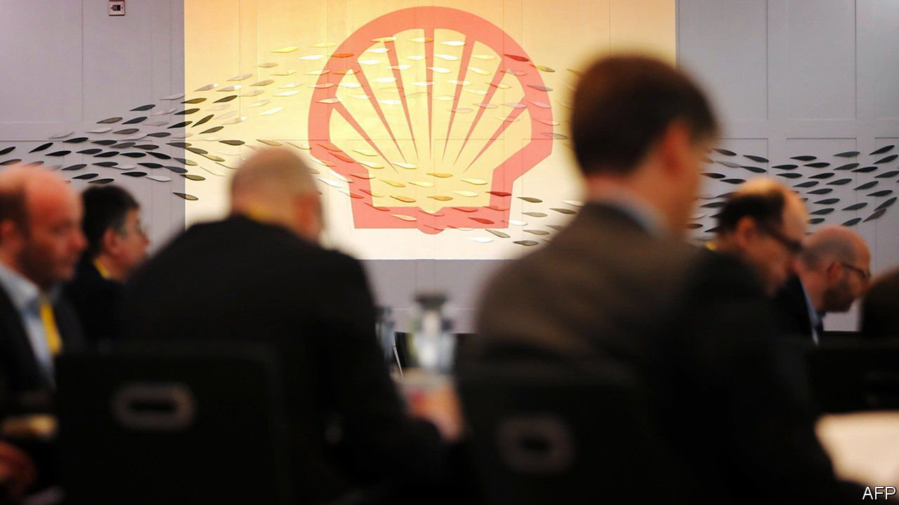

###### Royal purge

# Shell mulls a breakup 

##### The oil major is looking for a less taxing energy transition 

 

> Nov 20th 2021 

PITY BEN VAN BEURDEN. The boss of Royal Dutch Shell is an affable man steering a Scylla-and-Charybdis course between oil-loving shareholders on one extreme and carbon-hating ones on the other. His latest task is to convince investors that Shell’s strategy of doubling down on oil and gas production while bulking up on renewables is viable, even as Third Point, a hedge fund, demands it breaks itself up. And for seven years he has run a company with one foot in the Netherlands and the other in Britain—with Brexit in between.

On November 15th Shell offered shareholders some badly needed simplification. It asked them to vote next month for a proposal to ditch a dual Anglo-Dutch share structure, haul the headquarters back to Britain, and scrap the Royal Dutch name. It marks a homecoming of sorts. The original moniker dates back to the 19th century, when the company’s forebear, Marcus Samuel, dealt in sea shells along the Thames. But the reaction in parts of the Netherlands has been apoplectic. Some politicians want to impose an exit tax to dissuade Shell from leaving.


Simplification looks like the handiwork of Andrew Mackenzie, Shell’s new chairman, who oversaw a restructuring of BHP, the Anglo-Australian miner that he previously ran. But it has a financial logic, too. Under the dual-share structure, Shell’s Dutch A shares were subject to a withholding tax, which meant that only British B shares could be bought back economically. That capped buy-backs at $2.5bn a quarter. Oswald Clint of Bernstein, an investment firm, says the maximum could now rise to $5bn. More buy-backs are a way of increasing cash returns to shareholders while they see how Shell’s energy-transition strategy plays out. They may not guarantee the company wins the argument against Third Point. But they will buy it some time.

There are other potential side-effects. The Netherlands has dealt some harsh blows to Shell recently. They include a court judgment in The Hague ordering Shell to reduce its worldwide emissions—part of which the company is appealing against (and which it says the planned move won’t affect). A Dutch pension fund, ABP, stunned Shell last month by saying it would sell its shares in the firm as part of efforts to divest from fossil fuels.

The British government cheered the relocation announcement. Kwasi Kwarteng, the business secretary, called it “a clear vote of confidence in the British economy”. But the boon to global Britain could come at a cost to global warming. In the coming months the government is expected to decide whether to allow drilling of an oilfield called Cambo off the coast of Scotland—a litmus test for the future of North Sea oil. Cambo is part-owned by Shell.■


