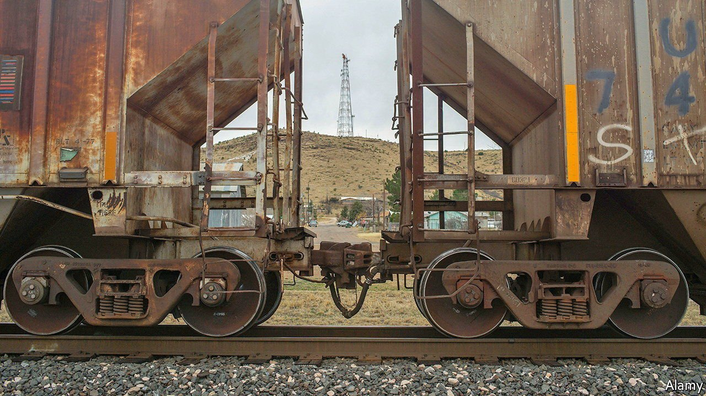
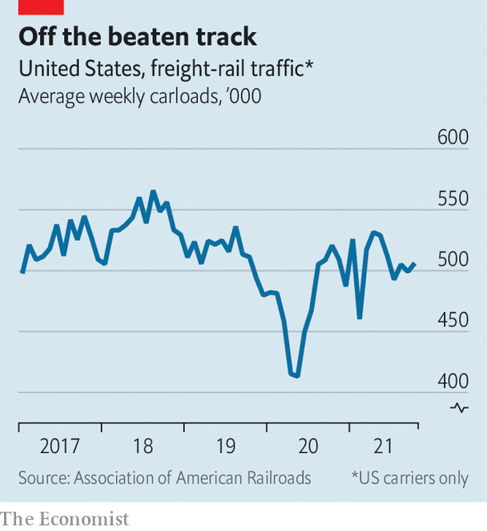

###### Chugging along

# Times are good for American railways 

##### Supply-chain snags are driving up profits 

 

> Nov 20th 2021 

FEW INDUSTRIES are more vulnerable to events that depress revenues and increase expenses than America’s railways. The basic business model is to lug lots of stuff to offset the high fixed costs of owning fleets of locomotives and maintaining thousands of miles of track. That has been hard as America’s supply chain has come unglued, first because of covid-19 and then as it has waned. Ports are gridlocked, warehouses over-stuffed and labour unavailable. It has unquestionably been a tough time to be a rail company and, it turns out, a remarkably good time to be one.

Volumes and profits at the listed companies that run America’s tracks and trains used to be tied as closely as a locomotive to its cargo. No longer. Traffic has yet to recover from pre-pandemic peaks, according to the Association of American Railroads, a trade group. But the financial equivalent of a train crash that such a slump would once have presaged has not arrived. On the contrary, America’s major freight carriers are on their way to record annual profits. Their share prices in recent weeks have helped stockmarkets there chug to new highs.


Train dispatchers have earned their crust in recent months: vital rails underlying many trans-continental supply chains are not exempt from disruptions of their own. At Union Pacific (UP), one of America’s two largest rail operators, fuel costs have risen by 74% over the past year and locomotive productivity has fallen by 8%. Freight car “velocity”, the number of miles travelled in a day, is 5% below the company’s standard, in part because of “terminal dwell”—rail-speak for being stuck.

 


Wildfires across 13 western states during the summer caused widespread delays, rerouting and damage. The global microchip snafu has reduced shipments of cars, a lucrative cargo. Railways have their own shortages to contend with, from the rolling chassis used for unloading containers to large warehouses. Employees, whom rail bosses once thinned in repeated cost-cutting drives, are now in short supply too. Many who were furloughed during the early days are not keen on coming back to work, says James Foote, the chief executive of CSX, the third-largest rail company.

Ordinarily all these factors would be toxic, but these are not ordinary times. The capacity to get goods from A to B has become extraordinarily valuable. Jennifer Hamann, UP’s finance chief, explains that strong demand “supports pricing actions that yield dollars exceeding inflation”. Price rises mean UP’s operating income over the past two years is up by 9% even as volumes have slipped by 4%.

Other railways have made precisely the same point (the networks overlap in places, though largely cover their own patch of America). All have limited capacity and similar obstacles. Better yet, for railway shareholders, the shortage of labour has been even more acute in the trucking industry, blunting outside competition.

Inevitably, the environment will shift as bottlenecks are resolved and workers return. Pushy business customers will not have forgotten how to negotiate. The railways themselves are not sitting still. UP, for example, is stretching its seemingly endless trains from 9,500 to 10,000 feet. CSX is introducing autonomous locomotives. Norfolk Southern is shifting ever more traffic from jammed west-coast ports to smoother operations on the east coast. This unusual moment, in short, will pass. But for now, the industry remains on something of a roll.■

