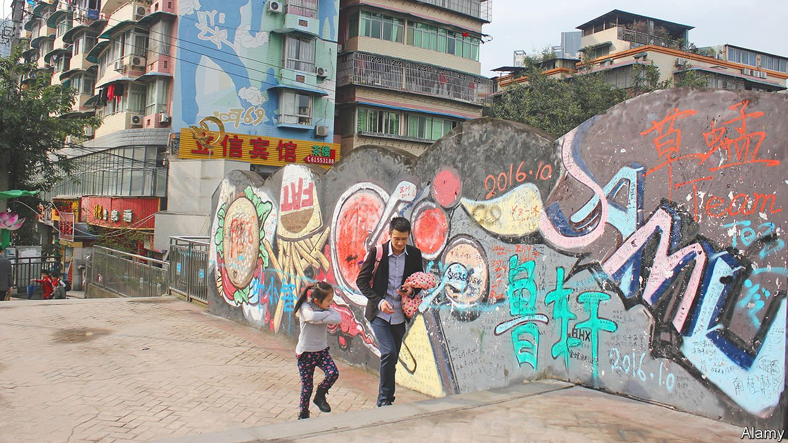

###### The grey walls of China

# Chinese officials help to cultivate a local graffiti scene 

##### Street art has a devoted following, but is not as edgy as graffiti in Western cities 

 

> Nov 18th 2021 

IN THE MID-1990s outlines of bulbous heads, spray-painted with a single swipe, began to appear on Beijing’s walls. Next to them was written “AK-47”. This tag, as graffitied signatures are known, belonged to Zhang Dali, an art student who had spent time in Italy and discovered graffiti culture there. On his return to China, swathes of its cities were being razed to make way for development. Workers were daubing the character chai, meaning “demolish”, on buildings due to be torn down. Mr Zhang took his cans to the same walls in protest at this often brutal upheaval.

Mr Zhang is widely regarded as China’s first modern graffiti artist. More recent ones are influenced by skateboarding culture or rap music. The art form is still in its infancy in China—it is far less commonly seen than in the West. But Liu Yuansheng, co-author of “Beijing Graffiti”, published in 2020, reckons the number of practitioners in the capital has at times swelled to 200.


Cities are riddled with CCTV cameras and teeming with law-enforcement officers. But it is not the threat of punishment that deters people from becoming graffiti artists. Doodlers rarely face more than a fine of 500 yuan ($80) and a day in police custody. Those caught tagging often get away with a promise to paint over their work. Sometimes the public defends such art. Residents in the central city of Wuhan called on officers to remove advertisements that had been pasted over a work by Rui Huang, a local artist. They felt that the ads had defaced his graffiti.

It may simply be that few people even consider spraying walls without permission. There is no tradition of guerrilla art used by criminal gangs to mark their territory or by protesters to attack the government. Mr Zhang’s poke at developers was a rare kind of dissent. The ruins gave him cover—officials turned a blind eye, knowing his works would soon be bulldozed.

China does have a history of using walls to express dissent in written form, however. A famous example occurred during the Democracy Wall movement of 1978-79 when people flocked to the brick wall of a bus station in Beijing to put up “big-character posters” demanding greater political freedom. A constitutional right to put up such posters was scrapped in 1980. These days mural self-expression rarely goes beyond unauthorised “throwies”, or two-tone tags in bubble-like writing, which can be seen on walls in Beijing.

Local governments sometimes even sponsor street art, regarding it as a sign of modernisation. In the run-up to the Olympic games that were held in Beijing in 2008, officials in the capital encouraged artists to paint a 300-metre-long “graffiti wall”. Designs were vetted first. A street in the south-western city of Chongqing is home to one of the world’s largest graffiti projects (pictured). It was created, with official approval, by 800 painters. This year Wuhan paid local crews to draw graffiti on a tram and several public buses.

There are others, however, who barely qualify as artists who scribble on walls. A Chinese citizen in Sydney, who goes by the name Lil Quacky, collects graffiti in an Instagram account called “chinesegraffitihub” (the app is blocked in China). Quacky began the project last year after noticing that someone had rewritten a roadside slogan in China that had urged people to carry away their rubbish. It had been changed to “Carry away your love.” Most graffiti submitted to Quacky consists of untidy spray-painted sentences. “Are they enough to shock passers-by, to make them think, to make them stay for a while?” are Quacky’s criteria for posting them online. Hundreds of examples have passed the test. ■

