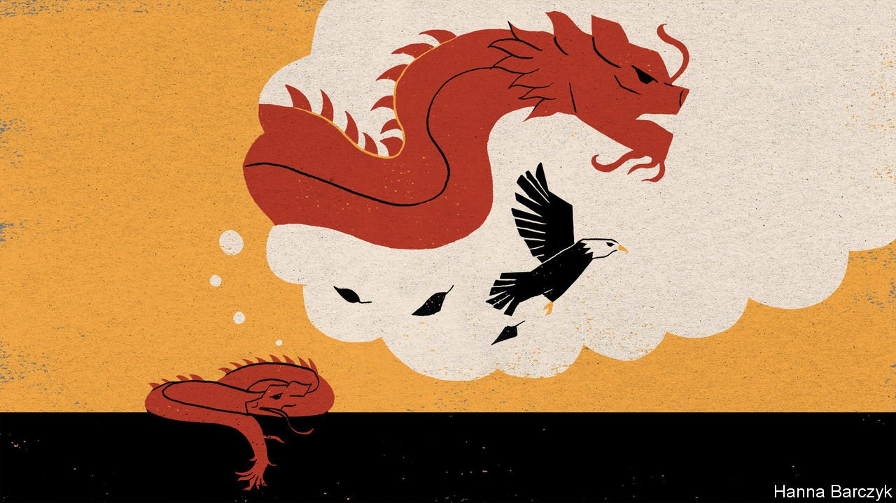

###### Chaguan

# Talks between Xi Jinping and Joe Biden do not herald a thaw 

##### The two presidents spoke about managing dangerous tensions, but an ice age looms 

 

> Nov 18th 2021 

BEIJING BASKED in golden sunshine on November 16th as President Xi Jinping spent more than three hours on a video call with his American counterpart, Joe Biden. After months of tensions, the virtual meeting was supposed to show that their countries could manage disputes and avoid a spiral of confrontation.

The two leaders’ remarks matched the burst of mild weather. Mr Xi called Mr Biden an “old friend”, nodding to hours that the two men had spent travelling and talking together in 2011, when each held the rank of vice-president. “I stand ready to work with you, Mr President, to build consensus, take active steps and move China-US relations forward in a positive direction,” Mr Xi said.


China’s state media announced, approvingly, that Mr Biden had offered reassurances on the most neuralgic points in the bilateral relationship. Notably, he had restated  that it does not support independence for the island of Taiwan, which China claims as its own. According to the Chinese readout, Mr Biden also hailed China’s 5,000 years of history, declared that his administration does not seek to change China’s system of government and stressed that as America strengthens its global alliances, the aim is not to oppose China. After months in which Chinese censors have tolerated online mockery of Mr Biden as a doddery shui wang, or “sleep king”, prone to napping during meetings, official outlets carried side-by-side images of Mr Biden and Mr Xi beaming and waving at one another online.

The White House, for its part, described a businesslike meeting. It quoted Mr Biden as telling his counterpart: “Our responsibility as leaders of China and the United States is to ensure that the competition between our countries does not veer into conflict, whether intended or unintended.” American officials are conscious that political opponents at home are eager to accuse Mr Biden of appeasement or of entering endless talks that go nowhere. The national security adviser, Jake Sullivan, duly described Mr Biden confronting Mr Xi over human rights, unfair trade practices and bullying of Taiwan. Mr Biden urged Mr Xi to send “senior and empowered” officials to meetings to make progress on pressing issues, rather than pursue “dialogue for dialogue’s sake”, Mr Sullivan told a post-meeting briefing at the Brookings Institution in Washington. Suitable topics include Afghanistan, trade, climate change, energy security, public health and the nuclear programmes of North Korea and Iran, Mr Biden suggested.

The video call was a far cry from a traditional summit between American and Chinese leaders. Such events are preceded by months of wrangling by officials over concessions, promises and deals so sensitive that only the top leaders can make them. It says much about the dire state of relations that this conclusion-free meeting—held online because Mr Xi has not left China or met a foreign leader since the covid-19 pandemic began—counts as a modest breakthrough.

In early September Mr Xi was shockingly testy at the start of a telephone call with Mr Biden, say people briefed on its contents. In that conversation, Mr Xi essentially rehearsed, in private, the same argument levelled by officials in public, namely that America is bent on containing China’s rise and is to blame for all present-day tensions. The argument’s second part is that President Donald Trump was a bad leader, but that Mr Biden is the same or worse because—as a more rational politician—he should know better. More emollient signals were sent by China on October 6th when Mr Sullivan met Mr Xi’s most senior foreign-policy aide, Yang Jiechi, in Switzerland. Western and Chinese sources describe Mr Yang explaining that China seeks a calm external environment in 2022, to avoid disrupting events including the Beijing Winter Olympics in February and a year-end Communist Party congress at which Mr Xi is expected to launch a third term as party chief.

In this low-trust moment, Mr Biden and Mr Xi are arguably the only American and Chinese officials able to have substantive discussions. Their video chat was better than nothing, but worryingly limited. When it comes to co-existing sustainably, . Mr Biden says that America and China are locked in an intense competition, which must be managed responsibly. Chinese officials call that framing too negative. They prefer talk of relations based on mutual respect and mutual interests: code for a realist America realising it has no choice but to accommodate China’s autocratic, statist ways.

China’s plan for world peace: America stops defying China

Mr Biden is presented in China as a more pragmatic president than his predecessor. Alas, scholars and state media frame his willingness to talk as an admission of American failure. In China’s telling, American inflation is linked to Trump-imposed trade tariffs (though inflation is recent and tariffs have been in place for three years). Chinese analysts blame another complex problem, supply-chain chaos, on a simple cause: Trump-era attempts to block exports of semiconductors and other advanced technology to China, while urging firms to move factories out of China. With the American economy now in “bleak” shape, the Biden administration “needs to ease relations with China in order to improve its political standing at home”, says Wang Yong, director of Peking University’s American studies centre. Professor Wang adds that America is losing the hearts and minds of younger Chinese, who have “given up their illusions” that the West is sincere when it expresses concerns about Muslims in Xinjiang or democrats in Hong Kong.

China’s leaders still want investment and technology from the West, but they think it is in decadent decline and are decoupling from Western norms and ideas. One video call cannot begin to fix a relationship in crisis. Mid-November often brings spells of sunshine to Beijing, which do not last. In China’s ancient, 12-season calendar, the freezing periods called “small snow” and “big snow” are next. Relations with America face a similar ice age. ■

An early version of this article was published online on November 16th 2021

