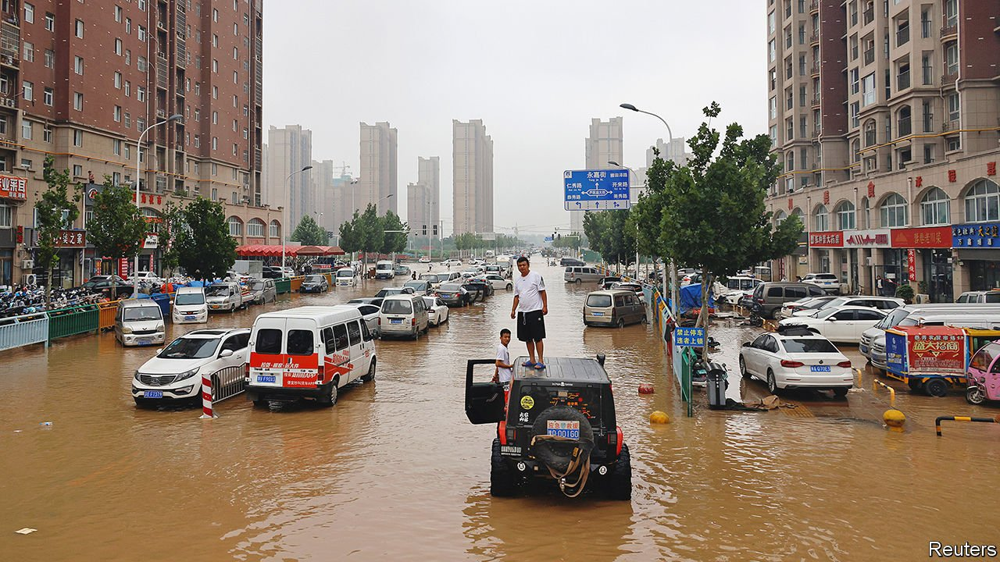

###### Soaking it up

# To prevent floods, China is building “sponge cities” 

##### After decades of ill-planned growth, urban areas are being retrofitted to prevent disasters 

 

> Nov 18th 2021 

LOCALS HAVE a saying: “When the Buddha’s feet are washed, Leshan cannot sleep.” The city in the south-western province of Sichuan has reason to be fearful. Leshan lies at the confluence of three tributaries of the Yangzi river. Centuries ago its residents carved a stone statue of the Buddha into a cliff face. It towers 70 metres high, overlooking the swift currents. In August 2020 its giant toes were bathed in river water for the first time since the Communist Party seized power in 1949. Thousands of residents suffered in the flood.

But it is not only the ancient threat of rivers in spate that unnerves Leshan. It is also the way the city itself has grown. By the time of last year’s disaster, its built-up area, including satellite towns, was more than half as big again as it was in 2000. City planners had failed to make due provision for floodwater runoff.


After four decades of frantic expansion, many other cities are in similar difficulty. They are poorly prepared for extreme downpours, which are likely to become more common as a result of global warming. One such storm in July over Zhengzhou, the capital of the central province of Henan, drenched the city in a year’s worth of rain in three days (see picture). Cars were swept away or trapped in flooded tunnels, where six motorists died. Another 14 people drowned in the subway system. In all, nearly 300 were killed. According to Chinese researchers, average annual losses from floods in China doubled from around 100bn yuan ($15.6bn) in the decade after 2000 to over 200bn yuan in the early 2010s.

About one in ten Chinese people lived in cities in 1950. Now six in ten do. About 70% of those cities are in floodplains. “We overbuilt, and we built it wrong,” says Yu Kongjian, a landscape architect at Peking University. Mr Yu was among the first to urge that urban areas become “sponge cities”, meaning they must be capable of absorbing rain without creating floods. He drew inspiration from old Chinese irrigation systems, such as “mulberry fish ponds” that act as natural reservoirs. He estimates that urbanisation has resulted in a third of farmers’ ponds and half of all wetlands disappearing.

The government has embraced the idea, and has adopted the term sponge city. In 2015 it released a series of guidelines for building them. The aim is for 80% of cities to collect and recycle 70% of rainwater by 2030. Local authorities have set their own targets. In 2018 Zhengzhou announced a plan to ensure that nearly nine-tenths of its core urban area would be “spongified” by 2030. This year Leshan said 40% of its urban area would meet the government’s sponge-city standards by 2025.

Cities have long tried to prevent flooding with hard engineering involving the “grey infrastructure” of dams, dykes and barriers. But urban surfaces of tarmac and concrete cause floodwater to rush into often inadequate drains. Producing a sponge effect requires measures such as creating artificial wetlands, planting roadside shrubs and using permeable materials to build pavements and plazas.

The flooding in Zhengzhou shocked the country. It left many Chinese wondering whether sponge cities were all they were cracked up to be. After all, a lot of money has been flowing into spongification. Experts reckon that implementing the government’s sponge-city guidelines will cost at least $1trn nationwide. Generous subsidies have been dolloped out to localities. Netizens were up in arms when they discovered that Zhengzhou had planned to invest close to 55bn yuan in sponge-related projects in the two years preceding the floods. How much was actually spent has not been made public. But the work had clearly failed to avert disaster (and had not reversed the extensive building-over of Zhengzhou’s wetlands that had occurred in recent decades). Officials insisted that the downpour was a “once in a millennium” event that even the best-built sponge city could not have coped with perfectly.

Experts agree that Zhengzhou has not disproved the effectiveness of the sponge-city programme. They point out that the government had required sponge projects to cover only 20% of the city’s urban area by 2020. So it may be difficult to evaluate Zhengzhou’s efforts at least until 2030. Kong Feng of the China Agricultural University in Beijing says that more subterranean spaces need to be used to collect floodwater. For example, he suggests, the lowest levels of underground car parks could be adapted to serve as emergency reservoirs. Such a backup “may not be needed for ten years. But use it just once and it will be life-saving for the city,” says Mr Kong. He has been involved in China’s first nationwide survey of risk from natural disasters, which was launched last year.

It is the case that local governments sometimes misspend the money they are given for sponge-city building. They are often reluctant to use expensive land to create natural drainage systems such as parks and ponds. For a sponge city to work, many government units must collaborate, from water-conservation and weather bureaus to education and emergency departments. For two days before the worst of the flooding, Zhengzhou’s meteorological office issued its highest level of alert for a rainstorm. But few officials appeared to pay much attention.

There is evidence from other places that spongifying can make a difference. Like Zhengzhou, the flood-prone city of Wuhan, on the banks of the Yangzi, was chosen as a pilot sponge-city in 2015. From July 5th to 6th last year, a cloudburst caused record rainfall over the city. Yet flood waters began to recede within hours. The following day centres for taking the gaokao, China’s university-entrance exam, stayed open despite heavy rain.

Many critics overlook the fact that in Zhengzhou, too, water levels fell more swiftly than they would otherwise have done, says Mr Kong (it may have helped that Zhengzhou’s flood-prevention efforts had also included the building or refurbishing of over 5,000 kilometres of drains). City officials recently called on Mr Yu and his team to help them make Zhengzhou more absorbent.

Tourists are flocking once again to Leshan’s Buddha, some to seek peace and protection at its feet. The statue conceals other strengths. Inside its body a drainage system, carved into the rock when it was built, helps to flush out rainwater and reduce erosion. Some say that the rocks gouged out of the cliff were dropped into the river, helping to calm it—and that the statue’s divine presence, where the rivers meet, also helps slow the water’s flow. For sponge-city enthusiasts it is nature, not the supernatural, that offers salvation. ■

