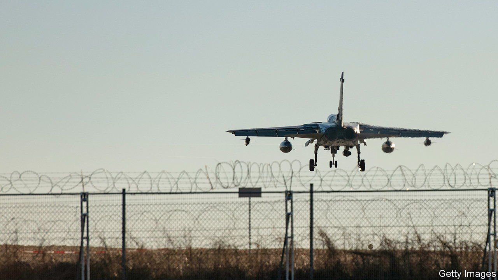

###### Atomic jitters

# Allies fear Germany’s incoming government will go soft on nukes 

##### What will happen to the nuclear bombs deployed there? 

 

> Nov 20th 2021 

GERMANY’S COALITION talks have done little to dispel its reputation for political dullness. After winning a majority in September’s election, the Social Democrats (SPD), Free Democrats and Greens aim to wrap up negotiations next week on their “traffic-light” coalition (named after the parties’ colours) before taking office in early December. Bar the odd wobble the talks seem to have been largely straightforward. But Germany’s closest allies have been watching one issue with mounting alarm.

The “P3”—America, Britain and France, the three nuclear-armed NATO allies that hold permanent seats on the UN Security Council—have two related concerns. First, that Germany may go soft on its involvement in NATO’s “nuclear sharing” arrangements, under which America stations up to 20 atomic bombs at Büchel Air Base in western Germany, while Germany maintains a fleet of dual-capable aircraft (DCAs), from which they can be launched. Second, that the incoming government may flirt with the Treaty on the Prohibition of Nuclear Weapons (TPNW), an international disarmament effort.


The first issue is familiar. Nuclear sharing, also practised by Italy, Belgium, the Netherlands and Turkey, gives countries without their own nuclear weapons an important stake in NATO’s nuclear planning. But Germans have long been uneasy about the presence of American nukes on their soil; in the early 1980s over 1m marched against the deployment of Pershing II missiles. Successive governments have vowed to seek the removal of nuclear bombs, only to yield to pressure from allies.

Yet several new elements are at play, including the fissures in the international arms-control regime, Russia’s growing unpredictability and the ascent to government of the Greens, who retain a strong pacifist streak. The most urgent issue is a pending decision on replacing Germany’s decrepit Tornado DCAs. These planes’ lifespan can be spun out to 2030 at the latest. To ensure operational continuity beyond that date, decisions for a replacement must be made by 2023, says Christian Mölling at the German Council on Foreign Relations.

The TPNW is a newer concern. Driven by non-nuclear countries and pressure groups, and in force since January, the treaty obliges ratifying countries (56 so far) to renounce the development, production and ownership of nuclear weapons. Supporters say this turns the screws on nuclear powers who have done little to meet their disarmament obligations under the Non-Proliferation Treaty (NPT) of 1970. Opponents say it weakens the NPT, undermines NATO’s deterrent and helps adversaries like Russia and China who face no pressure from civil society to sign up.

The P3, individually and together, have lobbied Germany’s government and the incoming coalition on both issues. Joe Biden’s and Emmanuel Macron’s joint call last month for allies to “continue close consultations on nuclear and arms-control matters” appeared to be aimed squarely at Germany. Olaf Scholz, the SPD’s taciturn chancellor-presumptive, has also been pressed but has given little away. “We have no idea what he thinks,” says one anxious P3 diplomat. His party’s left is strongly, and vocally, opposed to nuclear sharing.

Few expect the traffic-light coalition either to end nuclear sharing unilaterally or to join the TPNW outright. More likely is a pledge to stay in nuclear sharing without a clear proposal on how to implement it, despite the Tornado issue. A nervous government, says Claudia Major at the German Institute for International and Security Affairs, may simply drop out of the arrangement by kicking the can for as long as possible until the road runs out.

The TPNW is the allies’ bigger worry. Despite diplomats’ entreaties, Mr Scholz’s government is expected to say it will attend the treaty’s first meeting in Vienna in March, albeit not as a signatory. (Norway, another NATO member, will do the same.) Even that, reckon the P3, will damage NATO’s cohesion. Yet it may be the best that can be expected from a country destined to veer endlessly between America’s nuclear protection and the deep atomic queasiness of its voters. ■

