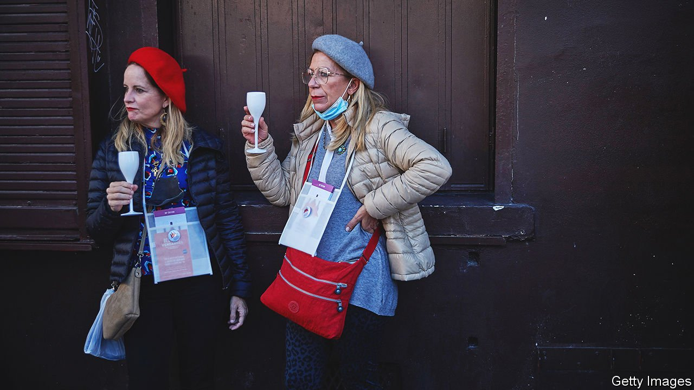
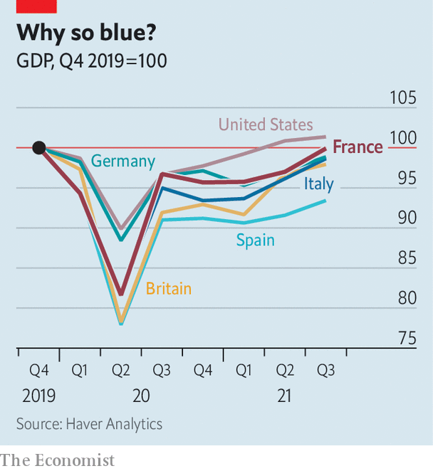

###### Bleak is chic

# France is doing well, but feeling miserable 

##### Blame a looming election, the structure of the state and an innate Gallic gloom 

 

> Nov 18th 2021 

TUNE IN TO any French prime-time talk show this autumn and discussion rages over the country’s wretched decline. France is losing its factories and jobs, squeezing incomes and small businesses, destroying its landscapes and language, neglecting its borders and squandering its global stature. Its people are fractious and divided, if not on the verge of a civil war, as a public letter from retired army officers suggested earlier this year. At the second presidential primary debate for the centre-right Republicans party, on November 14th, the five candidates competed with each other to chronicle French disaster. Listen to the hard right and it is “the death of France as we know it”.

The anxiety is widespread. In a recent poll 75% agreed that France is “in decline”. When asked to sum up their mood in another survey, the French favoured three words: uncertainty, worry and fatigue.


Like others, the French have some good reasons for apprehension. Lockdowns have been wearing. Rising gas and petrol prices, supply-chain delays, a new wave of covid-19 cases and restrictions: all are genuine causes of uncertainty. Moreover, the French hold a presidential election in April and the campaign is already divisive. The line-up is likely to feature not just one but two strong candidates from the hard right: Marine Le Pen of the National Rally (formerly the National Front), and , a reactionary former TV pundit. A sobering 47% of the French told a poll they will vote in the first round for a candidate from one or other political extreme. Some 60% say they have no confidence in President Emmanuel Macron.

 


Yet there is a paradox at the heart of France’s current malaise: the country is doing fairly well, and in some respects better than its neighbours. Covid cases are rising again in France, but nothing like as fast as in Germany. In July Mr Macron introduced covid passes; France now has a greater share of fully vaccinated people than Germany or Britain. Like most of Europe, the French economy is enjoying a bounce after a deep drop in GDP last year and is expected to expand by 6% this year. Third-quarter growth, of 3% on the previous one, was particularly strong, and higher than in Germany, Italy and Spain. French GDP is now back at its pre-pandemic level (see chart).

France’s unemployment rate, at 7.6%, has fallen below its pre-pandemic level. This is not primarily thanks to government wage-support schemes, generous though they were at the height of the pandemic. In September the number of workers on such schemes dropped to 520,000, down from 8.4m in April 2020. “We are seeing net employment creation in France in sectors like manufacturing that we haven’t seen for a while,” says Ludovic Subran, chief economist at Allianz, an insurer. Firms report difficulties recruiting; salaries are expected to rise. Under the government’s “Made in France” strategy, new factories—making batteries in northern France and insulation panels in the south-west—are in the works. The CAC 40 stockmarket index is at a record high.

So why are the French so convinced that things are falling apart? There is no single explanation. In a country that boasts four anti-capitalist presidential candidates, one reason could be a lingering French suspicion of the financial gains that economic recovery brings. The government has spent heavily to keep jobs and businesses going during the pandemic, in order to avoid lay-offs and bankruptcies, and to protect incomes. Living standards rose in 2020 and will do so again in 2021. But this policy is now also helping those with investments in such firms. The saved jobs are taken for granted whereas the rewarded shareholders are regarded in some quarters as undeserving beneficiaries. Mr Macron still struggles to shrug off his label of président des riches.

It could also be that the structure of government builds in disappointment. A strong central state, which the French dignify with a capital letter (État), headed by a powerful presidency, encourages excessive expectations of both. The conflict and compromise that characterises the reality of government is a source of particular dissatisfaction, as is the complexity of the globalised world. The difficulties that France has experienced securing microchips for its car-components industry, say, or halting migrant flows, are sometimes seen as not merely the result of global supply-chain jams or international-migration pressures, but a form of emasculation and wounded national pride.

A further answer may be that, as Claudia Senik, an economist at the Paris School of Economics, puts it: “The French have an ambivalent relationship to happiness.” A poll this week suggested that 78% feel happy about their own lives, but 60% are convinced that their country is going downhill.Being idealists, the French find that the real world always disappoints. Taught from a young age to adopt un esprit critique, they delight in disapproval. Last year, as covid first spread, a poll suggested that only 39% of the French thought that their government was managing the crisis well, compared with 74% in Germany and 69% in Britain. Bleak is chic.

Perhaps most important, ahead of any French presidential election the stirring of indignation and the promise of salvation is a practised political art. François Mitterrand campaigned as “the tranquil force” in his successful bid for the presidency in 1981, hinting at the chaos he would calm. Jacques Chirac promised in 1995 to mend the “social fracture” that he claimed threatened French unity. Mr Macron was unusual by campaigning in 2017 in tones of optimism. As covid cases rise, supply chains clog up and punitive winter heating bills arrive in the letterbox, there is still plenty that could go wrong. But even if it doesn’t, it will suit his opponents of all stripes to lay the doom on thick. ■

An early version of this article was published online on November 16th 2021

