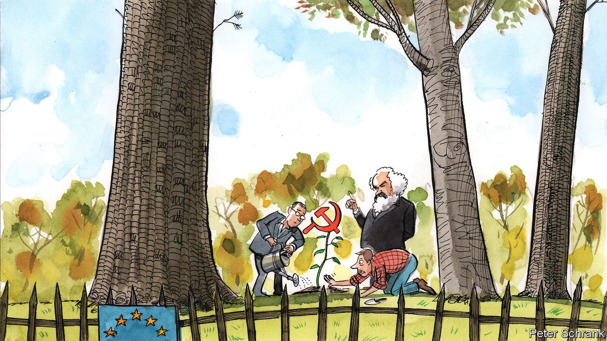

###### Charlemagne

# Last of the commies 

##### Local politics, force of habit and canny strategy help Europe’s communists cling on 

 

> Nov 18th 2021 

A PERK OF being locked up by a fascist dictator is that it leaves you with a lot of time on your hands. Altiero Spinelli, an Italian communist, spent the bulk of his youth imprisoned by Benito Mussolini. During one stint of internment in 1941, Spinelli used his spare time to come up with the Ventotene Manifesto, named after the island off Naples to which he was banished. Pieced together on cigarette papers, it provided a socialist blueprint for a federal Europe, earning the communist thinker a legacy as one of the more obscure founding fathers of the EU.

Aside from the European Parliament building in Brussels, which bears Spinelli’s name, communists left little mark on the club. Across western Europe, moderate Christian and Social Democrats ran the show. The Eurocommunists, who looked to Brussels rather than Moscow, were briefly in vogue in the 1970s and 1980s. Wily socialists, such as François Mitterrand, soon put them out of business. In Italy, where communists once won 34% of the vote, the party fell apart after communism collapsed in eastern Europe. And countries that had lived under communism were desperate to join the EU, in part so the ideology could not return.


The spectre of communism no longer haunts Europe. But it does occasionally jump from behind the curtain and shout “boo”. Sometimes the surprise comes from the least likely spots. Austria is probably the most bourgeois country in Europe: rich, cosy and more than a little smug about it. Yet its second city, Graz, is now run by the Austrian Communist Party, which came first in local elections with 29% of the vote. Wags soon renamed it Leningraz.

It was a revolution decades in the making. A low threshold for winning seats on the city’s council meant that communists could scrape a few even in dry years, and busy themselves with running the city’s housing policy. Popular measures helped, such as communist councillors donating two-thirds of their salaries to the needy. “What we are doing now would have been ordinary social democrat policy in the 1970s,” says Max Zirngast, a councillor who spent three months in a Turkish jail for criticising Recep Tayyip Erdogan’s autocratic regime before entering the world of Austrian municipal politics. A world without capitalism is still the aim. But a city with more social housing will do for now.

Tradition rather than grassroots fervour keeps the red flag flying in Cyprus. The island’s communist party, AKEL, is one of the country’s two main parties. It prospers thanks to an almost Anglican attitude to communism: just as one does not have to believe in God to go to church every Sunday, so Cypriots can vote for communists without wishing to seize the means of production. Card-carrying communists in shiny Mercedeses are a common sight. Force of habit rather than belief explains the party’s persistence, argues James Ker-Lindsay of the London School of Economics. As one of the biggest parties, AKEL is helped by being able to dish out the patronage that still dominates Cypriot politics.

In Europe, parties can be tiny but still influential. Christian Democrats found themselves supporting decidedly unChristian ideals due to panic about those to their right. Crackdowns on asylum-seekers and cuts to welfare budgets were triggered by parties that mustered barely a tenth of the vote. The same logic works for the far left. In an age of fragmentation, any party that can win even 5% of the vote becomes relevant. Take Portugal. Antonio Costa, the Socialist but still centre-left prime minister, relied on both the Portuguese Communist Party and the Left Bloc to remain in office.

Parties do not always use this power well. The communists voted against Mr Costa’s budget, leaving elections likely early next year. It was an odd decision. The budget was stuffed with lefty spending pledges, such as increased pensions and free child care. Now the leftist parties face losses in an election, the polls suggest. Such cock-ups are common. In the Czech Republic, the Communist Party of Bohemia and Moravia opted to support Andrej Babis, a billionaire, as prime minister. Three years later, the party was kicked out of parliament for the first time since 1948.

It is little surprise that the most successful far-left parties of recent years have eschewed outright communism. Some of Syriza’s leaders spent time in the Greek communist youth movement, but the party which ran Greece from 2015-19 bristled at mention of the c-word. (Hardcore lefties repay the favour by seeing Syriza and its eventual compromise with the EU as an example of what not to do in power.) Podemos, a far-left Spanish party, is part of the governing coalition, but its brand of anti-austerity populism comes from a different tradition to Europe’s remaining reds.

That country of single blessedness

Yet some traditional Marxist parties are savvy. The Workers’ Party of Belgium (PTB), which began life as a home for Marxists who found Belgium’s Communist Party a bit soft, is now a mainstream party. Pressure from the PTB led to Belgium gumming up a free-trade deal between the EU and Canada, which sent diplomats on a crash course on the rules of Belgian federalism. Popular campaigns to slash taxes on energy put left-wing rivals in government in an awkward spot. In the Flemish parliament, it mischievously complained that a pay cut for MPs had not actually gone through, two years after its approval. If polls are borne out, the far-left party is set to become the third-largest in the national parliament.

Wallonia, the French-speaking region of Belgium, provides the base of the PTB’s support. The region was the centre of continental Europe’s Industrial Revolution; now it is the apogee of deindustrialisation. Disaffected voters in depressed regions have been fodder for the radical right across Europe. Canny politics from the far left in Belgium has flipped that trend, dragging voters to the other side. In 1869 Karl Marx called Belgium the “the snug, well-hedged, little paradise of the landlord, the capitalist, and the priest”. In 2021 Belgium offers the EU’s best hope for the ideology that bears his name.■

