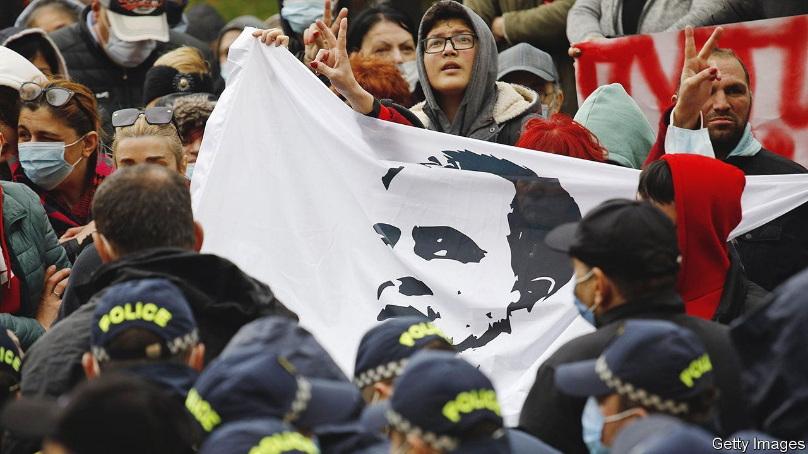

###### Caucasian degeneration

# Near death in jail, Georgia’s former president defies its current one 

##### Mikheil Saakashvili has been on hunger strike for six weeks 

 

> Nov 18th 2021 

EIGHTEEN YEARS ago this month, the 35-year-old Mikheil Saakashvili, an American-educated Georgian politician, led the first “colour revolution” in the countries of the former Soviet Union. When he subsequently became president he turned around the corrupt and failing republic, although he was also much criticised for hogging and abusing power. Now he is in prison fighting for his life after seven weeks on hunger-strike.

Mr Saakashvili stepped down in 2013 after his party lost an election, surrendering power to Bidzina Ivanishvili, a reclusive billionaire who founded and still controls the ruling Georgian Dream party. Mr Ivanishvili chased him out of the country and stripped him of his citizenship. Hated by the Kremlin, which fought a short war with Georgia in 2008, Mr Saakashvili spent the next eight years in Ukraine, where he became prominent.


Last month he returned to Georgia, only to be promptly arrested. In a video released by the government, he was shown being dragged, half naked, into a prison hospital. Mr Saakashvili has been denied the right to attend his own trial. A member of the European Parliament hoping to see him was turned away at the border.

Mass protests over Mr Saakashvili’s treatment are growing by the day. Ten members of parliament are also on hunger strike and his doctor says the former president could suffer a heart attack at any moment. His supporters say he has been denied access to proper medical care, increasing the risk to his life. If he dies, Mr Saakashvili will become a martyr. If he lives, it will be a rare example of successful resistance to Mr Ivanishvili.

This is the latest of many signs that Georgia is moving backwards. This year alone the government has arrested the head of the opposition, hacked the phones of human-rights activists and foreign ambassadors, and turned down an EU loan after backtracking on an agreement promising judicial and electoral reform. It has handled the covid-19 crisis badly. But its treatment of an admired, if flawed, former president could be its worst blunder yet.

