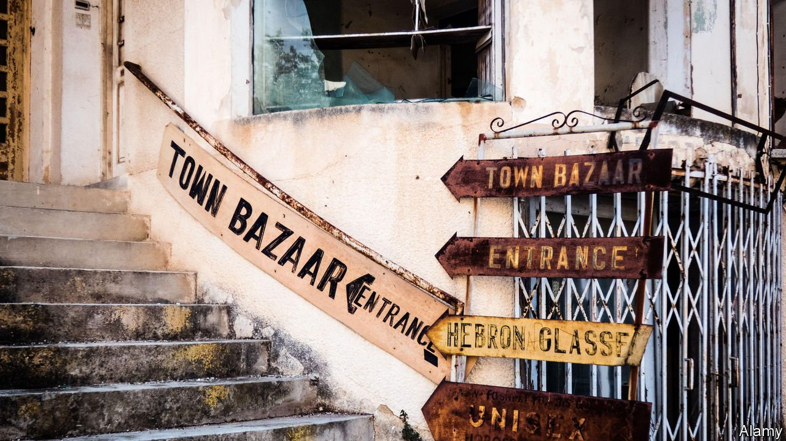

###### Permanent partition?

# Putting Cyprus together may be impossible 

##### Hopes fade for a solution to Europe’s longest frozen conflict 

 

> Nov 18th 2021 

APOSTOLIS, A RETIRED Greek-Cypriot dentist aged 78, tours his former clinic in Varosha, now a derelict shell of a building, for the first time in nearly half a century. His friend Despo wipes away tears in front of her grandfather’s old shop, where she would park her bike after school. Varosha was once home to some 39,000 Greek-Cypriots and swarms of tourists. Elizabeth Taylor and Richard Burton strolled on its beaches. Four young Swedes, later known as ABBA, gave one of their first concerts here. Now it is a ghost town, overgrown by bushes and trees. Opposite Apostolis’s clinic, painted over the façade of what was once a Greek high school, are a pair of flags, one Turkish, the other belonging to the Turkish Republic of North Cyprus (TRNC), set up after the island was split by a Turkish invasion in 1974 into Greek and Turkish portions.

Fenced off since the invasion, when its Greek-Cypriot residents fled the advancing Turkish troops, Varosha was partially reopened earlier this year. Turkey’s president, Recep Tayyip Erdogan, ordered the army to hand the town over to the TRNC. This has allowed visits by Greek-Cypriots living in the southern part of the island, in the Republic of Cyprus, which the outside world considers the legitimate government of the whole place. But it also bolsters the TRNC, which no country but Turkey recognises, and paves the way for the development of property still claimed by displaced Greeks. That, in turn, further complicates the Herculean task of reuniting the island. That was the point: Mr Erdogan and Ersin Tatar, the Turkish-Cypriot leader, have insisted for the past year that a united Cyprus is no longer possible. In New York in September Mr Tatar and Nicos Anastasiades, president of the Republic of Cyprus, seemed to agree that they had nothing to discuss.


Northern Cyprus, home to 450,000 people, has never stood on its own feet. Turkey stations tens of thousands of soldiers in the enclave, props up its economy, and is the main conduit for its foreign trade. Though Turkey has always meddled in the north’s affairs, it has never done so as much as now. “Ankara treats us like one of its districts,” says Ozdil Nami, a former TRNC foreign minister. A new low came last year, when officials and goons dispatched by Turkey endorsed Mr Tatar, an Erdogan loyalist, ahead of presidential elections and threatened his opponents, including Mustafa Akinci, the incumbent. Mr Tatar won the vote by a sliver. “Those people”, he says at his residence, referring to the politicians and journalists who accused Turkey of interfering in the elections, “are traitors.”

Echoing Mr Erdogan, Mr Tatar says he has no faith in a proposed federal model, which would bring north and south under one roof, and that the only way forward is to keep the island divided. Yet analysts and diplomats say a two-state solution is a pipedream. Not even Turkey’s closest allies would want to jeopardise relations with the EU, of which Cyprus is a member, by recognising the north.

The risk is that a botched campaign for sovereignty would put Northern Cyprus on a slippery slope to full annexation by Turkey. That is not an outcome Turkish-Cypriots want. The vast majority of them welcomed the Turkish invasion in 1974, which foiled an attempt by a Greek junta to unite the island with Greece. They feel close to Turkey. But they also have a separate identity. Many are alarmed by Turkey’s authoritarian turn. Settlers from Turkey, who began arriving after the invasion and are now about a third of the north’s population, are a lot keener on Mr Erdogan.

Greek-Cypriots are also alarmed. “If we don’t find a solution, we'll end up having a border with Turkey, which for us is a worst-case scenario," says a senior Cypriot official. But they also have themselves to blame for the stalemate. It was Mr Anastasiades and his team who reportedly got cold feet during the most recent reunification talks, in 2017. And it was Greek-Cypriot voters who rejected a settlement in a referendum back in 2004, on the eve of the country’s accession to the EU.

There is room for hope. A big offshore energy find could breathe new life into the talks, though it could also trigger a standoff between Turkey, Cyprus, Greece and the EU. Turkey’s push for a two-state solution could be a ploy intended to rattle the Greek-Cypriots. But facts on the ground will be hard to undo. “We might have reached a point where it’s no longer possible to put the island back together again,” says Fiona Mullen of Sapienta Economics, a consultancy in Nicosia, the capital. “Varosha may be the final nail in the coffin.” ■

