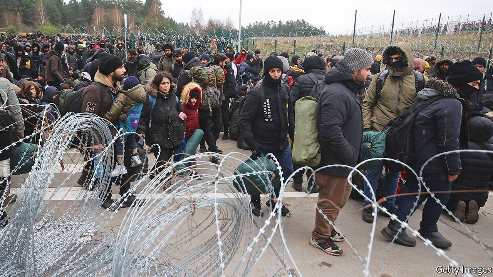

###### Borderline case

# The EU’s stand-off with Belarus is complicating its row with Poland 

##### The EU wants to help Poland with a migrant crisis while punishing it for judicial abuses 

 

> Nov 18th 2021 

THE MIGRANTS had nowhere to go. Behind them stood Belarus’s brutal security officers, before them rows of Polish soldiers. Mostly Iraqi Kurds, they had been lured to Minsk, Belarus’s capital, with promises of passage to Germany, then dumped in the forests, told to breach the border fence and beaten if they did not. On November 16th the Belarusians moved hundreds of them to a border crossing. Alexander Lukashenko, Belarus’s dictator, hoped that by provoking violence he could embarrass Poland and divide the EU, which imposed sanctions after he stole an election. When migrants threw stones, the Poles sprayed them with water cannon.

Mr Lukashenko’s use of helpless migrants as propaganda tools is a problem for the EU, but mostly not in the way he hopes. Rather, his border crisis complicates the European Commission’s conflict with Poland over the rule of law. Since coming to office in 2015, Poland’s ruling Law and Justice (PiS) party has passed laws that give the government power over the courts. The European Court of Justice (ECJ) has ruled that these laws violate EU rules about judicial independence and must be rolled back. After years of dithering, the commission has begun to enforce those judgments. Now it must balance supporting Poland on border security with keeping up the pressure on judicial matters.


Poland’s takeover of its judiciary is modelled on that of Hungary, Europe’s pioneer of illiberal democracy. PiS changed the rules governing its National Judicial Council, which picks judges, so that its members are named by parliament and the minister of justice, with no input from judges themselves. The ECJ has ruled that since the council is no longer independent, judges appointed under the new rules are not judges under EU law.

Many of them are poorly qualified PiS loyalists. PiS has packed the constitutional court and set up a disciplinary chamber of the supreme court that can punish judges for rulings it dislikes. The ECJ ordered Poland to disband the disciplinary chamber. The government says it will, but has yet to present a plan to that end.

This rule-of-law conflict threatens the very structure of the EU. In October, trying to wriggle out of the ECJ’S judgments, Poland’s constitutional court ruled that the articles of the union’s founding treaty dealing with judicial independence violate the Polish constitution. That challenged the principle that European law supersedes national law, without which the union would have little power. “We would be like the UN,” says an EU official.

The commission has some new tools of persuasion. Until it scraps the disciplinary chamber, Poland is accruing fines of €1m ($1.1m) a day. PiS is counting on €36bn from the EU’s new covid-19 recovery fund to bankroll its ambitious infrastructure and social-welfare plans. But that fund has a clause that blocks the money until the commission certifies that recipient countries comply with the rule of law. The commission could attach a list of specific conditions to Poland’s grants.

On November 15th Iustitia, an organisation of independent Polish judges, put out a proposal to restore the rule of law, including implementing all the ECJ rulings and giving judges back their voice on the National Council of the Judiciary. Some EU countries will press for such conditions, notably the Netherlands, which insisted on the rule-of-law clause. But Germany is more reluctant. Meanwhile Zbigniew Ziobro, Poland’s unrepentant justice minister, is trying to use the disbanding of the disciplinary chamber as an excuse for more changes, including a review of the credentials of every judge in the country. State-run television portrays the conflict as “an offensive of the ECJ against Poland”.

The migrant crisis is just as thorny. The EU and America have persuaded nearly all the airlines and transit countries that Mr Lukashenko used to bring in migrants to stop co-operating. The EU approved new sanctions this week on Belarusian individuals and firms, and could block trade entirely to deter Mr Lukashenko. That could limit the problem to the estimated 12,000-15,000 migrants already in Belarus—a fraction of the number who enter Italy across the Mediterranean each year.

EU and international law obliges countries to let people in to request asylum, so Poland’s pushbacks are illegal; some migrants have already died of exposure. The Poles have refused help from Frontex, the EU’s border agency, which can evaluate asylum claims fast. Marcin Przydacz, a deputy foreign minister, notes that few migrants apply for asylum in Poland; they want to get to Germany. Western officials hope to press Belarus to let UN agencies and NGOs offer humanitarian aid to the migrants there. Letting them cross might encourage more to come and reward the propaganda strategy of Mr Lukashenko and his sponsor, Vladimir Putin.

The commission may now postpone action on the rule of law in Poland until the border calms down. Failing to show solidarity could turn Poles against the EU and weaken their prime minister, Mateusz Morawiecki, a relative moderate and rival of Mr Ziobro. But a complete rollback of the government’s control over the judiciary is likely only if PiS loses the next election in 2023, says Stanislaw Biernat, a former judge on the constitutional court.

As for the migrants, they are losing hope that anyone will help them. As one put it, “The Poles will never have mercy on us, nor will the Belarusians have mercy on us. We are stuck between them.” ■

