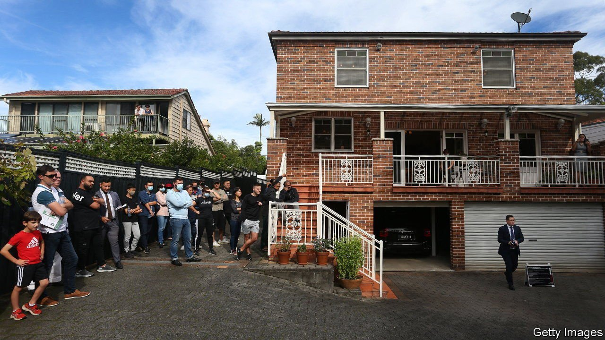

###### Patch-up job

# As housing costs rocket, governments take aim at large investors 

##### The approach is politically expedient, but it may not make housing cheaper 

 

> Nov 20th 2021 

HOUSING COSTS across the rich world are rising fast. In America and Australia prices have increased by nearly 20% in the past 12 months, and rents too are on the up. In the past year, prices in New Zealand have shot up at a pace of more than NZ$2,000 ($1,400) a week. Costs in big cities have been going up for years, propelled by a mix of cheap borrowing and a scarcity of new homes. The pandemic has made matters worse; lockdowns boosted demand for larger homes, while labour and materials shortages constrained housing supply. As they try to bring down costs, governments are throwing all sorts of ideas at the problem.

One set of policies involves helping first-time buyers and renters, while discouraging other types of prospective homeowners. Spain, for instance, wants to get young people out of their parents’ houses, and is offering them nearly $300 a month for rent. In South Korea, President Moon Jae-in has brought in more than 20 different regulations, including tighter lending rules and punitive taxes on expensive homes.


Officials elsewhere are focused on deterring foreign buyers. Justin Trudeau, Canada’s prime minister, vowed a two-year ban on house purchases by non-residents during his re-election campaign in August. New Zealand’s ban on foreigners buying homes came into force in 2018 after the controversial purchase of a ranch in the country by Peter Thiel, a Silicon Valley heavyweight. Yet although these policies have successfully put off foreigners, they have missed the mark on affordability. House prices in New Zealand have risen even as purchases by overseas buyers have dried up. Mr Moon’s efforts have, likewise, failed to curb steep price rises. Prices of flats in Seoul have increased by over a third during his presidency.

That might explain why the focus in South Korea has shifted to supply. This year the government unveiled a plan to build 83,000 homes in the capital. America has pledged to subsidise construction. Officials in Hong Kong, who blame unaffordable housing for the anti-government protests that erupted in 2019, want to ease costs by building a new city near the territory’s border with mainland China. The development could house as many as 2.5m people—a third of Hong Kong’s population.But Britain’s experience shows just how difficult expanding housing supply can be. The government wanted to revamp planning rules to open up more land to housebuilding. Then fears of a backlash from NIMBY voters and disagreements within the governing Conservative Party prompted a rethink.

Faced with the failures of managing demand and the political difficulties of expanding supply, some governments are turning instead to a more expedient target: big landlords. In October Spain’s left-wing coalition agreed on a housing bill aimed at cracking down on investment funds. The new legislation imposes rent controls on landlords with more than ten properties. The changes—due to take effect in the second half of 2022—are a blow for companies such as Blackstone, a private-equity giant that is Spain’s biggest landlord.

Spain is only the latest country to propose restrictions on large property investors. Similar approaches have sprung up in Ireland and New Zealand. In America President Joe Biden wants to restrict the types of homes large investors are allowed to own. Canada’s central bankers plan to analyse investors’ role in surging prices. In a referendum in September Berlin’s residents took the drastic step of voting to expropriate big landlords such as Vonovia and Deutsche Wohnen. (The result is non-binding, and legal setbacks mean it may never become reality.)

Taking on big investors might be popular with voters, and easier to achieve than loosening supply constraints. But whether such an approach will lead to more affordable housing is less clear: curbs on big landlords make it less profitable to build new properties. If the crackdown continues, investors could simply take their pots of capital elsewhere, leaving housing costs to rise further still. ■


