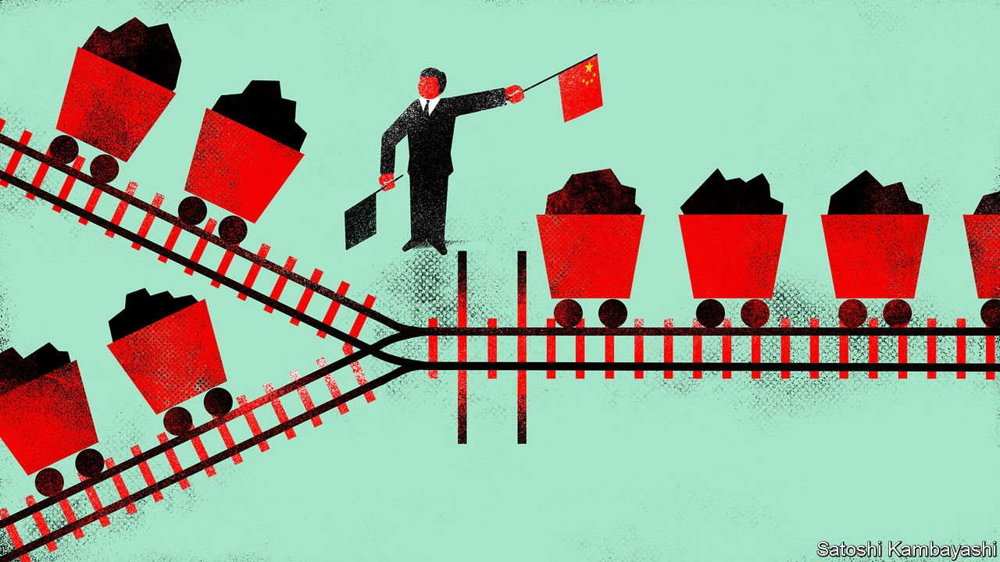
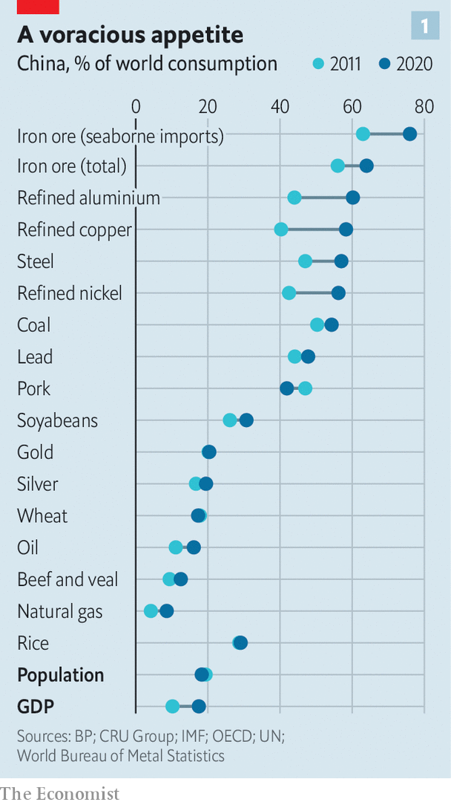
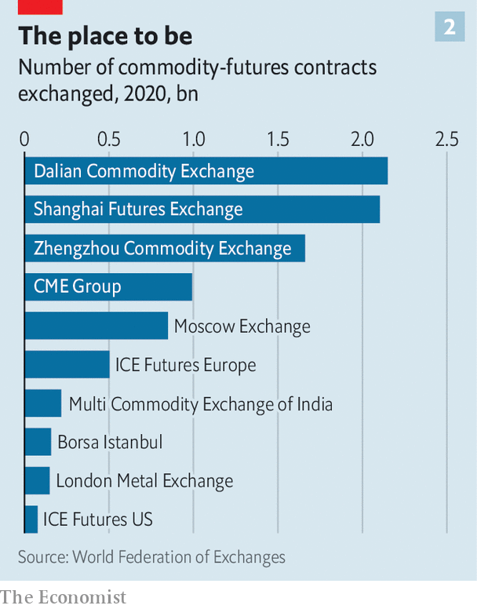

###### Material needs

# China seeks to extend its clout in commodity markets 

##### Aside from its big appetite for energy and metals, it is also opening up to international traders 

 

> Nov 18th 2021 

FEW CRISES highlight China’s weight in commodity markets as clearly as the global energy crunch. Though analysts attribute the shortages to many different causes, all mention China. Its post-covid economic recovery, coupled with a hot summer, produced a surge in demand for power. Supplies of its two main sources of electricity, coal and hydropower, were curbed by environmental crackdowns and droughts respectively.

At first China tried to supplement power generation with liquefied natural gas (LNG). Its imports of LNG so far this year are 14% higher than in the same period last year. That has caused prices to surge and has had ripple effects around the world. As LNG cargoes have been rerouted east, for instance, Europe has found itself short of gas. Rising gas prices have only underscored the importance of coal in China, which already consumes 55% of the world’s supply of the stuff. In October China imported nearly twice as much coal as it had in the same month in 2020, causing prices to boom. Even oil has risen on expectations that China will burn that too, if necessary, to keep its electricity plants running. As usual in commodity markets, other factors are also at play. But China still shakes the world.


China’s heft is partly the result of its size. As a huge consumer and, in some cases, producer of materials, it can disrupt global markets even with modest tweaks to policy. Its clout is growing on the financial side of commodity trading too, thanks to China’s three big futures exchanges; international traders say that you cannot be successful without dealing on them. Now China wants to extend its influence over commodities further still. Officials are aiming to turn the proliferation of local contracts, for instance, into international price standards.

 


The rule of thumb for commodity traders is that China consumes “half of everything”. For some materials, such as iron ore, even this is an understatement (see chart 1). China’s big appetite alone gives it influence in markets. But it also means that the authorities deem many commodities strategically important. And they are not shy about intervening.

Take maize. A glut in China in 2010-15 pushed government inventories up to unprecedented levels and led the authorities to reduce financial incentives to corn farmers. But the resulting fall in output was too sharp, forcing China to look overseas to replenish stocks. Corn imports jumped from less than 5m tonnes a year in 2013-18 to almost 30m tonnes in 2020. Partly as a consequence, American corn prices doubled over the first half of last year.

China’s strategies also involve boosting supply to keep prices low. In order to keep a lid on infrastructure costs in the 2000s, it invested in a huge number of aluminium smelters and encouraged producers to raise output. Graeme Train of Trafigura, a trading firm, estimates that the smelters cost around $70bn. But without them, the price of aluminium would probably have increased in line with that of copper, says Mr Train. And that would have raised China’s infrastructure costs by an extra $1trn or so between 2000 and 2015.

In some cases China’s appetite has helped create new financial systems. Iron ore, the main ingredient of steel, is a good example. Between 2003 and 2016 China’s imports of the ore rose tenfold as it built masses of steel-intensive infrastructure. Today it is the world’s biggest consumer of iron ore, for which it has also become “the world’s most sophisticated” market, says a manager at a big mining firm.

Buyers in other countries, such as Japan and South Korea, tend to prefer long-term contracts. In China a dynamic spot market has emerged, which gives punters opportunities to resell excess ore and informs the price of long-term contracts. Dozens of seaports act as mini iron-ore exchanges. They have storage facilities and serve as places where customers can buy and sell ore. Analysts look at the portside price to gauge the outlook for the market.

Chinese trading firms are becoming more sophisticated, too. The biggest, such as PetroChina and Sinopec, two state-owned oil companies, are getting better at strategically steering the market, notes Michal Meidan of the Oxford Institute for Energy Studies. They mimic tactics used by European traders. That includes placing bets to shift the price of the Dubai benchmark which, in part, helps inform the prices in their long-term contracts. Other Chinese traders are scaling up. In March COFCO, a food giant, announced plans to float its trading arm.

 


China’s commodity-futures exchanges are now world-beating. The three big ones are in Dalian, Shanghai and Zhengzhou. The number of contracts traded on these in 2020 was six times higher than on America’s CME Group’s exchanges (see chart 2). In terms of value they were roughly equivalent. From January to June this year the ten most-traded agricultural futures contracts were all Chinese. So were eight of the top ten metals contracts and five of the top ten energy contracts.

Chinese exchanges look different from Western ones. They are dominated by retail investors (who are nicknamed “chives” because when they get cut down, they soon grow back). Estimates from 2016 suggest that this group holds around 85% of open positions, compared with 15% on Western bourses. They trade smaller lots, too, and hold them for less time, which adds to liquidity. A lack of expertise means retail investors tend to accentuate price swings. For the most part, they are losing money, says Xiao Jin of Orient Futures, a broker.

For officials in Beijing, the next step in the development of China’s commodity markets is to turn the country’s benchmarks into global standards. One reason for this is to boost use of the yuan, which is used to conduct only 2-3% of cross-border commodity trades, compared with the dollar’s share of 38%. Another is that officials are wary of Western benchmarks, suspecting that they may have been manipulated.

Until now China’s way of protecting its manufacturers and consumers from price volatility had been through isolation. Only select state firms could trade on foreign commodity-futures exchanges, and only a small group of international traders could access Chinese ones. Those exchanges have no warehouses—which are where physical commodities are delivered—outside the mainland. Foreign exchanges are not allowed warehouses inside China.

But the new strategy of benchmark nationalism is leading China to slowly loosen the rules for international traders. Around 80 commodity-futures contracts are traded on its big exchanges, nine of which are available to foreign punters. That covers mostly imported commodities, such as copper and oil. Some of these trade on Shanghai’s International Energy Exchange, a subsidiary of the city’s Futures Exchange designed to appeal to traders abroad. As more investment firms take advantage of arbitrage opportunities, the prices of futures contracts on Western and Chinese exchanges are more often moving in tandem.

More opening up is in the works. In September the State Council, China’s cabinet, said it would launch more futures contracts, accelerate the participation of overseas traders in Chinese markets and build another yuan-denominated exchange aimed at such punters.

Two big problems stand in the way of these ambitions, though. One is shifting commodity demand. Over the next decade this is likely to become more evenly spread around the world, argues Jeffrey Currie of Goldman Sachs, a bank. Climate-friendly policies require vast amounts of metals to build wind turbines and power grids. Meanwhile, China’s economy will slowly become more services-oriented, reducing the need for commodities. Its consumption of some metals, such as aluminium, is expected to peak in the next few years.

Another hurdle is trust. China’s commodity exchanges are closely tied to the state. Senior managers move between exchanges and government departments. Authorities intervene readily in markets. Investors point to China’s intervention in equity markets after a downturn in 2015. Back then, it banned short-selling and told investors with big stakes in companies that they could not sell shares. All this makes commodity investors worry about the predictability of Chinese markets.

Indeed, China has dabbled with commodity-market intervention in the past year, as prices have gone berserk. Authorities worry that rising costs will squeeze the manufacturing sector. To offset this, in the summer they sold some of their metal reserves and cracked down on speculative hoarding. In September they auctioned off oil reserves, too. In both cases the extra supply was so small that it had no lasting effect on prices. But analysts think the goal was not to move the market but to signal to investors that regulators are watching it.

The energy transition will probably make commodity prices much more volatile, as demand and supply adjust over time and one occasionally overshoots the other. Chinese authorities will have to decide whether to interfere or let markets respond. The path they choose will determine the future of commodity markets far beyond their borders. ■


An early version of this article was published online on November 15th 2021

