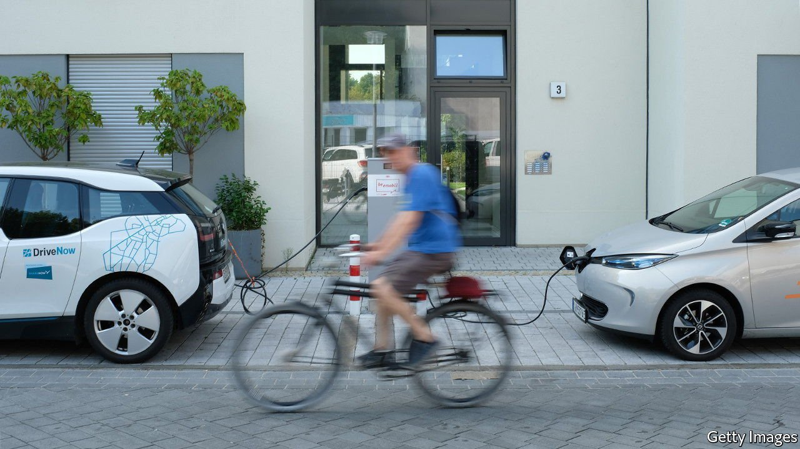
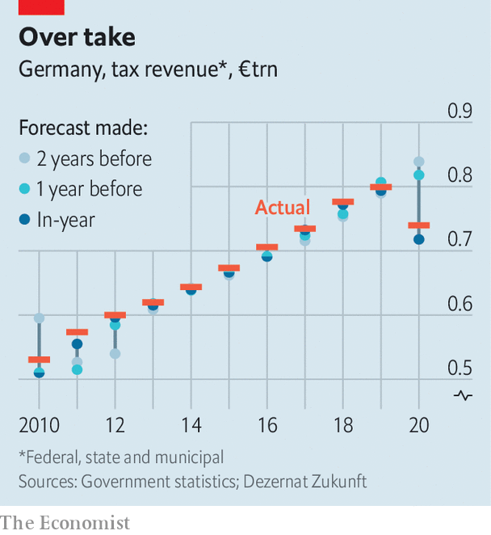

###### Houdini economics

# Germany grapples with weird ways to dodge its debt brake 

##### The constitutional ceiling on borrowing is inspiring all sorts of wheezes 

 

> Nov 20th 2021 

VISITORS TO MURKY corners of the internet may encounter ads promising “one weird trick” to help them lose weight or acquire millions. To meet its climate obligations and upgrade its digital infrastructure, Germany needs to rustle up perhaps €50bn ($57bn) a year in public investment. But a “debt brake” inserted into the constitution in 2009 limits annual borrowing to 0.35% of nominal GDP (equivalent to about €12bn). Changing the constitution looks impossible. Squaring this circle means the three parties now negotiating a coalition agreement, after an election in September, will need some tricks of their own.

Several are doing the rounds. The first is to establish off-budget public companies that can tap markets for funds devoted to specific aims: insulating buildings, say, or charging stations for electric cars. Deutsche Bahn, Germany’s rail giant, operates this way. A related but distinct proposal is to beef up the KfW, the state development bank, to enable it to leverage private funds for green investment. In theory hundreds of billions could be raised this way, although EU state-aid rules are a constraint.


A more cunning ruse is to go on a one-off borrowing binge in 2022, exploiting the temporary suspension of the debt brake applied last year, which allowed the government to fund furlough schemes and the like in the pandemic. Experts have mentioned a sum of €500bn, to be spent over the next decade. But a badly designed scheme could attract the beady eye of Germany’s constitutional court.

Perhaps the cleverest wheeze comes from Dezernat Zukunft, a Berlin-based think-tank. Noting that the debt brake relies on estimates of the mysterious “output gap”—or the difference between GDP today and a measure of the economy’s potential—the group suggests tweaking some of the inputs to that calculation. Assuming more slack in the labour market than the finance ministry does, for example, would raise the spending limit. Conservatives dismiss the idea as “Pippi Longstocking economics”. But it involves no legal jiggery-pokery and rests on assumptions no more outlandish than those already in use. “No one understands these bureaucratic methods, which is why they are politically attractive,” says Jens Südekum of Heinrich-Heine University in Düsseldorf. They could add €20bn of annual spending.

 


More conventional sources may offer fiscal crumbs. A new global corporate-tax deal could raise a few billions, as could the legalisation and taxation of cannabis, which is likely under the next government. EU climate funds might offer a bit more. The odd subsidy might be cut. And the government anyway has a tendency to underestimate projected tax revenues; 2020 brought in €11.4bn more than expected (see chart). These will not flood the coffers, but every little helps.

Each of these proposals, to varying degrees, may make it into the coalition agreement promised by the end of November. The absurdity of some of Germany’s finest economic minds concocting complex schemes to escape the country’s self-imposed limitations is not lost on all of them. “It’s ridiculous that so much time is spent trying to find a way around rules we have set ourselves,” says Philippa Sigl-Glöckner of Dezernat Zukunft. Clicking on “one weird trick” ads is rarely wise. But Germany has left itself little choice. ■


