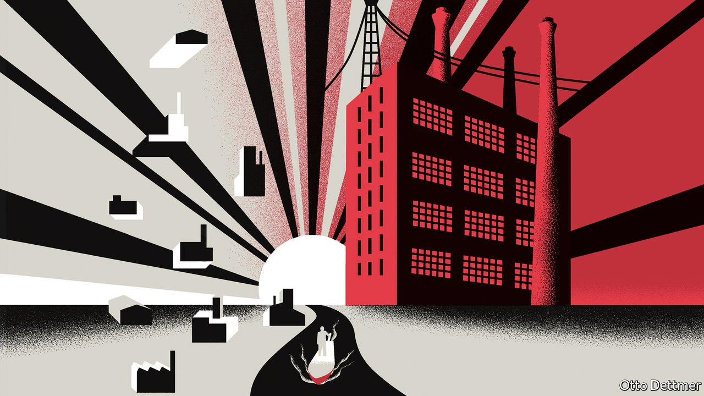

###### Free exchange

# Janos Kornai understood capitalism by studying its opposite 

##### Prices cannot work if losses do not hurt 

 

> Nov 20th 2021 

IN HIS CABIN aboard the SS Bashan, a luxury river boat sailing to Wuhan, Janos Kornai was sleepless with excitement. The Hungarian economist, who died last month, was one of seven foreign experts invited in 1985 to share their views on China’s economic reforms. As Julian Gewirtz recounts in his book “Unlikely Partners”, Mr Kornai stole the show. On a week-long cruise with an audience of Chinese technocrats, he dissected socialism’s familiar “cares and woes” (featherbedded firms, rushed growth and consumer shortages). And he offered a hopeful vision of a restrained, guided capitalism. His book “Economics of Shortage” soon became a bestseller in China, although he never saw any royalties.

Forty years earlier, Mr Kornai lay on the roof of a Jesuit monastery in Budapest, hiding from a fascist raid down below, even as Soviet forces dropped bombs from above. The skyline had a “hellish beauty”, he wrote. As a Jewish Hungarian who had lost his father and a brother to the Holocaust, he welcomed the Soviets as liberators. He did not even mind when they stole his watch. His gratitude was one reason why he became an enthusiastic communist, so devoted to his work on a party newspaper that he missed the birth of his first child. His communism, in turn, explains why he became an economist. He pored over Karl Marx’s “Das Kapital”. Enlightenment radiated from it “like sunshine”, he later wrote. “I had no more doubts about what profession to choose.”


The spell of Marxism broke when he met a victim of the torture it entailed. He also came to hate the improvised haste of journalism. He turned instead to research at Hungary’s Institute of Economics. But his reporter’s habits served him well in his dissertation. By interviewing managers, grumbling with them about bureaucratic idiocy, wastage and “disregard for customer needs”, he crafted a rare systematic account of how a planned economy actually worked, as opposed to how it was supposed to work. The book also served as an index of shifting political winds. It was celebrated in the lead-up to the Hungarian revolution in 1956, denounced after that revolution was crushed by Soviet tanks, then approved for translation into English, all by the same person, the director of the institute.

Some socialist reformers thought that widespread state ownership was compatible with market forces and price signals. But Mr Kornai recognised that getting prices right, even if it were possible, would not be enough. Under capitalism, a firm cannot defy prices for long without going bust. Under socialism, things were different. State-owned firms knew they could always appeal to higher authorities to bail them out. In 1979 Mr Kornai called this a “soft budget constraint”: the sharp line drawn by economists on their blackboards was smudged. If firms do not fear losses, they need not heed prices. This lack of financial restraint also allowed firms to indulge their “investment hunger”, an excessive appetite for resources, which squeezed out consumers and resulted in chronic shortages.

The argument made his name: it was a “congenial” extension of a concept familiar to mainstream economists. Mr Kornai had once had larger ambitions, hoping to smash the crystal through which most economists viewed the world. He had studied neoclassical theorists such as Kenneth Arrow with much the same care he had lavished on Marx. But he could not square their ethereal “general equilibrium” theory with his observations of the living, breathing economy. The mismatch reminded one economist of a line by the poet Edith Sodergran: “You searched for a woman and found a soul—you are disappointed.”

On the China cruise, Mr Kornai convinced his audience of the need to harden the budget constraints of the country’s firms. One of his fellow passengers is now China’s banking regulator. But the imposition of financial discipline remains a work in progress. The rise in defaults, even of state-owned firms, in recent years is evidence of some harder financial lines. But it comes only after years of gluttonous investment.

China has not, however, suffered chronic shortages. On the contrary, it is a “super-surplus” economy, marked by massive excess capacity, as Xu Chenggang, one of Mr Kornai’s students, has pointed out. One reason is that state-owned enterprises do not have the economy to themselves. They coexist with fiercely competitive private firms. The surpluses may also reflect the dual nature of investment. It is both an immediate source of demand and an eventual source of supply. In the short run, it makes a claim on the economy’s resources, which can crowd out consumers. But when the investment bears fruit, it adds to the economy’s ability to supply goods and services, resulting in abundance not scarcity.

Team transitory

Like the economies he deciphered, Mr Kornai inhabited two worlds. He was half in the mainstream of economics, half out. From 1983, he was half in America, half out. The transitions were not always easy. It took him time to perfect his English. In his Boston driving test, he declared that a “no hitchhiking” sign was a “no hijacking” sign. In a lecture, he repeatedly mispronounced warehouse as whorehouse. On returning home to Hungary each year, he had to remember to drop his upbeat stateside persona and complain a bit more.

But although he straddled different worlds, he was in no doubt where his allegiances ultimately lay. “Despite its detrimental and morally nasty features...I would sooner live under the capitalist system than in the happiest barrack in the socialist camp,” he wrote in his memoir. And although he was intellectually opposed to patriotic bombast, he felt an instinctive pride in the achievements of his compatriots. It was their music and literature that moved him. Their unillusioned meliorism that animated him. He counted in Hungarian. And when he wasn’t sleepless with excitement, he dreamt in it too. ■

