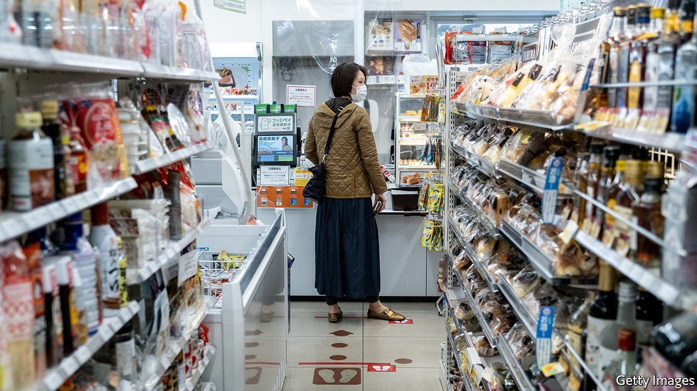
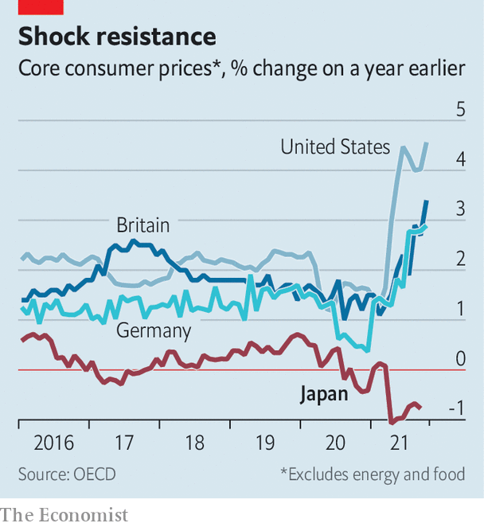

###### Land of the falling price

# The case of the curiously quiescent inflation rate 

##### As consumer prices rise across much of the world, inflation in Japan stays stubbornly low 

 

> Nov 20th 2021 

INFLATION IS SURGING around the world, with price rises now exceeding central banks’ targets. but Japan is a notable holdout. Although policymakers there have long sought to generate inflation, consumer prices still refuse to budge. In October they rose by just 0.1% year-on-year, and inflation, excluding fresh food and energy prices, actually fell by 0.7% in the same period. By comparison, a “core” measure rose by 4.6% in America in October, 3.4% in Britain and 2.9% in Germany (see chart).

 


What’s going on? Japan is not insulated from global trends. In October producer prices rose by 7.9% year-on-year, the largest single increase since 1980. The pickup was overwhelmingly led by higher import costs, which rose by 38% in yen terms. The prices of petroleum products and lumber rose by 45% and 57%, respectively, compared with the same month last year.


These increases may in small part have been offset by an idiosyncratic factor. Tumbling mobile-phone fees, driven by a government campaign against carriers, are pulling down the consumer-price index as a whole. The communications segment of the basket is down by 34% year-on-year. Yet even if fees were flat, inflation would still be below target. That suggests broader economic factors are an important part of the story.

Entrenched expectations built up through decades of little to no inflation play a big role in explaining why rising producer costs have not fed through to consumer prices. Domestic companies are notoriously unwilling to pass on increases in the prices of imports to consumers. At a press conference in October Kuroda Haruhiko, the governor of the Bank of Japan, attributed this reluctance to habits picked up during the country’s periodic bouts of deflation. Companies have a good reason to resist increases. Last week Kikkoman, a producer of soy sauce, announced a 4-10% increase in its prices from February. Such an event might barely be noticed in America. But in Japan it made the national news.

Another crucial factor is the weakness of Japan’s consumer recovery. Private spending fell in the third quarter of the year, and is now 3.5% below where it was at the end of 2019. Spending on durable goods, the source of much American inflation, has been practically flat for the past eight years in Japan.

The Bank of Japan was an early adopter of zero-interest-rate policies and bond-buying programmes, tools that have since been used elsewhere in the rich world as interest rates hit rock-bottom after the global financial crisis of 2007-09. The absence in Japan of the same inflationary pressures apparent across other advanced economies once again makes the country a laboratory for economists.

Despite the Bank of Japan’s activism, inflation has persistently failed to reach its 2% target. Its assets ran to 103% of Japanese nominal GDP even before the pandemic, and bond and stock purchases since have pushed that share up to 134%. In the same period, the Federal Reserve’s purchases have risen from 19% to 36% of American GDP. The Bank of Japan’s policy to keep ten-year government-bond yields at around 0% is still firmly in place, even as a similar effort at yield-curve control by the Reserve Bank of Australia was abandoned after it came under market pressure in October.

This suggests that whatever is raising prices elsewhere in the world—whether supply-side constraints associated with the pandemic, demand-side stimulus, or some combination of the two—monetary easing alone is struggling to move the needle when confronted with decades of low inflation expectations. Kishida Fumio, Japan’s new prime minister, has vowed to deploy a fiscal-stimulus package that includes cash for poor families and the under-18s. Analysts at Barclays, another bank, expect new spending worth 3.7% of GDP.

These handouts may well nudge up inflation, if the money is actually spent by consumers rather than saved. But for now Japan seems to be the place that inflation forgot yet again. ■


