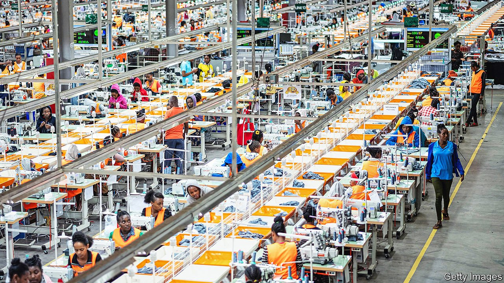
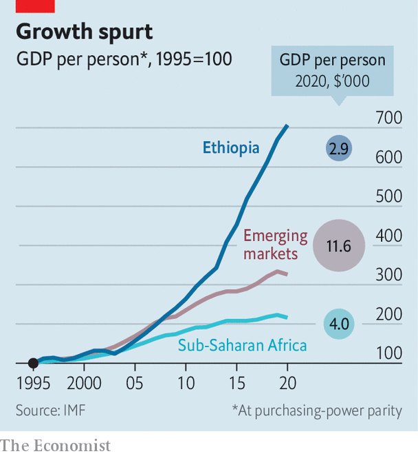

###### Lost promise

# The violence in Ethiopia imperils an impressive growth record 

##### Of all the countries in Africa, it came closest to mimicking the Chinese model 

 

> Nov 20th 2021 

ONE OF THE most extraordinary growth records over the past two decades was to be found, perhaps surprisingly, in the horn of Africa. Real GDP per person in Ethiopia, the second-most-populous country in Africa, rose by an average annual rate of 9.3% from 1999 to 2019, just 0.4 percentage points less than China’s pace of growth. Now a year-long war between Ethiopia’s government and forces led by the Tigrayan People’s Liberation Front (TPLF) threatens to spill into the capital city, wreak humanitarian disaster and wipe away those economic gains.

From the late 1990s, a roaring Chinese economy provided the impetus for a boom in the rest of the developing world. As China became richer, some of its industry moved abroad, allowing poorer countries like Bangladesh and Vietnam to follow in its wake. In the 2010s some optimists hoped that this process of sequential industrialisation might eventually shift to Africa. More than any other country there, Ethiopia illustrated this potential.

 


Three decades ago, its economy was among the world’s least developed. Then in 1991 forces led by the TPLF overthrew the Marxist regime that had long run things. Though the TPLF-dominated government remained authoritarian, it began liberalising the economy and directing investment towards infrastructure. Ethiopia’s GDP per person has risen more than sevenfold since 1995, faster than other sub-Saharan economies and the emerging world as a whole (see chart). The share of Ethiopians living in extreme poverty fell from half the population to under a quarter in the 2010s.


Ethiopia’s success was first owed to increasing productivity in agriculture, which lifted incomes and helped the construction and service sectors expand. While employment in industry rose rapidly from the late 1990s into the 2010s, most manufacturing workers laboured at small firms, making food and beverage products and other goods for local markets. Coffee and cut flowers remain big exports.

Yet over the past decade, manufacturing for export has gained a foothold. In industrial parks scattered across the country factories sprang up, many dedicated to making the textiles and clothing that often represent the first rung on the industrialisation ladder. Apparel giants like H&amp;M and Primark began sourcing products from Ethiopian plants, and the value of clothing exports rose more than sixfold from 2009 to 2019. Foreign direct investment roughly quadrupled from 2011 to 2017, much of it from China. The vast majority of direct investment—about 80%—flowed into the manufacturing sector.

But economic development depends more on sustaining growth over long periods than on bursts of explosive growth. Fighting in Tigray, one of Ethiopia’s most important industrial centres, has idled or destroyed many factories. Others are increasingly being shut out of markets. On November 2nd President Joe Biden suspended Ethiopia’s tariff-free access to America, citing “gross violations of internationally recognised human rights”, chiefly by the forces of the prime minister, Abiy Ahmed. Plans to privatise more of the economy are faltering as foreign investors lose their appetite.

A swift, diplomatic resolution to the crisis may let Ethiopia salvage something of its economic miracle. Still, the road ahead would be difficult. Even before the Tigrayan forces’ advance, the government faced unmanageable foreign debts of nearly 30% of GDP: a heavy burden for a poor country coping with covid-19, and which collects less than 7% of GDP in tax.

Nor can the destruction of capital be easily undone. Foreign investors may prove difficult to lure back. China enjoyed good relations with the TPLF when the group ran the country, and might be expected to provide support if the TPLF wins. But it faces a slowdown at home; and because China’s spending in Ethiopia favoured manufacturing, rather than the production of commodities needed by Chinese industry, it may treat its investments there with less urgency.

A protracted conflict, by contrast, would undo most or all of the country’s past economic gains. Whatever happens next, Ethiopia’s case already demonstrates that a state’s capacity to maintain order is the most important, and often the most elusive, condition for development. ■


