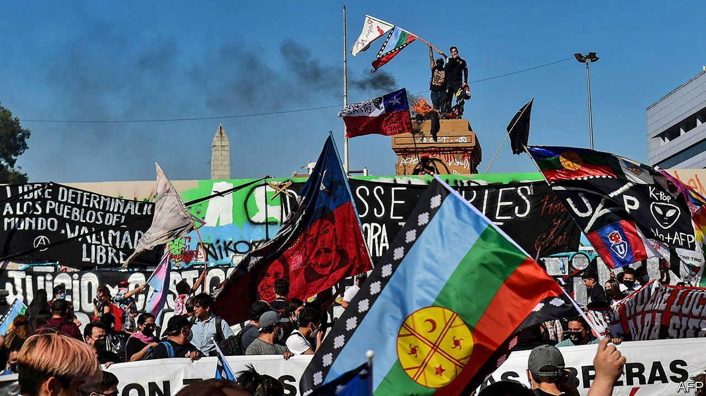

###### From role-model to cautionary tale

# Chile’s voters are on the verge of a terrible mistake 

##### Two extremists are leading in the polls for this week’s presidential election 

 

> Nov 20th 2021 

FOR MOST of this century Chile was a stable and predictable country, with steady economic growth and moderate politics. Outsiders saw it as a success story and a model for Latin America. But that stable Chile disappeared two years ago, in an explosion of massive and sometimes violent protests. Discontent had built up and politicians seemed unable to deal with slower growth and narrowing opportunities, especially for younger people. A plan to hold a convention to write a new constitution calmed the protests and seemed to offer a peaceful solution to the sort of grievances that have afflicted many countries in recent years. But Chile has yet to recover its balance, as a polarised presidential election on November 21st is likely to show.

In a vote for the constitutional convention in May (in which only 43% turned out), support surged for the hard left while drying up for mainstream parties. As a result, the convention has become a theatre of wokeness, with calls to wage war against pivotal industries such as mining (accounting for over half of exports) and agriculture for export (more than 30%), alongside more justified demands for a bigger role for the state in pensions, health care and green regulation. Optimists say a realistic, modernising constitution can still emerge; pessimists fear a Utopian list of unaffordable rights and anti-capitalism.


Similarly, Gabriel Boric, the candidate of the hard left, has seemed poised to win the presidential election. A former student leader, he is a democrat. But some of his allies, who include the Communist Party, are not. Much of the left has failed to condemn the criminal violence of a hard core of protesters and has opposed the widely popular deployment of the army to quell a low-level insurgency among some Mapuche, an indigenous group in the south.

Mr Boric wants to expand tax revenues by 8% of GDP over six to eight years (impossible, say many economists) and review trade agreements in order to engage in industrial policy. The laudable intention is to diversify the economy, but by means that seem likely to do far more harm than good. Mr Boric might well prove to be more pragmatic than his programme suggests. But plenty of Chileans are alarmed by it and by his allies.

That is why support has grown for  of the hard right. He has exploited fears of disorder, violence and uncontrolled immigration, offering a mano dura (a firm hand). His promise of big tax cuts just when Chileans want better services is as delusional as Mr Boric’s revenue target. Whereas Mr Boric promises the most left-wing government since the chaotic Socialist-Communist administration of Salvador Allende, Mr Kast offers the most right-wing one since the dictatorship of General Augusto Pinochet, whose crimes he sometimes denies. Neither offers the combination of stability, economic growth and reform that the country needs.

The seeming advantage of the extremes owes much to the discrediting of politicians from the two mainstream coalitions—and to their loss of self-belief. Some have embraced populist measures, such as letting workers spend 30% of their retirement savings, guaranteeing a future pensions crisis. None offers a convincing counter-narrative to the radicals. In fact, the past 30 years were far from the disaster they are now painted as.

The boast of Utopia

There are two moderate candidates, Yasna Provoste of the centre-left and Sebastián Sichel of the centre-right. Either, and especially Ms Provoste, would offer hope that Chile can draw back from its dangerous polarisation and find a new consensus. Chileans would be wise to vote for them, not least to provide an incentive to Messrs Boric and Kast to move to the centre if they reach the inevitable run-off next month. It is high time for Chileans to come to their senses, and see the merits of the moderate record that they are on the verge of disavowing. ■

