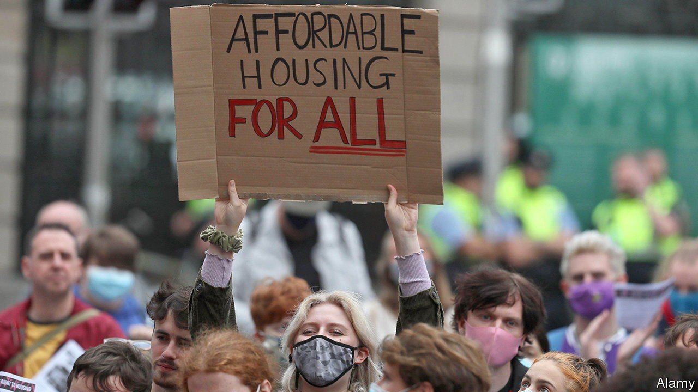

###### Barbarians at the garden gate

# Hostility towards private equity’s push into property is misguided 

##### Big investors are filling a gap in the market 

 

> Nov 20th 2021 

“VULTURES OUT” read one of the many placards young protesters waved at a recent rally in Dublin. The cause of their anger was spiralling rents in the Irish capital, pushed higher as the fastest growth in house prices in years has made renting more attractive. The sentiment is spreading. Private-equity firms, insurance companies, pension funds and other institutional investors that have snapped up residential property during the pandemic are becoming the butt of resentment in rich countries. As their share of the residential-property market has grown, so has the backlash. Some blame big landlords for soaring rents. Others accuse them of exploiting crisis for profit.

Policymakers have been fast to . The White House wants to restrict the types of properties that large investors are allowed to buy. New Zealand has scrapped tax breaks for property investors, and Ireland has slapped a 10% tax on the bulk-buying of houses. Canada’s central bank says the role that big investors play in housing requires more scrutiny. In Germany Berlin’s residents voted in September to force their city’s biggest landlords to sell more than 200,000 flats to the state, though the referendum was non-binding and the constitutional court is expected to overturn the result if it becomes law. Spain’s left-wing government is the latest to unleash measures to deal with big landlords. Under new proposals, they will face rent controls, higher taxes on empty property and a ban on buying social housing.


From this brouhaha, you might think that professional landlords are gobbling up the market. In fact, their share remains modest. In America investors own just 2% of rental homes. Across Europe, publicly listed funds own less than 5%. In Spain the criticism has focused on Blackstone, the country’s biggest residential landlord. After entering the market eight years ago, the private-equity giant now owns 30,000 homes. Yet this amounts to just 1% of the total stock.

There is no doubt that big investors have big ambitions. Single-family homes and flats that are built to rent have become a lucrative line of business. Other Wall Street firms such as KKR and Goldman Sachs are also piling in to the market—and they are building as well as buying. By some estimates, they account for more than 6% of new homes in America each year. Across Britain, institutional investors are expected to supply a tenth of the government’s housing target in the next few years. Since 2018 they have built nearly a quarter of new homes in Liverpool, and more than 15% in Nottingham, Leicester and Sheffield.

This injection of capital should be welcomed, not scorned. The investors want to make money, naturally, but they see a gap in the market that needs filling and they are doing something about it. Demand for rental housing has never been higher. In Britain less than one in ten homes were rented in the mid-1990s. The share today is closer to one in five. A third of households in America are rented. Falling home ownership rates across the rich world mean that decent quality housing in the private rented market is more sought-after than ever. Yet tenancies are insecure and the supply of rental homes has failed to keep up with demand. A number of countries face chronic shortages. Canada’s national rental vacancy rate in 2020 was 3%. In parts of Australia it is below 1%.

The flood of institutional money into the rental market comes at a crucial time. City centres are full of empty buildings, as a result of the pandemic. That has created the chance to expand housing there by converting them. However, this will require not only an overhaul of planning rules but lots of money to pay for the building work. Cities like New York show what is possible. Big investors there have been turning offices into homes for years. As a result, some 60,000 people live in Lower Manhattan today, up from just 14,000 in the mid-1990s. The City of London believes it has room for an extra 1,500 homes by 2030.

The crux of the problem is a lack of supply in the places where economic opportunities are greatest. Some say the answer is higher interest rates or macroprudential tools, such as restrictions on the amounts that banks can lend. These policies would temper demand and price growth, but would not bring the economic benefits of letting successful cities grow. Some favour loan schemes for first-time buyers, but these only inflate house prices—failing both homebuyers and taxpayers. Straightforward solutions such as relaxing planning laws can be politically poisonous. Britain seems to have shelved a proposed planning reform that would have encouraged more house-building.

Rather than rely on gimmicks, countries must build their way out of the crisis. That is why, instead of caricaturing big funds as barbarians at the garden gate, policymakers should lay out the welcome mat. ■

