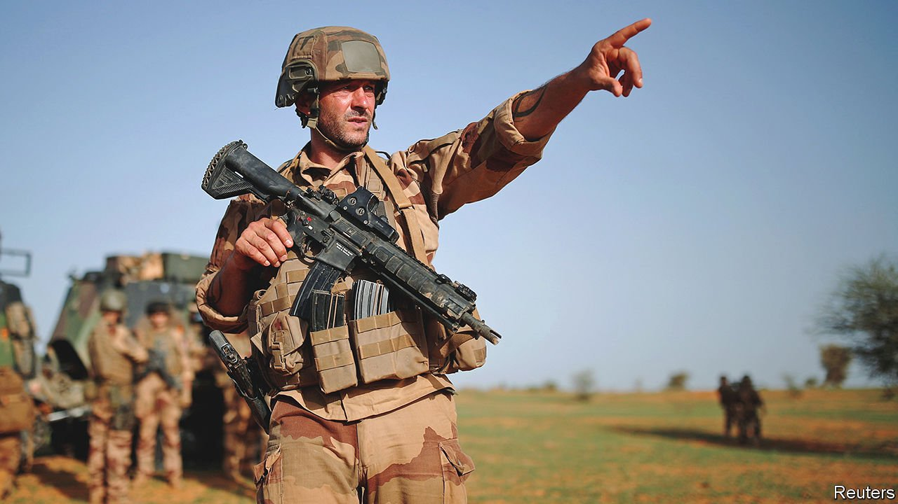

###### The next Afghanistan

# How not to lose the war on terror in Africa 

##### To prevail against jihadists in the Sahel the West must learn from past mistakes 

 

> Nov 20th 2021 

IN MANY WESTERN countries, politicians, soldiers and veterans gather every November to pay tribute to comrades killed fighting for their country. Among those commemorated this year were more than 3,500 troops from America and its allies who died in Afghanistan before the West’s humiliating retreat this summer. And among those paying tribute, far from the Cenotaph in London or the Arc de Triomphe in Paris, were dusty Western soldiers in small garrisons across a swathe of Africa. With the formalities over, they resumed their posts among almost 9,000 European and American troops on the front line of what is now the West’s biggest offensive against jihadists, in the Sahel. It is . How it will end depends in no small part on whether the West learns the right lessons from its failures in Afghanistan.

Some may argue that the main lesson is to avoid fighting insurgents in distant lands where no pressing national interests are at stake. But that is not the case in the Sahel, where jihadists aligned to al-Qaeda and Islamic State have taken aim at Western countries, bombing their embassies and kidnapping or killing their citizens. If the jihadists are given havens and time, they will surely launch attacks on European or American soil, too. “That is their goal and their determination and they’ve been open about it,” says a Western general.


Western governments see other interests at stake as well. The most afflicted countries of the Sahel (Burkina Faso, Mali, Niger) are among the poorest, have the world’s fastest-growing populations and are among those where climate change will do the greatest harm. It would not take much of a push by the insurgents to make some of these fragile states crumble. Millions could be displaced, many of whom would flee the ensuing humanitarian disaster northward, to Europe.

How to ward off calamity? Afghanistan underlines the need for patience. The Economist opposed withdrawing from the country when a small force could have kept the Taliban at bay without suffering many casualties. Western governments—and in particular France, whose forces do most of the fighting—should be clear that they are in for a long fight in the Sahel.

To try to build a full democracy against a ticking clock in Afghanistan was a fool’s errand. Doing so in the Sahel would take decades, if it were doable at all. Hence, although the West should offer more than a purely military solution, it should be realistic about what it can achieve. A start would be to respond to local grievances. Niger defeated a rebellion by its Tuareg minority in the 1990s by pairing military action with talks and promises of political representation and a share of state revenues. In Mali more than 40 local peace deals have provided some relief from relentless conflict. Outsiders must water these rare green shoots of peace.

Afghanistan also showed that, even with overwhelming military power, it is hard to defeat an insurgency without also winning over the local people. In the Sahel every demand for a bribe, every massacre by militiamen or soldiers, alienates civilians from Western-backed regimes and drives them towards the black flag of jihad. But governments are loth to disarm militias or prosecute abuses, for fear of provoking more coups. They should look to Niger which has managed to discourage ethnic militias. Though hard hit by a jihadist insurgency, it has thereby largely avoided the spiral of communal violence that afflicts its neighbours. Farther afield, Uganda showed it is possible to hold troops ruthlessly to account by sentencing two of its peacekeepers to death for killing civilians in Somalia.

Western governments must be honest with their own voters. Unless they build support for a long war, the jihadists may simply wait until the French-led operation grows weary. That would be a recipe for the same ignominious defeat suffered by the West in Afghanistan. It need not happen again. ■

