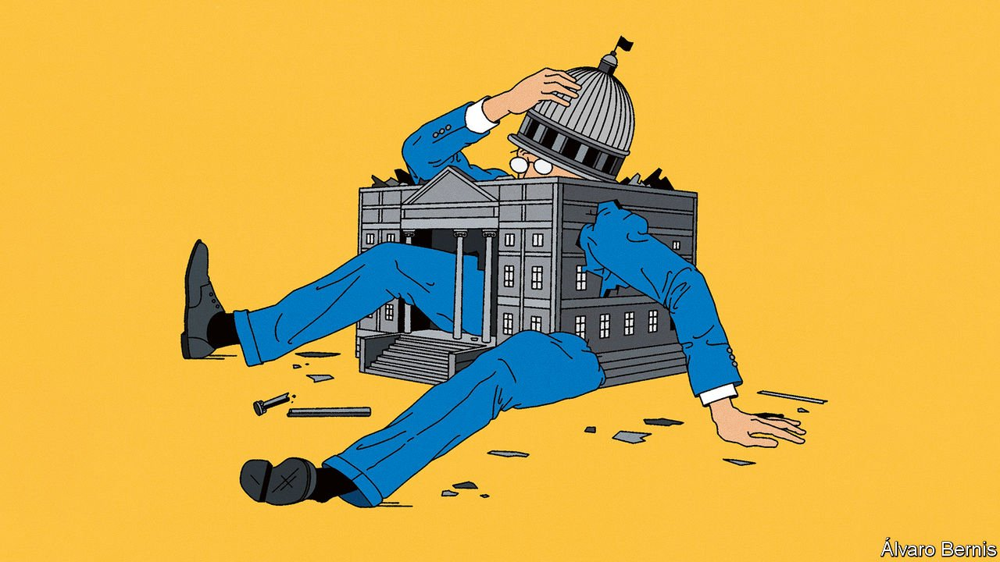

###### Bureaucracy unbound

# The world is entering a new era of big government 

##### How should classical liberals respond? 

 

> Nov 20th 2021 

“KEEP YOUR eye on one thing and one thing only: how much government is spending,” Milton Friedman once said. Today his eyes would be popping. Governments have spent $17trn on the pandemic, including loans and guarantees, for a combined total of 16% of global GDP. On current forecasts, government spending will be greater as a share of GDP in 2026 than it was in 2006 in every major advanced economy. America is about to put $1.8trn into expanding its welfare state; Europe is doling out a €750bn ($850bn) investment fund; and Japan is promising a “new capitalism”, with even more government largesse.

In the coming decades the state’s economic footprint will expand yet further. Four-fifths of the world economy is now subject to a net-zero emissions target, a goal that in Britain is projected to raise the government-debt-to-GDP ratio by 21 percentage points by 2050 as the state subsidises decarbonisation and growth slows. And many countries have ageing populations that will demand vastly more spending on health care and pensions.


It would be easy for classical liberals such as this newspaper to despair at government’s relentless march. As the state has grown during the pandemic, its failures have been on full display. Early in the crisis America’s public-health authorities hindered private labs developing their own tests for the virus; this year they took until October to approve rapid tests that could have been available before the summer. For months Europe’s vaccine roll-out was too slow. China once celebrated its response to the virus as a victory for a strong-state model. Now its zero-covid strategy exemplifies the inflexibility of unchecked centralised power. One of the scandals in which British politics is mired is over whether its leaders took advantage of the crisis to award lucrative contracts to their pals.

The long-term threat of a big state is that such bureaucracy, institutional failure and corruption become routine and widespread, making people poorer and limiting individual freedom. But these dangers are mixed with an opportunity. To understand how, consider why government grows.

As our  this week explains, the state almost always expands relative to GDP over time. Three forces are at work. The first is obviously malign. Inertia and mission creep make government hard to pare back. Voters and lobbyists who benefit from a regulation or item of spending have every reason to work hard at preserving it, whereas the many taxpayers who pay for pork barrels have better things to do than petition politicians to get rid of them. The bureaucrats in charge want to defend their turf and careers. When a programme fails, its supporters say it could still succeed if only it were given more money.

The second force is a fact of life. Prices of the services welfare states provide, such as health care and education, grow faster than the economy because of their high labour intensity and low rates of productivity increase. Though government inefficiency can make things worse, this “cost disease” afflicts the private and public sectors alike. It comes with the territory.

The third force is that governments today have more things to get done. As voters became richer over the 20th century they demanded more education and more of the expensive health care that takes advantage of the latest science. Today, as they age, they want to keep up spending on the elderly. And, increasingly, they want governments to do something about climate change.

These three forces are plain to see in the true impact of Margaret Thatcher and Ronald Reagan, the anti-government free-marketeers who loom largest in the public imagination. They are often said to have laid the groundwork for the “neoliberal era”. In fact, they did not leave a sustained legacy of smaller government. In 2019 America’s federal government spent a higher share of its GDP than in any of the ten years preceding Reagan’s presidency. Three decades after Thatcher left office—one of those decades being defined by austerity—Britain’s Conservative government will soon preside over the highest sustained spending as a share of the economy since the pre-Thatcher era.

The lasting victory of Reagan and Thatcher—and other reformers in Sweden, New Zealand and elsewhere—was over the first of the forces for big government. They realised that the state is at its worst when it is swollen by the distorted incentives of insiders to seek ever more control. Governments rightly sold off nationalised firms, cut back regulations, simplified some taxes and promoted competition. A consensus emerged about the limited role of government in liberal societies. Its adherents welcomed markets in most of the economy, but permitted redistribution and spending on public services to make the world fairer.

Today this consensus is under threat just when it is needed most. As ageing and climate change irresistibly increase government’s size, it is vital to recognise what the state can and cannot do well—and to avoid Leviathan wielding its might to the benefit of insiders and cronies. The argument for limited government should today be about the nature of the state’s interventions, not whether limiting global warming or providing for the elderly are necessary.

One task is to maximise the role of markets and individual choice. Climate change should be fought with a price for carbon, research-and-development subsidies and highly scrutinised public investments, not by rationing flights, promoting green national champions or enlisting central banks to distort financial markets. The welfare state should focus on redistributing cash and letting those in need choose what to do with it, not setting up new bureaucracies such as President Joe Biden’s proposed federal child-care system. Taxes should be broad-based and friendly to investment.

The supersized state

The state must also seek to be nimble and efficient. Income support for households should be automated where possible as the financial sector becomes more digitised. Much form-filling can be eliminated, as Estonia’s war on paperwork has shown. If there were fewer, better-paid bureaucrats, the public sector could attract more talented staff. And politicians should be willing to start afresh when tackling new problems, rather than relying on lacklustre incumbent departments. The biggest successes of governments during the pandemic have come from internal startups like Operation Warp Speed, which helped bring about America’s development of vaccines.

The state should strive to be impartial. Narrow interests, whether the unions and anointed victim groups favoured by the left, or the right’s chums in business, will always seek to capture it. To resist, bureaucrats do not need relentless cynical, self-serving attacks on their integrity from politicians, but transparency and support for the ethos of public service. Though rising total spending on the old is justified, a full-scale gerontocracy is not. Retirees with deep pockets do not need public handouts. On the contrary, they should bear a heavier burden as taxes shift from wages, towards property, inheritance and consumption.

The prize is enormous. The difference between good government and bad will be measured not just in the rapid transition to net zero and the provision of a sustainable safety-net for the old, but in societies that are fairer and a lot more prosperous. In the 20th century classical liberals ensured that the growth of government accompanied the progress of humanity. The same might yet be true in the 21st. ■

For subscribers only: to see how we design each week’s cover, sign up to our weekly  newsletter.

