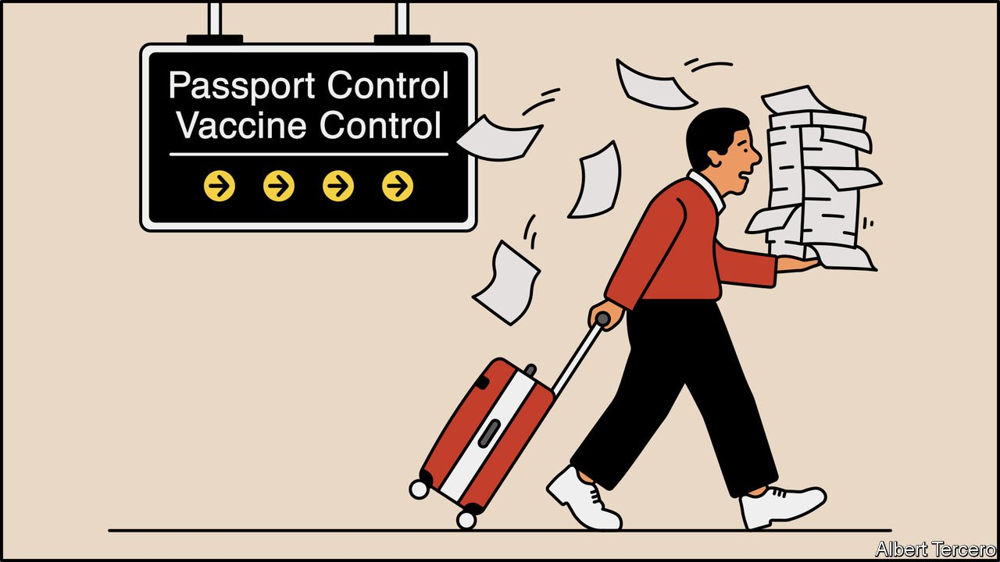
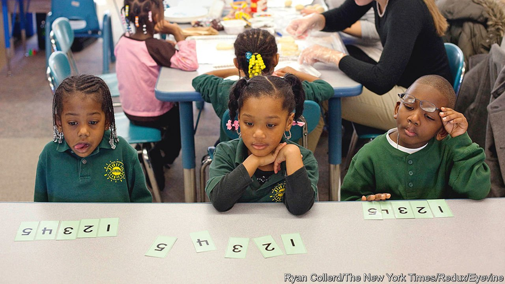
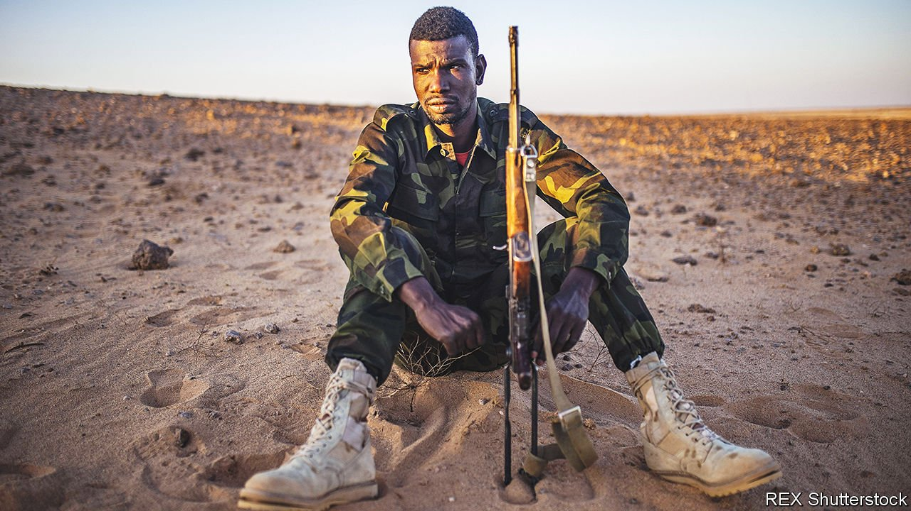
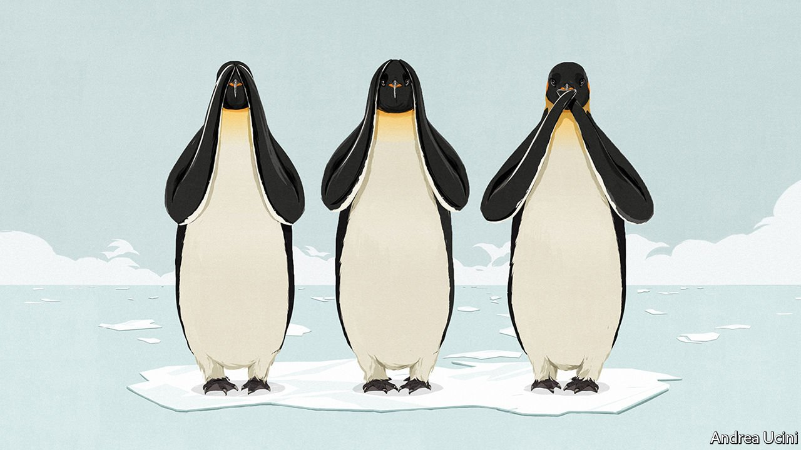
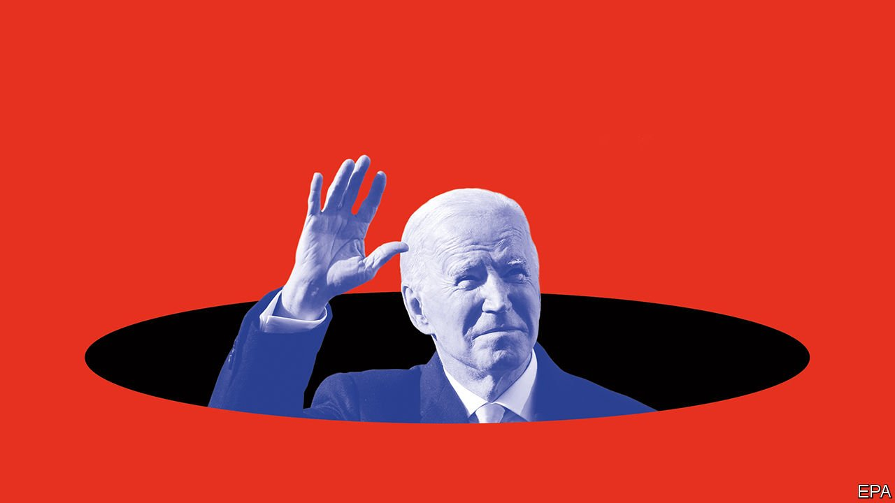
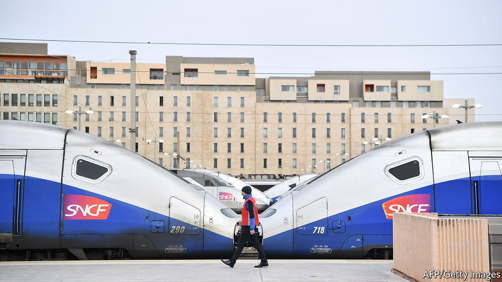

###### On vaccine passports, maths, Western Sahara, climate change, Joe Biden, French acronyms

# Letters to the editor 

##### A selection of correspondence 

 

> Nov 20th 2021 

Letters are welcome via e-mail to 

Vaccine passports

Your article on vaccine passports mentioned a paper-based “yellow card” that the World Health Organisation has published for 30 years (“”, October 30th). This document contains the International Certificate for Vaccination or Prophylaxis (ICVP), which is recognised by all countries, unlike country-specific covid-19 certificates. The WHO is working on a digital version of this. In the near term the paper-based booklet will be revised to include an extra section on laboratory results aimed at providing a universally accepted tool for international travel.


Currently, the WHO does not recommend that countries require proof of vaccination against covid-19 as a condition of travel, given the limited and uneven access to vaccination worldwide. Nevertheless, travellers can be provided with an international certificate on the model of the ICVP to document that they were inoculated with any of the vaccines that have received WHO approval for emergency use. Measures such as testing or quarantine could be eased for vaccinated travellers, based on each country’s risk assessment and on WHO guidance.

TARIK JASAREVICSpokesperson

World Health Organisation

Geneva

 


A question of numbers

“” (November 6th) correctly highlighted a serious problem with American competitiveness and national security arising from the poor quality of education in mathematics. You discussed at some length the methodology of teaching, but the real problem is the quality of the teaching. Teachers are poorly paid. A graduate with an engineering or science degree can earn twice as much in the private sector.

Substandard teaching in maths, science and technology has far-reaching consequences. I came to America on an H-1B visa because my employer could not find an American with my skills. Visit any engineering office or laboratory now and you’ll find that about half the workers obtained their primary and secondary education in a foreign country. Relying on immigration to make up the shortfall has worked so far, but America is becoming less attractive as a destination for various reasons, making it more difficult to attract these skills.

NIGEL GALESan Antonio, Texas

 


Morocco and Western Sahara

Regarding the conflict in Western Sahara (“”, November 6th), the claim by the Polisario Front, which is seeking independence, to control 20% of the land is a flagrant violation of the 1991 ceasefire agreement, as the UN has repeatedly noted. Under the agreement, 80% of the territory remains under Moroccan control and 20% is designated as demilitarised buffer zones.

It is true that Western Sahara under Morocco’s rule is booming. Subsidies target Sahrawis first and foremost, and not only non-Sahrawis coming from other parts of Morocco. By contrast, Sahrawis in the camps on Algerian soil are warehoused against their will. They are considered refugees but they have no right to free movement or gainful employment, nor to be counted and identified, as stipulated in the Geneva Convention and demanded by the UN Security Council. The Polisario receives 134,000 daily food rations from the World Food Programme, but aerial pictures and evidence on the ground suggest that those in the camps number less than 90,000. The European Anti-Fraud Office has accused Polisario in the past of embezzling rations and selling them on the black market, with help from Algerian military officers.

War will only make an already dire situation in the camps unbearable and explosive. Morocco has been trying to appeal to Algeria to open channels of dialogue. Rulers in both countries owe it to their populations and next generations to think peace and not war, prosperity instead of belligerence. Those beating the drums of war would drag the region into a conflict where everyone will lose.

LAHCEN HADDAD

Minister in the government of Morocco, 2012-16

Rabat

 


The elephant not in the room

China pumps almost 30% of the world’s carbon-dioxide emissions into the atmosphere, and yet you singled out the prime ministers of India and Australia and a senator from West Virginia as cowards on fossil fuels (“”, October 30th). Xi Jinping didn’t even turn up at the COP26 summit in Glasgow. China is still increasing its capacity for coal-fired power stations.

GREG WELSBY

Brisbane, Australia

One widely neglected legal issue associated with global warming is how international bodies, and the UN in particular, should deal with waterlogged states; small islands and low-lying countries that will probably be flooded by 2100 because of rising sea levels. Much has been said about relocating populations from these places for their safety, but no attention has been paid to the legal standing of these states without a sovereign territory to rule. Will they continue to enjoy votes in the UN and other world agencies?

PROFESSOR PETER HAAS

University of Massachusetts Amherst

 


Battling Biden

Your analysis of American politics is bleak (“”, November 6th). Joe Biden’s widely popular social, infrastructure and climate programmes are apparently no match for the challenges at hand. The party of liberalism, diversity, education and the popular vote is mathematically doomed at elections. All that is left is for Donald Trump to fulfil the prophesies and return in 2024 with a flush Republican majority in Congress. Can a future edition give us details about how to emigrate to Canada? Or better yet, provide a road to redemption?

GREG BUSS

Portland, Oregon

 


Quintuple-A rating

The French addiction to acronyms does indeed extend to gastronomy (“”, October 30th). The acronym AAAAA on menus marks the provenance of stuffed intestines approved by the Association Amicale des Amateurs d’Andouillette Authentique (Friendly Association Of Authentic Andouillette Amateurs). I like to think that the abbreviation is somewhat tongue in cheek.

CHRIS CLOUGH

Paris

It is the Dutch who top the Euro-abbreviations league. Theirs run the full gamut from political parties (PvdA, D66, PVV, VVD) to football clubs (NEC, NAC, VVV, MVV, AZ). And the Netherlands surely wins the prize for the world’s silliest name for a football club: Go Ahead Eagles.

PETER CAIN

Trier, Germany

The essential feature of an acronym is that it can also be pronounced as a word. This was clearly understood by Admiral Ernest King when he was offered the position of commander-in-chief of the US fleet by Franklin Roosevelt soon after Pearl Harbour. He accepted, but asked that the job’s acronym, CinCUS (“sink us”), be changed to CominCh.

MICHAEL LAGGAN

Newton of Balcanquhal, Perthshire

