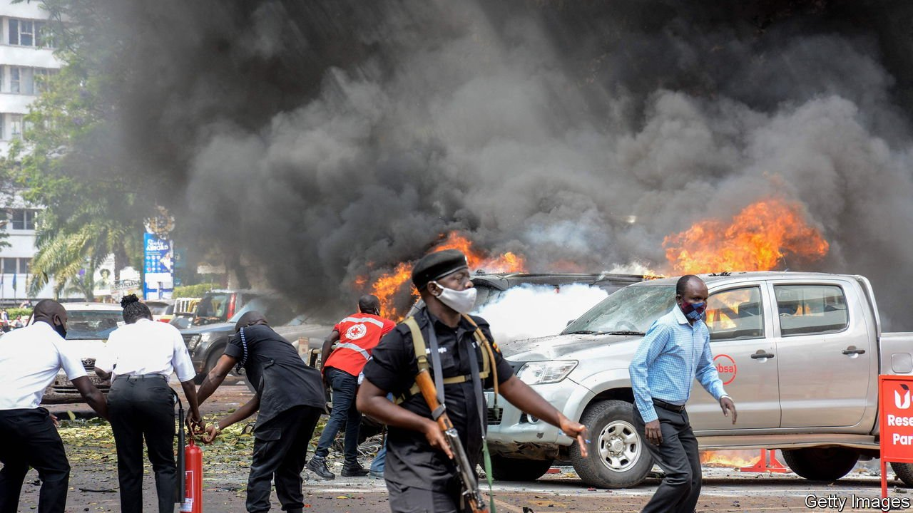

###### Whodunnit

# A string of bombings is rattling Uganda 

##### Is the Islamic State responsible? 

 

> Nov 18th 2021 

PLUMES OF SMOKE rose above Kampala, Uganda’s capital, after a bomb blew up near the central police station on November 16th, followed minutes later by a blast on a road that runs past the parliament. Counter-terrorism police then shot dead a man who they said was carrying a device intended to set off a third explosion.

Police said that seven people, including three suicide-bombers, died in the blasts, which injured another 36 people. They were quick to blame “radicalised groups” linked to the Allied Democratic Forces (ADF), a rebel outfit based in the neighbouring Democratic Republic of Congo. Islamic State (IS), which counts the ADF among its affiliates, later said that it was behind the attacks.


The bombings did not come out of the blue. Last month a waitress was killed by a blast in a Kampala bar, for which IS also claimed responsibility. Two days later a man detonated a bomb on a bus, killing only himself. More tenuously, the government has blamed the ADF for a string of attacks on public figures, including an assassination attempt in June on a government minister and former army commander. Those shootings, carried out by men on motorcycles, followed a different pattern from the recent bombings. The evidence linking them to the ADF seems shaky.

The ADF was born in the 1990s in a marriage of convenience between Islamist rebels and ethnic separatists from the Rwenzori mountains straddling the border with Congo. It mounted several bomb attacks in Uganda before decamping to lawless eastern Congo, pursued by Uganda’s army. It found a niche there among a patchwork of rival militias, looting villages and smuggling timber. At one point it had shrunk to just a few dozen fighters.

The ADF is plainly making a comeback. Last year it killed at least 800 Congolese civilians and forced thousands to flee their homes. In one attack this month it massacred 38 people in the Congolese town of Beni, slitting their throats or burning them alive. It has been reinvigorated by a growing network of recruits across east Africa, who share bomb-making skills and may be inspired by wider Islamist influences. Last year Musa Seka Baluku, leader of one ADF faction, declared that his group was now the “Central Africa Province of Islamic State”. In March the American government designated it a foreign terrorist organisation and an IS affiliate.

It is not yet certain whether the ADF has operational links to IS. A report by UN experts in June found no conclusive evidence that IS had command over it, or provided “financial, human or material” support. But jihadist propaganda that links the two groups has raised the ADF’s profile and lets IS boast of an ever-wider global reach.

Uganda’s president, Yoweri Museveni, also has an interest in playing up the threat. He has long positioned himself as an ally in the global war on terror, securing financial and military support from Western governments which has helped him prolong his authoritarian rule.

“The ADF originally grew out of a feeling of marginalisation among the Muslim community of Uganda,” says Kristof Titeca of the University of Antwerp, noting that the government has sometimes made that problem worse. A notorious anti-terrorism police unit has a record of abducting and torturing Muslims, some of whom have died in custody. After this week’s bombings Mr Museveni boasted of the recent extrajudicial killings of seven men who he says were linked to the ADF. Tellingly, he signed off with the nickname his supporters gave him in the civil war that brought him to power: Ssabalwanyi, meaning “Greatest of fighters”. ■

