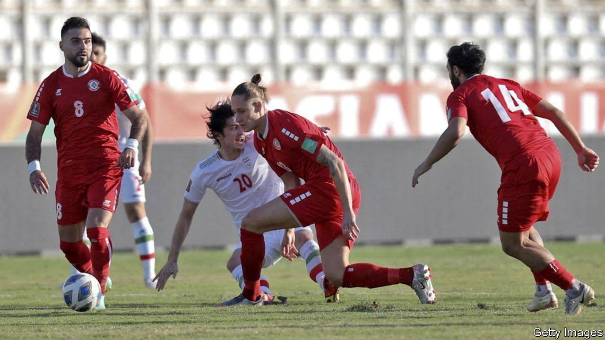

###### Pitch darkness

# Even football has become mired in Lebanon’s political and economic crises 

##### The country is struggling to hold World Cup qualifiers amid power cuts and ruined stadiums 

 

> Nov 20th 2021 

IT SHOULD HAVE been a moment for national excitement. Lebanon has never reached the final stages of the World Cup before, but its national squad has made it to the third round of qualifiers for next year’s tournament in Qatar. Last month they netted a crucial win against Syria. Going into two matches this month, against Iran and the United Arab Emirates (UAE), the Cedars seemed to have a fighting chance of making the play-offs. Instead of revelry, though, the contests offered a reminder of how much has gone wrong in a country mired in political and economic crises.

Start with the timing. The fixtures could not be at prime time in the evening, because enough electricity could not be guaranteed to keep the stadium lit. Then FIFA, football’s global governing body, barred fans from the stands, citing security. Some would have struggled to make the trip anyway, since petrol prices have risen tenfold in the past two years.


Then there was the venue. The national stadium in Beirut was damaged in a huge explosion at the city’s port last year. Instead the qualifiers were played in Sidon, 40km (25 miles) south, at an arena sometimes called Martyr Rafik Hariri Stadium. So Lebanon played Iran (and lost) on a pitch named for a prime minister whose murder is widely blamed on Hizbullah, a militia backed by Iran.

Football is often politics by other means, but Lebanon’s matches took that maxim to an extreme. Some Lebanese accused Hizbullah supporters of cheering for the other side. Others posted photos of Iran’s team lugging bulky suitcases through Beirut’s airport, musing that the bags might be stuffed with military gear rather than football kit.

Five days later, the stands were empty again for Lebanon’s 1-0 loss to the UAE. Last month Saudi Arabia recalled its ambassador from Beirut after Lebanon’s information minister criticised the Saudi-led war in Yemen. The UAE, loyal to the Saudis, told its citizens not to travel to Lebanon.

Lebanon’s collapsing economy has prompted many citizens to leave. Athletes are no exception. With salaries fast becoming worthless, several star footballers have decamped for Jordan.

Even watching their favourite teams is now a challenge for Lebanese fans, many of whom like to follow Europe’s Champions League on TV. This summer, though, far fewer could afford a $75 subscription package, twice the monthly minimum wage. Others found themselves sitting in darkness at kick-off.

Few expect things to improve soon. The cabinet, formed in September after a year of deadlock, has not met in over a month owing to political disputes. Elections scheduled for spring portend more paralysis. As for the Cedars, they trail the UAE in the race for a spot in the play-offs. At least their next qualifier, in January, will be played against a far less contentious rival: South Korea.

