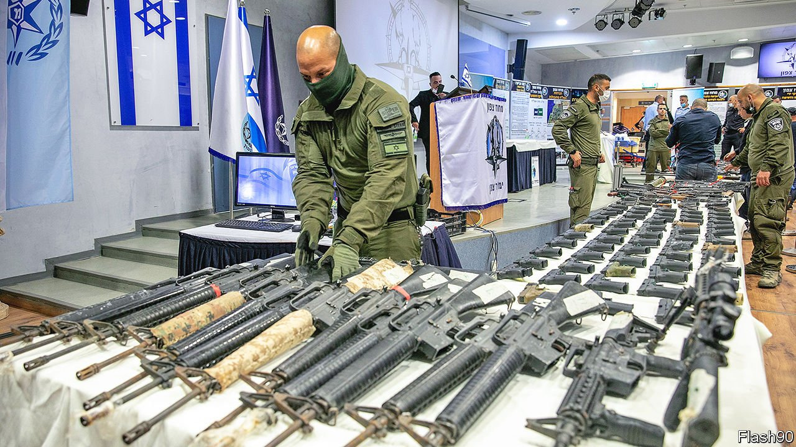

###### Spies against crime

# The murder rate rises among Arab-Israelis 

##### The government is sending in more police, who are not always welcome 

 

> Nov 18th 2021 

AUGUST 11TH WAS a red-letter day for the Israeli police. A new division, headed by Israel’s first Muslim deputy commissioner, was inaugurated with the mission “to thwart crime in Arab-Israeli communities and to restore security to the streets”. In the Middle East, where no ceremony is complete without guns, weapons seized in raids on Arab neighbourhoods were put on display. Naftali Bennett, Israel’s prime minister, promised enough funding to triple the number of Arab officers in the force in the next few years.

In the months since, however, violence has soared. At least 109 Arab-Israelis have been murdered this year, mostly by gangs. To emphasise their control of the streets, criminals shot at the new commander’s home in Kafr Kanna in Galilee.


Israeli and foreign attention is often focused on the violent clashes between Israelis and Palestinians in the West Bank and Gaza. Overlooked is a growing crime wave afflicting Israeli-Arabs. In 2020 a record 96 Israeli-Arabs were killed in criminal incidents. That figure has already been surpassed this year, with 98 deaths in its first nine months. Israeli-Arabs are 21% of Israel’s population but three-quarters of the country’s murder victims. Police think that 80% of the country’s gun-related crimes between 2015 and 2019 took place in Arab neighbourhoods, where tens of thousands of illegal weapons are stashed away. On November 9th, 65 Arab-Israelis were arrested and dozens of weapons seized in what the police described as the biggest ever operation of its kind in Israel.

This year the police have solved 71% of murder cases where the victim was Jewish. But this success rate tumbles to just 22% when the victims are Arab (almost all non-political murders are Jew-on-Jew or Arab-on-Arab). One of the main problems is, indeed, a lack of policing. Despite promises by previous governments to devote more resources to such work in Arab neighbourhoods, only 13% of police officers are Arab, and a third of police stations planned for Arab towns have never been built.

The shortfall is not just in numbers, but in operational targets as well. Over the previous two decades, police waged a successful campaign against the main Jewish organised crime groups, leaving space for Arab syndicates to take over their rackets.

Neglected by the police, some Arab local authorities have taken to hiring their own security firms. But some of these have brokered side deals with the crime families and are now trying to block the police from making arrests.

The question of how best to deal with the crime wave goes to the heart of the Arab-Israeli predicament. As Israeli citizens, most Arabs want to be treated equally with Jews. But many also see themselves primarily as Palestinian and feel that co-operating with or working for the Israeli police would betray this identity.

Efforts to curtail Arab criminals present their own dilemmas. In the hope of achieving swift results, the government also plans to enlist Israel’s internal security agency, the secretive Shin Bet, to make use of its electronic snooping kit and intelligence-gathering skills. These have been honed during decades of trying to catch Palestinian bomb-makers.

Not everyone is happy to see the spy agency turn its eyes to gang crime. Many Arab-Israelis see Shin Bet as an agency of political oppression and fear that its officers see Arab-Israelis as potential fifth-columnists. Shin Bet also makes itself unpopular by shielding Arab criminals who double up as informants.

Mansour Abbas, the leader of Ra’am, a conservative-Islamist party that is part of the governing coalition, approves of the government using “all the tools it has, all the agencies it has” to fight crime. By joining the government, Ra’am has secured $16bn in funding for Arab areas, part of which will go to policing. His rival Ayman Odeh, leader of the Joint List, an Arab opposition alliance, retorted angrily, “After decades in which the government and police treated us as the backyard, the last thing we need is more of the same: police for Jews and Shin Bet for Arabs.”

“The problem goes far beyond a lack of police officers,” says Thabet Abu Rass of the Abraham Initiatives, a pro-tolerance charity. A lack of building permits in Arab areas provokes family feuds over the tiny parcels of land that can be built on. A lack of bank lending leaves many Arab citizens reliant on loan sharks. Widespread joblessness makes it easy for gangs to recruit lookouts and gunmen. Mr Abu Rass blames “Arab leaders who know who the crime bosses are and won’t call them out, and the Jewish leaders who won’t address the core problems of equality”. Just adding more cops, he says, “won’t change that”. ■

