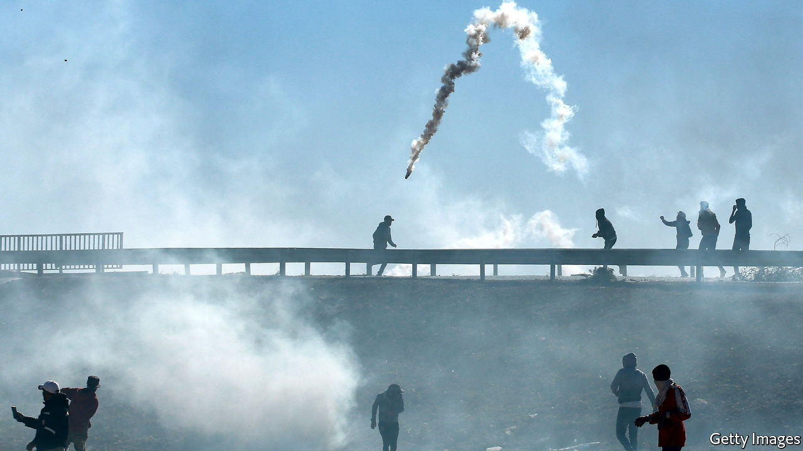

###### Bad smells everywhere

# Tunisia gets violent over landfills 

##### Corruption over rubbish collection is undermining the government 

 

> Nov 20th 2021 

IT WAS DIFFICULT to tell the smells apart. For months the town of Agareb, near Tunisia’s coast, had reeked of rubbish because of an overflowing landfill. In September the authorities closed the site, which residents were calling a danger to public health. But this month, after trash had piled up in the streets, it was reopened. Protesters cried foul and on November 10th clashed with security forces. Along with the stench of tear-gas and garbage, a new smell filled the air: burning tyres.

One person was killed and a police station was ransacked. It was the worst violence in Tunisia since President Kais Saied suspended parliament and grabbed power in July. Critics called his actions a coup. But many in Agareb applauded him. The town of 40,000 has long been neglected. Its poor residents have grown disillusioned with the country’s decade-old democracy. They say they voted overwhelmingly for Mr Saied in 2019, hoping he would clean up corruption. If he had to act like an authoritarian to do it, so be it.


That was how most of them felt in July. Now they have changed their minds. The people of Agareb are calling Mr Saied a dictator. For it was he who overruled the local authorities and reopened the landfill, in part to provide relief for nearby Sfax. Tunisia’s second city and industrial powerhouse had been suffering under even bigger mountains of uncollected garbage.

Residents of Agareb say the landfill, opened in 2008, was meant to be in use for only five years. A judge ordered it closed in 2019, to no avail. Now it is not only overflowing, but full of dangerous industrial and medical waste, including amputated body parts and fetuses, say activists. They claim the dump has spread disease including respiratory ailments and cancer.

Tunisia collects around 2.5m tonnes of waste every year. Little of it is recycled. Much of it ends up in one of 13 official landfills without being properly treated. A lot of it just piles up in the streets. Even in Tunis, the capital, less than two-thirds of the waste is collected, says the World Bank. In Sfax province the local government refused to collect rubbish after the Agareb landfill was closed.

Collecting trash can be profitable. But the big contracts offered to waste-management companies have been controversial. Elyes Fakhfakh resigned last year as prime minister after he was accused of concealing a conflict of interest in awarding such deals (he denies wrongdoing). His opponents also have links to businessmen with fingers in the waste-management pie.

Last summer an Italian company sent nearly 300 containers of “plastic trash” to Tunisia. A Tunisian firm had agreed to recycle it for a fee. But the trash was mostly household waste, of the sort now piling up on Tunisian streets. The deal violated international treaties, as well as Tunisian law. Twenty-six people, including a former environment minister, were arrested.

The waste-management scandal typifies Tunisia’s corruption and mismanagement, with the burden falling mostly on the poor. It was hoped that Mr Saied’s government would do better. But cleaning up Tunisia is proving to be as hard as ever. Many of the country’s landfills are in poorer areas like Agareb. Any of such places could be the next to erupt. ■

