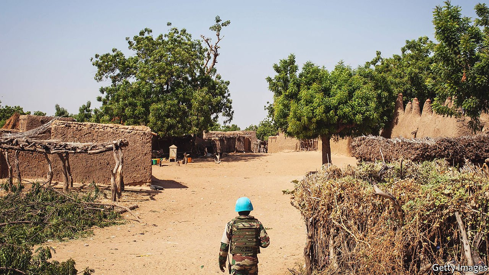
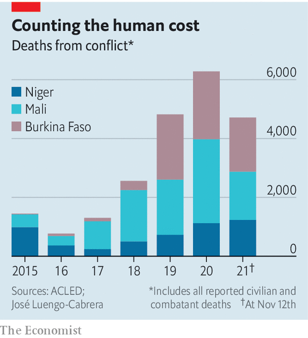
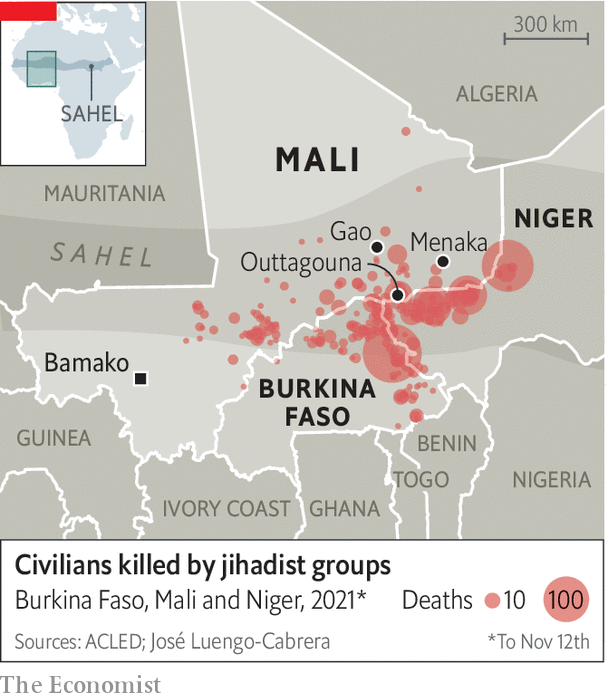

###### Sahel in a handbasket

# Why the war against jihadists in Mali is going badly 

##### Dysfunctional politics is exacerbating poor security 

 

> Nov 18th 2021 

WHEN UN PEACEKEEPERS roll out into the sand and scrub beyond their bases in Gao in northern Mali, locals loosen veils and light cigarettes. When British peacekeepers camped near one village, people held a joyous wedding with dancing and singing, both of which had waned under the influence of the jihadists battling for control of the area. Outgunned by the British detachment, the insurgents “try to be where we are not”, says Major Gavin Hudson, one of its officers.

In much of northern Mali the state and its security forces are completely absent. So when the blue helmets move on, safety goes with them. At dusk one evening in August jihadists swept into the town of Outtagouna, about 170km (106 miles) from Gao. They gunned down at least 54 young men. Peacekeepers arrived the next morning but, laments Major Hudson, they were too late to be of much use.

 


The biggest Western fight against jihadists is now in Mali, Niger and Burkina Faso. France has about 5,000 soldiers fighting in the region, backed by about 1,000 American troops. Hundreds of European commandos help them and train the Malian army. The UN has almost 15,000 peacekeepers. Yet even with these forces arrayed against them, the insurgents have spread relentlessly across Mali and deep into neighbouring Niger and Burkina Faso. More than 2m people have been forced from their homes and more than 10,000 killed in the past two years (see chart).


In short, the region’s governments and their Western backers are slowly losing the war. Many of the reasons can be seen in Mali, where the insurgency first took root under a corrupt government focused on the capital, Bamako, at the expense of the rest of the country. Across much of Mali there are no police, judges, teachers or nurses. UN peacekeepers recently flew a regional governor to a village in the north-east to meet his people. For one 61-year-old villager it was the first time in his life he had ever seen anyone representing the state. In 2018 fully 75% of civil servants (including teachers and nurses) were in the capital, on which the government showered 80% of its spending even though it is home to roughly 13% of the population. The authorities have, in effect, outsourced the war to France and the UN, withdrawing their forces from large parts of the country. In areas where there is no state and criminality is rife, jihadists are able to win support by offering justice, even if it is brutal.

In Burkina Faso and Niger, too, jihadists flourish in places where the state is absent or where they have been able to force it out. Since 2018 insurgents in the borderlands between the three countries have assassinated or abducted 300 officials, community leaders and their family members.

Most analysts argue that the jihadists will not be beaten by force alone, and that improved governance and economic development are essential to win the state legitimacy. But where to start with a state that has done so much to delegitimise itself? In 2020, after the government claimed victory in a dodgy legislative election, thousands of people took to the streets in protest. They were angry not just about the election but also about corruption and deteriorating security. Many cheered a coup led by Colonel Assimi Goïta in August of that year. Although he promised to hold elections within 18 months and appointed a civilian as interim president, he soon changed his mind and used a second coup in May this year to install himself in the top job.

Choguel Maïga, his civilian prime minister, recently said that elections promised for February could be delayed by “a few months”. It will probably be much longer. “Elections have given us what for 30 years? Endemic corruption, lethargy and nepotism,” says Oumarou Diarra, a former imam who is now in the government. The putschists claim they need more time to “refound” the state after years of corruption and bad government. Many Malians believe them. A poll of Bamako residents in September found that 75% wanted the elections postponed.

General Marc Conruyt, who recently commanded French forces in the region, argues that “the political upheaval and political difficulties in Bamako had a very, very limited impact” on military operations. But that may not last. To rally support for a much longer transition, Mali’s interim government has repeatedly blamed France for the country’s woes. Mr Maïga recently claimed, absurdly, that France is training jihadists. Yet he also complained about France closing some bases and about its plans to withdraw almost half of its troops.

Complicating matters further are Mali’s plans to hire Wagner Group, a Russian mercenary outfit. “When you call a doctor [because]...your fingers hurt but now your whole arm is missing,” says Mr Diarra, “you should change doctor.” Yet this is a dangerous game, especially as Mr Goïta would probably prefer France to stay despite his government’s taunts. Florence Parly, the French defence minister, warns that her country “will not be able to cohabit with mercenaries” if Wagner deploys.

 


Politics is tangled up with security—and violence—in the provinces, too (see map). Many jihadists are political figures with a following. Iyad Ag Ghali, the leader of Jama’at Nasr al-Islam wal Muslimin, which is linked to al-Qaeda, was not always a jihadist. He first came to prominence as a Tuareg rebel leader. Many jihadists in northern Mali remain linked to Tuareg separatist groups. A peace agreement signed in 2015, which could reduce some of the anger that drives people towards violence, has not been fully implemented.

In central Mali, where violence is now worse than in the north, jihadists have exploited rifts between communities and posed as defenders of the Fulani ethnic group. Militias such as Dan Na Ambassagou (“Hunters who trust in God”) claim to defend other ethnic groups. The result is tit-for-tat massacres. A similar dynamic is tearing at the social fabric in Burkina Faso and Niger. Peace requires not just schools and clinics but also ideas about how best to share power in multi-ethnic communities.

Many Malians believe that talks with jihadists could provide some ideas. France, which has lost over 50 soldiers in the Sahel since 2013, opposes that idea. Still, there have been more than 40 local peace deals in Mali and plenty in Burkina Faso, too. Some are between clashing ethnic groups, but others include the jihadists.

High-level political negotiations between the Malian government and senior jihadist leaders would require a bigger leap. The Malian government recently announced that such talks would begin and then, days later, denied it. Many suspect French pressure was behind the flip-flop, but there are also tensions between Mr Goïta, who is thought to favour negotiations, and Mr Maïga, who is more sceptical.

The trouble is that the Malian government will not be entering into any negotiations from a position of strength. “The stability of the Sahel”, intones Mr Diarra gravely, “depends on the stability of Mali.” He is quite right about that. But it is hardly a reason for optimism. ■

An early version of this article was published online on November 17th 2021

