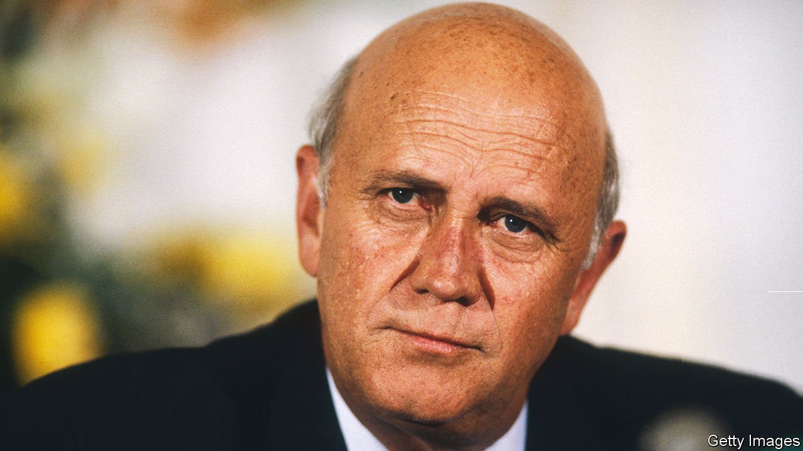

###### Builder and dismantler

# F.W. de Klerk had to abandon what his ancestors had believed in 

##### The last president of apartheid South Africa died on November 11th, aged 85 

 

> Nov 20th 2021 

TO MAKE THE close acquaintance of F.W. de Klerk was to look into the face of a voortrekker. Although he had been comfortably brought up in suburban Johannesburg, his blue eyes still seemed to stare across the veld and the mountains the Afrikaner volk had crossed on the Great Trek in the 19th century. And his set jaw seemed ready to declare, as he often did, the blunt-but-courteous words: “You are wrong.”

His people had taken wagons eastwards to escape the imposition on Dutch-speaking Boers of English imperialism, English anti-slavery laws and the English language. For him the Boer wars against the British, in which his grandfather fought, were the first anti-colonial conflicts in Africa, and the Boers were another African tribe. His own Huguenot ancestors had arrived there in 1688. That made him an African born and bred, through and through, as well as one of a strictly Calvinist people destined by God’s hand to find their dwelling place in southern Africa.


The de Klerks survived grandly. His uncle became South Africa’s prime minister in the 1950s, and his father also served in government. Both men built up the National Party, which in 1948 introduced apartheid. Under this system it was illegal for different races to marry, socialise, own property or work without permission across much of the country. In 1970 black South Africans were barred from citizenship and expected to move from the cities to “Bantustans”, distinct tribal states, leaving whites as the majority.

To Frederik, as he grew up and studied behind the walls of his own culture, this seemed how things should be. God, having created the different races from Adam, also allotted the boundaries where each race should live. Apartheid was Scripture, to the letter. But then in 1993, as president, he took the whole system down.

The first step came in 1990, when he vowed in Parliament to begin negotiations to end it. The African National Congress (ANC), the main group resisting apartheid, was to be unbanned and its leader, Nelson Mandela, released from prison. Conservative MPs were shocked, and heckled him. They knew him as a firm supporter of apartheid, especially when, as education minister, he reinforced it in the universities. He was also a member of the Broederbond, a secret brotherhood that protected Afrikaner interests. Now he was betraying them.

He brushed that accusation aside. First, he had always been a pragmatist, despite the tough talk. Politics, as Bismarck said, was the art of the possible. The silver thread in his career was loyalty to party policy, so he proposed only as much as he thought the party would bear. At some points he sounded ultra-conservative. At others—as when he oversaw the repeal of the Mixed Marriages Act—he seemed liberal, almost revolutionary.

Second, his speech was no Damascene moment. His conversion had been gradual. It began when he had to deal with black and coloured (mixed-race) clients in his first legal practice in Vereeniging. As a politician after 1972, he became still more involved with other races. By the late 1980s he had started to look hard at himself, on his knees before God, to find out where he and the party should go. Apartheid was under increasing strain. The Bantustans were struggling. In the slums and townships on the outskirts of cities, where most of the black population had stayed, misery and indignation were sparking into violence. And his country, beset by sanctions, was now isolated in the world.

Publicly he boasted that South Africa could get round sanctions. Privately, he knew it was teetering over the abyss. And it was not just the economy or the violence that worried him. He was a member of an increasingly beleaguered tribe, and his bold dismantling of apartheid was not just to ease the lives of the black majority. It was also to ensure that Afrikanerdom was saved.

The aftermath was hard. In South Africa’s first all-race elections, in 1994, the ANC swept the board with two-thirds of the vote, a share he thought unhealthy. He was appointed deputy president in Mandela’s new Government of National Unity, which felt humiliating. And working with Mandela, despite some mutual respect, was a strain. When they jointly won the Nobel peace prize in 1993 he found himself seething during Mandela’s speech, biting his tongue to keep his fury back. It wasn’t the only time. There were silent spells, too, and arguments even in the street.

Frankly, he felt he had done more than Mandela to bring apartheid down. To convince his own party had been bruising. At one peak in the terrible unrest he had defied his own generals, who wanted to bring in martial law. The chief reason for Mandela’s coolness towards him was that he would not apologise for apartheid, or declare it intrinsically evil. But almost to the end, he could not do that.

He managed to admit the pain caused by it, and to call it “unfortunate”. But he still agreed with the premise. A separate-but-equal space for each tribe to develop was not morally repugnant to him. His own people had wanted that, when they set up independent Boer republics in Transvaal and the Orange Free State. And it could be a racial success. America had clobbered him, but on a visit there in 1976 he had seen more racial incidents in a month than in South Africa in a year.

When the Truth and Reconciliation Commission spoke to him in 1995, he defended the state security forces who had backed the racist status quo with ever increasing violence. He denied that they had ever been authorised to carry out killings, least of all by him. Such abuses by rogue whites were always overplayed. And he resented being nagged to prostrate himself. Only at the end, in a video released posthumously, did he utter the word “wrong”.

In 1989, when he took the oath as South Africa’s president, he refused to say “So help me God”, after the chief justice. Instead he said clearly, in Afrikaans, “So help me the triune God, Father, Son and Holy Spirit”. When he retired from politics and wrote his memoirs, he gave them the bland subtitle “A New Beginning”. But their title, much more fervent, was “The Last Trek”. ■

