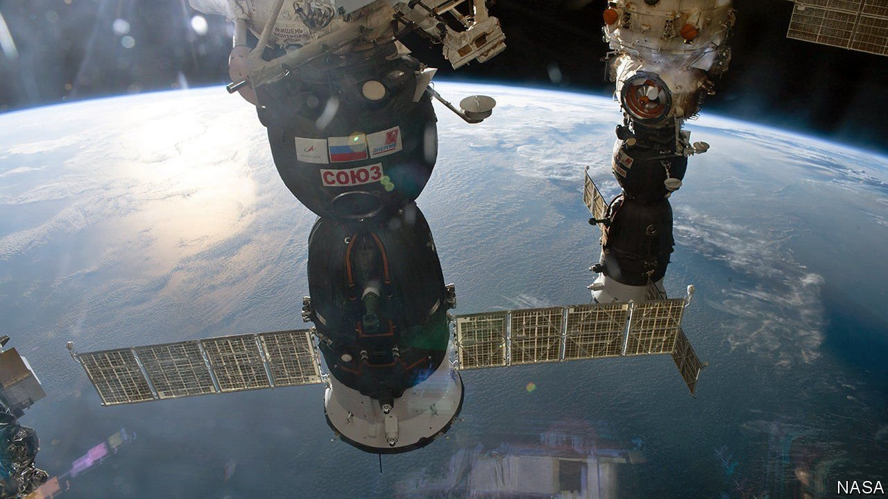

###### ASATs and the ISS

# A Russian anti-satellite missile test puts the ISS in peril 

##### Should such tests now be banned? 

 

> Nov 18th 2021 

“SORRY FOR the early call”, the transmission from ground control to the International Space Station (ISS) in the morning of November 15th began, “but we were recently informed of a satellite break-up and need to have you guys start reviewing the safe-haven procedure.” That meant the crew of the ISS—a joint venture between America, Canada, the European Space Agency, Japan and Russia—had to seal off some of the modules in which they live and work and retreat to the two space capsules currently moored at its airlocks, lest debris from the break-up puncture their living space.

The source of the debris was a Soviet-era spy satellite, Kosmos-1408, in an orbit 100km or so above, and at an angle to, that of the ISS. A few hours earlier this had been blown to smithereens in a Russian anti-satellite-missile test which turned the two-tonne hulk into some 1,500 pieces of debris large enough for American radars to track (meaning a few centimetres or greater across), and countless more smaller fragments. The exact extent of the cloud of debris could not be known, but it looked as if the ISS was passing through it, and would do so repeatedly.


America condemned the test as “reckless”, stressing that it endangered not just the five astronauts on the ISS (four Americans and a German) but also the two Russian cosmonauts, one of whom, Colonel Anton Shkaplerov, is currently the station’s commander. Russia’s defence minister, Sergei Shoygu, was quoted in TASS, a Russian news agency, as saying that “a cutting-edge system of the future” had “hit an old satellite with precision worthy of a goldsmith. The remaining debris pose no threats to space activity.”

That was not true. When a satellite is destroyed in this way the debris starts off close to the satellite’s previous position and orbit. That was the situation when the ISS was put on alert hours after the test. Over days, the debris spreads out along the orbit, forming a ring around Earth. Over weeks, lateral spread turns that ring into a shell. This diffuses the risk. But if America’s assessment of 1,500 fragments holds, the test will have increased the total number of trackable bits of space debris by almost 10%. And all space debris poses some threat to space activity.

The fallout—or rather, the fall-ceaselessly-around—from the Russian test is not quite as bad as that from a similar Chinese test carried out in 2007, which accounts for 3,500 bits of trackable debris. But it is worse than the debris from an Indian test which took place in 2019. That used a target in a very low orbit, and as a result most of shrapnel has since re-entered Earth’s atmosphere. The same is true of America’s own most recent satellite-smashing escapade, in 2008, which destroyed a re-entering satellite said to have a dangerous amount of fuel on board.

Why do countries keep doing these things? One reason is the link to missile defence. An ability to destroy a satellite with a missile launched from below, as the Russians did, is also an ability to destroy an intercontinental ballistic missile during the part of its flight which puts it above the atmosphere. America prizes that ability, and others seek it. But testing missile-defence systems, or for that matter anti-satellite weapons, does not require the creation of copious orbital debris with no prior warning. (The Outer Space Treaty of 1967 requires countries to consult with each other before doing anything which might lead to “potentially harmful interference”.) Such flamboyant recklessness seems to be more about proving a point. It is possible that the timing of Russia’s test, coinciding with its build-up of troops on the Ukrainian border, was intended as a signal.

Brian Weeden of the Secure World Foundation, an organisation devoted to the sustainable and peaceful use of space, says the test “calls into question [Russia’s] commitment to dealing with the threats to the long-term sustainability of space and their expressed desire to prevent an arms race in outer space.” One way in which that desire is purportedly expressed is in the “Treaty on Prevention of the Placement of Weapons in Outer Space and of the Threat or Use of Force against Outer Space Objects”, which Russia and China started to promote at the UN in 2008. America and its allies are not keen—in part, America says, because it does not place limits on ground-based anti-satellite systems.

Earlier this month, though, the UN General Assembly voted in committee for an “open-ended working group” on possible norms, rules and principles for the responsible and peaceful use of space. Despite Russia and China voting against, because they prefer their treaty, open-endedness may provide enough scope for some sort of agreement. But not soon. UN processes, like space debris, can stay up in the air for a very long time. ■

This story is an updated version of this  that we published in the aftermath of the explosion.

To enjoy more of our mind-expanding science coverage, , our weekly newsletter.

